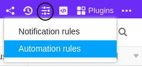

Grâce à l'automatisation, vous ne devez plus effectuer manuellement des entrées dans d'autres tableaux, mais vous pouvez faire en sorte que ces étapes soient exécutées automatiquement. Le grand avantage est que le déclencheur ne doit pas se trouver dans le même tableau que l'action déclenchée.

## Ajouter des entrées dans d'autres tableaux par automatisation

1. Cliquez sur  dans l'en-tête de base, puis sur **Règles d'automatisation**.
2. Cliquez sur **Ajouter une règle**.
3. **Nommez** l'automation et définissez le **tableau** et la **vue** dans laquelle elle doit être déclenchée.
4. Définir un **événement déclencheur** qui déclenchera l'automatisation.
5. Cliquez sur **Ajouter une action** et sélectionnez **Ajouter une nouvelle entrée dans un autre tableau** comme action automatisée.
6. Définissez le **tableau** dans lequel l'entrée doit être insérée, ainsi que les **champs** pré-remplis.
7. Confirmez en cliquant sur **Envoyer**.

## Création de l'automation

Définissez un **événement déclencheur** pour l'automatisation, après avoir d'abord déterminé dans quel **tableau** et quelle **vue** il se produira.



L'action automatisée **Ajouter une nouvelle entrée dans un autre tableau** est à votre disposition. **exclusivement** est disponible pour les événements déclencheurs suivants :

- [Les entrées remplissent certaines conditions après traitement](#automations-trigger_eintraege_erfuellen_nach_bearbeitung_bestimmte_bedingungen)
- [Une nouvelle entrée est ajoutée](#automations-trigger_ein_neuer_eintrag_wird_hinzugefuegt)


