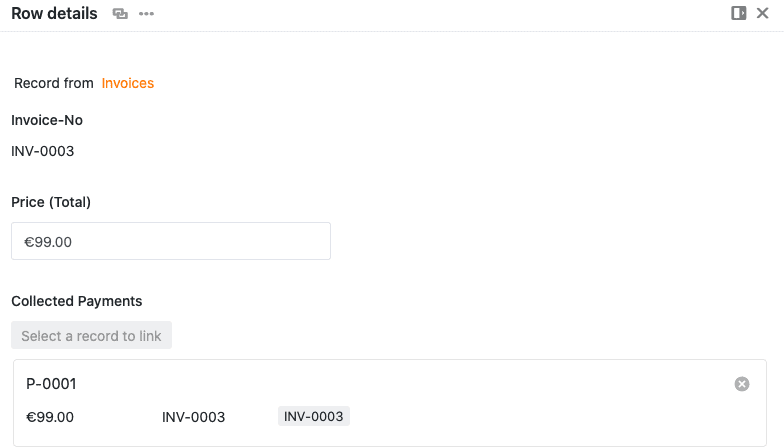

Mithilfe von Automationen müssen Sie Einträge in Ihren Tabellen nicht mehr manuell miteinander verknüpfen, sondern können diese Schritte automatisch ausführen lassen. Definieren Sie hierfür einfach eine entsprechende Automation für eine beliebige Tabellenansicht.

## Verlinken von Einträgen per Automation

1. Klicken Sie im Base-Header auf  und im Anschluss auf **Automatisierungsregeln**.
2. Klicken Sie auf **Regel hinzufügen**.
3. **Benennen** Sie die Automation und legen Sie die **Tabelle** und **Ansicht** fest, in der diese wirken soll.
4. Definieren Sie ein **Trigger-Ereignis**, welches die Automation auslöst.
5. Klicken Sie auf **Aktion hinzufügen** und wählen Sie als automatisierte Aktion **Links hinzufügen** aus.
6. Bestätigen Sie mit **Abschicken**.

## Anlegen der Automation

Definieren Sie für die Automation zunächst ein **Trigger-Ereignis**.



Die automatisierte Aktion **Links hinzufügen** steht Ihnen **ausschließlich** bei folgenden Trigger-Ereignissen zur Verfügung:

- "Einträge erfüllen nach Bearbeitung bestimmte Bedingungen
- "Ein neuer Eintrag wird hinzugefügt
- "Periodischer Trigger



Wählen Sie anschließend als automatisierte Aktion **"Links hinzufügen"** aus.

 

Wählen Sie abschließend eine **Spalte** aus, die mit der ausgewählten Tabelle verknüpft werden soll, und definieren Sie eine **spezifische Bedingung**, die erfüllt sein muss, damit die Automation durchgeführt wird.

Bestätigen Sie abschließend die Automation mit einem Klick auf **Abschicken**.

## Anwendungsbeispiel

Ein konkreter **Anwendungsfall** für diese Art von Automation könnte beispielsweise auftreten, wenn Sie in der Buchhaltung eines Unternehmens arbeiten. Dabei möchten Sie sowohl eine Tabelle mit allen Zahlungen pflegen, die auf ein Konto des Unternehmens eingehen (**Payments**), als auch eine Tabelle mit allen Rechnungen, die an das Unternehmen gezahlt werden müssen (**Invoices**).

In der Tabelle **Payments** erfassen Sie neben den **Transaktionsnummern** der Zahlungen (P-0001 etc.) bereits die **Beträge** der verschiedenen Zahlungen (Spalte **"Value"**).

Ihre Tabelle **Invoices** enthält derweil die **Rechnungsnummern** (Spalte **"Invoice-No"**) und die jeweiligen **Rechnungsbeträge** (Spalte **"Price Total"**).

Mithilfe einer **Automation** möchten Sie nun die beiden Tabellen **Payments** und **Invoices** miteinander **verlinken**, damit Sie die eingegangenen **Zahlungen** anhand ihrer Rechnungsnummern automatisch einer **Rechnung** zuordnen können.

### Vorbereitung der Automation

Bevor Sie die Automation anlegen können, müssen Sie in der Tabelle **Payments** zunächst noch zwei Spalten hinzufügen. In der Spalte **"Inv-No"** tragen Sie manuell die Rechnungsnummern ein, die zu den jeweiligen Zahlungen gehören – was später die Automation **auslösen** soll. In der Spalte **"Invoices"** werden nach Anlegen der Automation automatisch die **verlinkten Einträge** aus der Tabelle **Invoices** hinzugefügt.

In der Tabelle **Invoices** benötigen Sie ebenfalls noch eine Spalte (**"Collected Payments"**), in der im Zuge der Automation die verlinkten Einträge der Tabelle **Payments** hinzugefügt werden.

Im Anschluss können Sie für die Tabelle **Payments** eine **Automation** anlegen.

### Anlegen der Automation

Als Erstes geben Sie der Automation einen Namen und wählen die Tabelle **Payments** mit der gleichnamigen Ansicht aus, in der diese wirken soll.

Als **Trigger-Ereignis** der Automation wählen Sie die Option **"Einträge erfüllen nach Bearbeitung bestimmte Bedingungen"** aus. Dabei fügen Sie als Filterbedingung hinzu, dass die beiden Spalten **"Inv-No"** und **"Value"** der Tabelle "Payments" **nicht leer** sind. Diese Bedingung ist sinnvoll, da die Automation ausgelöst werden soll, sobald in diesen Spalten Einträge vorhanden sind.

 

Als **automatisierte Aktion** der Automation definieren Sie abschließend die Aktion **"Hinzufügen einer verlinkten Spalte in die Tabelle"**.

Die Spalte **"Invoices"** ist die Spalte, in welche die verlinkten Einträge im Zuge der Automation hinzugefügt werden sollen.

Im letzten Schritt der Definition der Automation sollten Sie noch eine weitere **Bedingung** festlegen, die erfüllt werden muss, damit der Spalte ein verlinkter Eintrag hinzugefügt wird. In diesem Beispiel wird dabei definiert, dass jeder **Eintrag**, der in der Spalte **"Inv-No"** hinzugefügt wird, auch in der Spalte **"Invoice-No"** der Tabelle **Invoices** zu finden sein muss.

Konkret bedeutet dies, dass jede **Rechnungsnummer**, die Sie einer Zahlung in der Tabelle **Payments** manuell zuordnen, bereits in der Tabelle **Invoices** zu finden sein muss, damit die entsprechenden **Einträge** beider Tabellen miteinander **verlinkt** werden können.

### Testen der Automation

Wenn Sie daraufhin in der Tabelle **Payments** in der Spalte **"Inv-No"** eine Rechnungsnummer eintragen, die bereits in der Tabelle **Invoices** zu finden ist, wird der entsprechende **verlinkte Eintrag** automatisch der Tabelle in der Spalte **"Invoices"** hinzugefügt.



Mit einem Klick auf den verlinkten Eintrag öffnet sich ein Fenster, in dem Sie die Inhalte des **verlinkten Eintrags** aus der Tabelle **Invoices** einsehen können.

Zusätzlich werden durch das Auslösen der Automation auch in der Tabelle **Invoices** die **verlinkten Einträge** aus der Tabelle **Payments** hinzugefügt. Dabei wird in der Spalte **"Collected Payments"** automatisch jeder Rechnungsnummer die dazugehörige **Zahlungsnummer (P-000X)** zugeordnet. Durch die **Automation** können Sie folglich für jede Rechnung die dazugehörige **Zahlung** einsehen und schnell feststellen, welche Rechnungen beglichen und welche Rechnungen noch offen sind.

Auch in dieser Tabelle können Sie mit einem Klick auf den verlinkten Eintrag ein Fenster öffnen, in dem Sie die Inhalte des **verlinkten Eintrags** aus der Tabelle **Payments** einsehen können.

### Weitere hilfreiche Artikel in der Rubrik Automationen:

- [Übersicht über Automationen](https://seatable.io/docs/arbeiten-mit-automationen/uebersicht-ueber-automationen/)
- [Funktionsweise von Automationen](https://seatable.io/docs/arbeiten-mit-automationen/funktionsweise-von-automationen/)
- [Anlegen einer Automation](https://seatable.io/docs/arbeiten-mit-automationen/anlegen-einer-automation/)
- [Automationen verwalten und bearbeiten](https://seatable.io/docs/arbeiten-mit-automationen/automationen-verwalten-und-bearbeiten/)
- [Automationen stoppen](https://seatable.io/docs/arbeiten-mit-automationen/automationen-stoppen/)
- [Automationen löschen](https://seatable.io/docs/arbeiten-mit-automationen/automationen-loeschen/)
- [Ausführungslog einer Automation anzeigen](https://seatable.io/docs/arbeiten-mit-automationen/ausfuehrungslog-einer-automation-anzeigen/)
- [Warum finde ich Automationen in meiner Base nicht?](https://seatable.io/docs/arbeiten-mit-automationen/warum-finde-ich-in-meiner-base-die-automationen-nicht/)
- [Automations-Trigger](https://seatable.io/docs/arbeiten-mit-automationen/automations-trigger/)
- [Automations-Aktionen](https://seatable.io/docs/arbeiten-mit-automationen/automations-aktionen/)
- [Zeilen per Automation sperren](https://seatable.io/docs/beispiele-fuer-automationen/zeilen-per-automation-sperren/)

### Weitere interessante Beispiele von Automationen:

- [Zeilen per Automation sperren](https://seatable.io/docs/beispiele-fuer-automationen/zeilen-per-automation-sperren/)
- [Zeilen per Automation hinzufügen](https://seatable.io/docs/beispiel-automationen/zeilen-per-automation-hinzufuegen/)
- [Einträge in andere Tabellen per Automation hinzufügen](https://seatable.io/docs/beispiel-automationen/eintraege-in-andere-tabellen-per-automation-hinzufuegen/)
- [Benachrichtigungen per Automation versenden](https://seatable.io/docs/benachrichtigungen/benachrichtigungen-per-automation-versenden/)
- [E-Mail-Versand per Automation](https://seatable.io/docs/beispiel-automationen/e-mail-versand-per-automation/)
