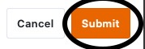

Mithilfe von Automationen müssen Sie Zeilen mit bestimmten Einträgen nicht mehr manuell in Ihren Tabellen hinzufügen, sondern können diese Schritte automatisch ausführen lassen. Definieren Sie hierfür einfach eine entsprechende Automation für eine beliebige Tabellenansicht.

## Wie Sie Zeilen mit einer Automation hinzufügen

1. Klicken Sie im Base-Header auf  und im Anschluss auf **Automatisierungsregeln**.
2. Klicken Sie auf **Regel hinzufügen**.
3. **Benennen** Sie die Automation und legen Sie die **Tabelle** und **Ansicht** fest, in der diese wirken soll.
4. Definieren Sie ein **Trigger-Ereignis**, welches die Automation auslöst.
5. Klicken Sie auf **Aktion hinzufügen** und wählen Sie als automatisierte Aktion **Zeile hinzufügen** aus.
6. Bestätigen Sie mit **Abschicken**.

## Anlegen der Automation

Definieren Sie für die Automation zunächst ein **Trigger-Ereignis**.



Die automatisierte Aktion **Zeile hinzufügen** steht Ihnen **ausschließlich** nach folgenden Trigger-Ereignissen zur Verfügung:

- Ein neuer Eintrag wird hinzugefügt
- Einträge erfüllen nach Bearbeitung bestimmte Bedingungen
- Periodischer Trigger



Wählen Sie anschließend als automatisierte Aktion **Zeile hinzufügen** aus.

 

Im nächsten Schritt definieren Sie die **Einträge**, die nach dem Auslösen der Automation in einer Zeile erscheinen sollen. Mit einem Klick auf **Feld hinzufügen** können Sie jeweils einen beliebigen Eintrag definieren.

Wählen Sie zunächst die **Spalte**, in welche der Eintrag eingefügt werden soll.

Anschließend können Sie den **Eintrag** definieren. Je nach ausgewähltem [Spaltentyp](
) stehen Ihnen dabei unterschiedliche **Optionen** zur Verfügung.

Aktivieren Sie abschließend die Automation mit einem Klick auf **Abschicken**.

## Anwendungsbeispiel

Ein konkreter **Anwendungsfall** für diese Art von Automation könnte beispielsweise auftreten, wenn Sie in einer Tabelle Ihre wöchentlichen Team-Meetings erfassen. Dabei möchten Sie, dass jede Woche vor Beginn des Meetings schon automatisch eine Zeile mit bestimmten Einträgen angelegt wird, damit Sie nur noch die restlichen Informationen manuell eintragen müssen.

In diesem Zusammenhang könnten Sie unter anderem das **Datum** des Meetings, den **Besprechungsraum** und die feststehenden **Themen** vorab definieren.

### Anlegen der Automation

Als Erstes geben Sie der Automation einen **Namen** und wählen sowohl die **Tabelle** (hier: Team Meetings) als auch die **Ansicht** (hier: Weekly Team Meeting) aus, in der die Automation wirken soll.

Als **Trigger-Ereignis** der Automation wählen Sie die Option **Periodischer Trigger**.

Definieren Sie anschließend, in welchen Abständen die Automation ausgeführt werden soll. Damit die Zeile mit den entsprechenden Einträgen jede Woche der Tabelle hinzugefügt wird, wählen Sie **wöchentlich**.

Des Weiteren können Sie sowohl einen konkreten **Wochentag** als auch eine konkrete **Uhrzeit** auswählen, zu welcher die Automation ausgelöst wird. In unserem Anwendungsfall bietet es sich an, als Zeitpunkt eine Stunde vor Beginn des wöchentlichen Meetings am Montagmorgen auszuwählen.

Als **automatisierte Aktion** definieren Sie im nächsten Schritt die Aktion **Zeile hinzufügen**.

Mit einem Klick auf **Feld hinzufügen** können Sie beliebig viele **Einträge** definieren, die automatisch in der Zeile erscheinen.

Damit in der Zeile automatisch das jeweilige Datum des am selben Tag anstehenden Team-Meetings erfasst wird, wählen Sie die **Datum-Spalte** und den Wert **Der Tag der Ausführung** aus.

Sie können mit einem Klick auf **Feld hinzufügen** beliebig viele weitere **Einträge** definieren, mit denen die Zeile nach Auslösung der Automation gefüllt wird. Wählen Sie hierzu einfach eine entsprechende **Spalte** Ihrer Tabelle aus dem Drop-down-Menü aus und definieren Sie einen Wert im nebenstehenden Eingabefeld.

Wenn das Team-Meeting zum Beispiel üblicherweise in einem bestimmten Raum stattfindet, können Sie diesen Raum als gesetzten Wert definieren. Auch falls gewisse Themen (wie z. B. Neuzugänge/Austritte/Jubiläen) bei jedem Team-Meeting auf der Agenda stehen, können Sie diese immer in die Zeile eintragen lassen.

### Testen der Automation

Wenn die Automation funktioniert wie gewünscht, fügt SeaTable Ihrer Tabelle nach Auslösung des periodischen Triggers (hier: immer montags um 7 Uhr) automatisch eine Zeile mit den zuvor definierten **Einträgen** hinzu. Dies erspart Ihnen einige Tastenanschläge und Sie können daraufhin die noch offenen Daten manuell eintragen.



### Weitere interessante Beispiele von Automationen:

- [Zeilen per Automation sperren](https://seatable.io/docs/beispiele-fuer-automationen/zeilen-per-automation-sperren/)
- [Verlinken von Einträgen per Automation](https://seatable.io/docs/beispiele-fuer-automationen/verlinken-von-eintraegen-per-automation/)

- [Einträge in andere Tabellen per Automation hinzufügen](https://seatable.io/docs/beispiel-automationen/eintraege-in-andere-tabellen-per-automation-hinzufuegen/)
- [Benachrichtigungen per Automation versenden](https://seatable.io/docs/benachrichtigungen/benachrichtigungen-per-automation-versenden/)
- [E-Mail-Versand per Automation](https://seatable.io/docs/beispiel-automationen/e-mail-versand-per-automation/)
