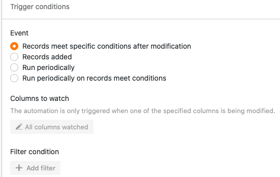

Grâce aux automatisations, vous n'avez plus besoin d'ajouter manuellement des lignes avec certaines entrées dans vos tableaux, mais vous pouvez faire en sorte que ces étapes soient effectuées automatiquement. Il suffit pour cela de définir une automatisation correspondante pour n'importe quelle vue du tableau.

## Comment ajouter des lignes avec une automatisation

1. Cliquez sur  dans l'en-tête de base, puis sur **Règles d'automatisation**.
2. Cliquez sur **Ajouter une règle**.
3. **Nommez** l'automatisation et définissez le **tableau** et la **vue** dans lesquels elle doit agir.
4. Définir un **événement déclencheur** qui déclenchera l'automatisation.
5. Cliquez sur **Ajouter une action** et sélectionnez **Ajouter une ligne** comme action automatisée.
6. Confirmez en cliquant sur **Envoyer**.

## Création de l'automation

Définissez d'abord un **événement déclencheur** pour l'automatisation.



L'action automatisée **Ajouter une ligne** est à votre disposition **exclusivement** sont disponibles après les événements déclencheurs suivants :

- Une nouvelle entrée est ajoutée
- Les entrées remplissent certaines conditions après traitement
- Déclencheur périodique


