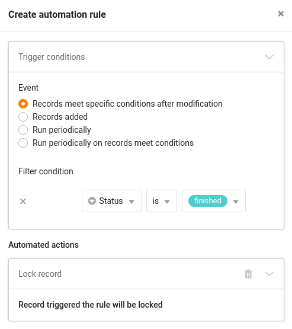

Mithilfe von Automationen müssen Sie Zeilen in Ihren Tabellen nicht mehr manuell sperren, sondern können die [Sperrung von Zeilen]() automatisch ausführen lassen. Das ist sehr nützlich, wenn Sie immer ab einem bestimmten Zeitpunkt (z. B. wenn ein Vorgang abgeschlossen ist) verhindern wollen, dass eine Zeile weiter bearbeitet werden kann.



## Anlegen der Automation

1. Klicken Sie in den Base-Optionen auf  und im Anschluss auf **Automatisierungsregeln**.
2. Klicken Sie auf **Regel hinzufügen**.
3. **Benennen** Sie die Automation und legen Sie die **Tabelle** und **Ansicht** fest, in der sie wirken soll.
4. Definieren Sie ein **Trigger-Ereignis**, welches die Automation auslöst.
5. Klicken Sie auf **Aktion hinzufügen** und wählen Sie als automatisierte Aktion **Eintrag sperren** aus.

 7. Bestätigen Sie mit **Abschicken**.



Die automatisierte Aktion **Eintrag sperren** steht Ihnen ausschließlich bei folgenden Trigger-Ereignissen zur Verfügung:

- Einträge erfüllen nach Bearbeitung bestimmte Bedingungen
- Ein neuer Eintrag wird hinzugefügt
- Periodisch ausführen, wenn Einträge bestimmte Bedingungen erfüllen



## Anwendungsbeispiel

Möchten Sie beispielsweise in einer Ihrer Tabellen jede Zeile **sperren**, in der ein bestimmter Eintrag einen spezifischen **Wert** erreicht, definieren Sie als Trigger der Automation das Ereignis: **Einträge erfüllen nach Bearbeitung bestimmte Bedingungen**.

Legen Sie anschließend den **Wert** fest sowie die **Spalte**, in der dieser erreicht werden muss.

Legen Sie zum Schluss als automatisierte Aktion **Eintrag sperren** fest.

Ab diesem Moment wird die angelegte Automation **alle Zeilen** sperren, in denen sich **Einträge** so verändern, dass sie die Automatisierungsregel erfüllen.



## Mehrere Zeilen gleichzeitig sperren

Automationen sind äußerst hilfreich, wenn Sie mehrere Zeilen gleichzeitig sperren wollen. Wählen Sie dazu den Trigger **Periodisch für Einträge ausführen, die die Bedingungen erfüllen** und legen Sie die entsprechenden Bedingungen fest. Anstatt die Ausführungshäufigkeit und -zeit einzustellen, klicken Sie unten auf **Jetzt ausführen**, um alle gewünschten Zeilen sofort zu sperren.

Mehr Informationen zur Sperrung von Zeilen erhalten Sie im Artikel [Sperren einer Zeile]().

### Weitere hilfreiche Artikel in der Rubrik Automationen:

- [Übersicht über Automationen]()
- [Funktionsweise von Automationen]()
- [Anlegen einer Automation]()
- [Automationen verwalten und bearbeiten]()
- [Automationen stoppen]()
- [Automationen löschen]()
- [Ausführungslog einer Automation anzeigen]()
- [Warum finde ich Automationen in meiner Base nicht?]()
- [Automations-Trigger]()
- [Automations-Aktionen]()
- [Verlinken von Einträgen per Automation]()

### Weitere interessante Beispiele von Automationen:

- [Verlinken von Einträgen per Automation]()
- [Zeilen per Automation hinzufügen]()
- [Einträge in andere Tabellen per Automation hinzufügen]()
- [Benachrichtigungen per Automation versenden]()
- [E-Mail-Versand per Automation]()
