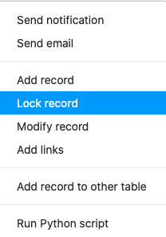
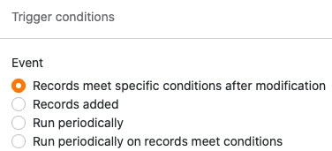
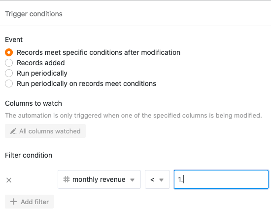

With the help of automations, you no longer have to manually lock rows in your tables, but can have [rows perform the]() automatically. This is very useful if you always want to prevent a row from being processed further from a certain point in time (e.g. when a process has been completed).



## Creating the automation

1. In the base options, click  and then click **Automation Rules**.
2. Click **Add Rule**.
3. **Name** the automation and specify the **table** and **view** in which it should act.
4. Define a **trigger event that triggers** the automation.
5. Click **Add Action** and select **Lock Entry** as the automated action.

7. Confirm with **Submit**.



The automated action **Lock entry** is only available for the following trigger events:

- Entries meet certain conditions after editing
- A new entry is added
- Execute periodically when entries meet certain conditions



## Application example

For example, if you want to**lock** any row in one of your tables where a certain entry reaches a specific **value**, define the event: **Entries meet certain conditions after editing** as the automation trigger.

Then set the **value** and the **column** in which it must be reached.

Finally, set **Lock Entry** as the automated action.

From this moment on, the created automation will lock **all rows** where **entries** change in such a way that they fulfill the automation rule.



## Lock multiple rows at the same time

Automations are extremely useful if you want to lock several rows at the same time. To do this, select the **Execute Periodically** trigger for **entries that meet the conditions** and set the appropriate conditions. Instead of setting the execution frequency and time, click **Execute Now** below to immediately lock all the desired rows .

For more information on blocking rows , see the article [Blocking a row.]()

### More helpful articles in the Automations section:

- [Overview of automations]()
- [How automation works]()
- [Create an automation]()
- [Manage and edit automations]()
- [Stop automations]()
- [Delete automations]()
- [Show execution log of an automation]()
- [Why can't I find automations in my base?]()
- [Automation trigger]()
- [Automation actions]()
- [Linking entries via automation]()

### Other interesting examples of automations:

- [Linking entries via automation]()
- [rows Add via automation]()
- [Add entries to other tables via automation]()
- [Send notifications via automation]()
- [E-mail dispatch via automation]()
