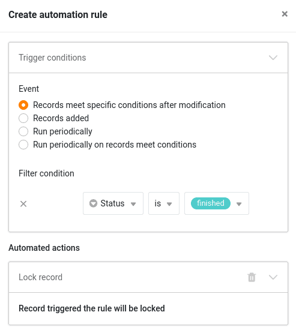
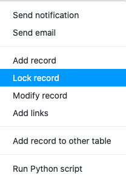
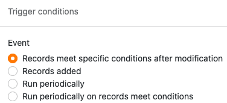
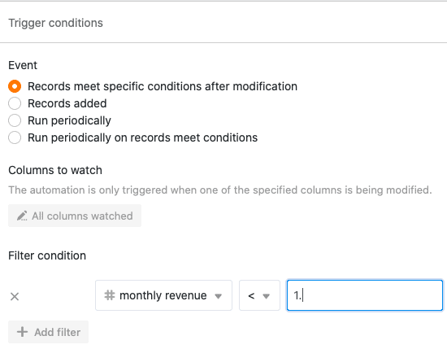
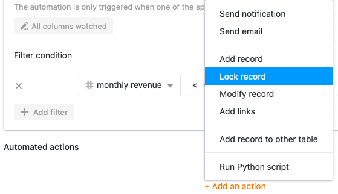
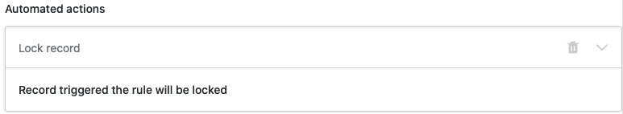

С помощью автоматизаций вам больше не придется блокировать строки в таблицах вручную, а можно блокировать [строки]() автоматически. Это очень полезно, если вы всегда хотите предотвратить дальнейшее редактирование строки после определенного момента времени (например, когда операция завершена).



## Создание автоматизации

1. В опциях базы нажмите на , а затем на **Правила автоматизации**.
2. Нажмите кнопку **Добавить правило**.
3. **Назовите** автоматизацию и определите **таблицу** и **представление, в** которых она должна работать.
4. Определите **триггерное событие, которое запускает** автоматизацию.
5. Нажмите **Добавить действие** и выберите **Заблокировать запись** в качестве автоматического действия.

7. Подтвердите с помощью кнопки **Отправить**.



Автоматическое действие **Ввод замка** доступен только для следующих триггерных событий:

- Записи соответствуют определенным условиям после редактирования
- Добавляется новая запись
- Выполняется периодически, когда записи соответствуют определенным условиям



## Пример применения

Например, если вы хотите **заблокировать** каждую строку в одной из ваших таблиц, в которой определенная запись достигает определенного **значения**, определите событие: **Записи удовлетворяют определенным условиям после обработки** в качестве триггера автоматизации.

Затем задайте **значение** и **столбец**, в котором оно должно быть достигнуто.

Наконец, установите **блокировку входа в** качестве автоматического действия.

С этого момента созданная автоматизация будет блокировать **все строки**, в которых **записи** изменяются таким образом, что они выполняют правило автоматизации.



## Одновременная блокировка нескольких линий

Автоматизация чрезвычайно полезна, если вы хотите заблокировать несколько строк одновременно. Для этого выберите триггер **Выполнять периодически для записей, удовлетворяющих условиям**, и задайте соответствующие условия. Вместо того чтобы устанавливать частоту и время выполнения, нажмите кнопку Выполнить **сейчас** внизу, чтобы немедленно заблокировать все нужные строки.

Для получения дополнительной информации о блокировке строк см. статью [Блокировка строки]().

### Больше полезных статей в разделе "Автоматизация":

- [Обзор автоматики](https://seatable.io/ru/docs/arbeiten-mit-automationen/uebersicht-ueber-automationen/)
- [Функциональные возможности автоматики](https://seatable.io/ru/docs/arbeiten-mit-automationen/funktionsweise-von-automationen/)
- [Создайте автоматизацию](https://seatable.io/ru/docs/arbeiten-mit-automationen/anlegen-einer-automation/)
- [Управление и редактирование автоматизаций](https://seatable.io/ru/docs/arbeiten-mit-automationen/automationen-verwalten-und-bearbeiten/)
- [Остановить автоматизацию](https://seatable.io/ru/docs/arbeiten-mit-automationen/automationen-stoppen/)
- [Удалить автоматизацию]()
- [Отображение журнала выполнения автоматизации](https://seatable.io/ru/docs/arbeiten-mit-automationen/ausfuehrungslog-einer-automation-anzeigen/)
- [Почему я не могу найти автоматизацию в своей базе?](https://seatable.io/ru/docs/arbeiten-mit-automationen/warum-finde-ich-in-meiner-base-die-automationen-nicht/)
- [Триггер автоматизации]()
- [Действия по автоматизации](https://seatable.io/ru/docs/arbeiten-mit-automationen/automations-aktionen/)
- [Связывание записей с помощью автоматизации]()

### Другие интересные примеры автоматизации:

- [Связывание записей с помощью автоматизации]()
- [Добавление линий с помощью автоматизации]()
- [Добавление записей в другие таблицы с помощью автоматизации]()
- [Отправка уведомлений с помощью автоматизации]()
- [Отправка по электронной почте с помощью автоматики]()
