Mithilfe von [Automationen](https://seatable.io/docs/automationen/uebersicht-ueber-automationen/) müssen Sie die Zeitpunkte einer Statusänderung nicht mehr **manuell** erfassen, sondern können dies **automatisch** von SeaTable übernehmen lassen.

## Zeitpunkte von Statusänderungen per Automation erfassen

1. Klicken Sie im Base-Header auf  und im Anschluss auf **Automatisierungsregeln**.
2. Klicken Sie auf **Regel hinzufügen**.
3. Geben Sie der Automation einen **Namen** und legen Sie die **Tabelle** und **Ansicht** fest, in der diese wirken soll.
4. Definieren Sie das **Trigger-Ereignis**, welches die Automation auslöst.
5. Klicken Sie auf **Aktion hinzufügen** und wählen Sie als automatisierte Aktion **Neuen Eintrag in anderer Tabelle hinzufügen** aus.
6. Definieren Sie die **Tabelle**, in die der Eintrag eingefügt werden soll, sowie die vorausgefüllten **Felder**.
7. Bestätigen Sie mit **Abschicken**.

## Anlegen der Automation

Definieren Sie für die Automation zunächst das passende **Trigger-Ereignis**.



Wählen Sie anschließend als automatisierte Aktion **Neuen Eintrag in anderer Tabelle hinzufügen** aus.

 

Im nächsten Schritt wählen Sie die **Tabelle** aus, in welche der Eintrag nach Auslösung des Triggers hinzugefügt werden soll.

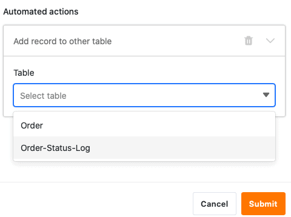

Klicken Sie im Anschluss auf **Feld hinzufügen**, um die Spalten auszuwählen, für die Sie festgelegte Werte im neuen Eintrag definieren möchten.

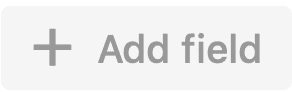

Wählen Sie nun im Drop-down-Menü eine entsprechende **Spalte** aus und definieren Sie den vorausgefüllten **Wert** im Eingabefeld. Je nach ausgewähltem [Spaltentyp](
) haben Sie unterschiedliche **Optionen** zur Auswahl.

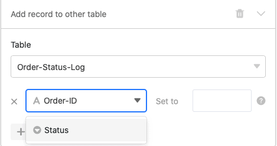

Bestätigen Sie abschließend die Automation mit einem Klick auf **Abschicken**.

## Anwendungsbeispiel

Ein konkreter **Anwendungsfall** für diese Art von Automation könnte beispielsweise auftreten, wenn Sie die verschiedenen **Bestellungen** für Ihr Unternehmen in einer Tabelle festhalten möchten.

Dabei möchten Sie die **Zeitpunkte**, an denen es bei einer oder mehreren Bestellungen in Ihrer Tabelle zu **Änderungen am Bestellstatus** kommt, automatisch in einer anderen Tabelle festhalten. So können Sie jederzeit den **Status** Ihrer Bestellungen überblicken und jede **Statusänderung** von "Zahlung erforderlich" bis "Produkt erfolgreich zugestellt" zeitlich nachvollziehen.

Konkret umsetzen lässt sich dies mithilfe einer Tabelle ("Order"), in der Sie die verschiedenen **Bestellungen** erfassen, die Sie für Ihr Unternehmen getätigt haben. Erheben könnten Sie in diesem Zusammenhang die **Bestellnummer**, den **Betrag** und den **Status** der einzelnen Bestellungen.

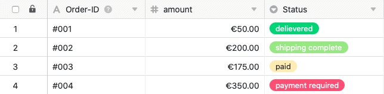

In einer anderen Tabelle ("Order-Status-Log") möchten Sie ebenfalls die verschiedenen **Bestellnummern** samt den dazugehörigen **Beträgen** sehen. Zusätzlich wird in dieser Tabelle in der [Datum-Spalte](https://seatable.io/docs/datum-dauer-und-personen/die-datum-spalte/) "last status change" der **Zeitpunkt der letzten Statusänderung** eingetragen.

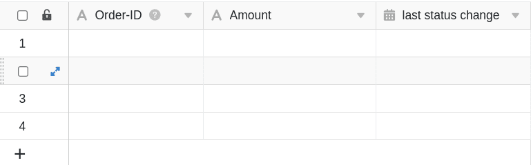

Mithilfe einer Automation soll nun jedes Mal, wenn Sie den **Status** einer Bestellung in der Tabelle "Order" verändern, der **Zeitpunkt** der Statusänderung in der Tabelle "Order-Status-Log" in die Spalte "last status change" hinzugefügt werden. Zusätzlich werden mithilfe der Automation auch die **Bestellnummern** und **Beträge** automatisch der Tabelle "Order-Status-Log" hinzugefügt.

### Anlegen der Automation

Als Erstes geben Sie der Automation einen **Namen** und wählen sowohl die **Tabelle** ("Order") als auch die **Ansicht** ("All Orders") aus.

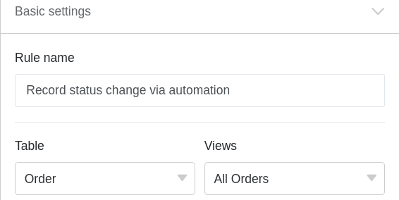

Als **Trigger-Ereignis** der Automation wählen Sie die Option **Einträge erfüllen nach Bearbeitung bestimmte Bedingungen** aus.

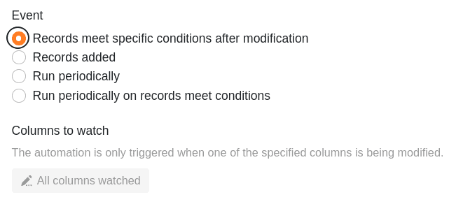

Fügen Sie als **Filterbedingung** hinzu, dass die Spalte **Status** in der Tabelle "Orders" nach der Bearbeitung **nicht leer** sein darf, um die Statusänderungen zu erfassen.

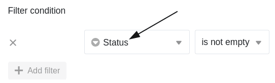

Als **automatisierte Aktion** definieren Sie die Aktion **Neuen Eintrag in anderer Tabelle hinzufügen**.

Im nächsten Schritt wählen Sie als **Tabelle**, in die nach Auslösung der Automation der Zeitpunkt der Statusänderung hinzugefügt wird, die Tabelle "Order-Status-Log" aus.

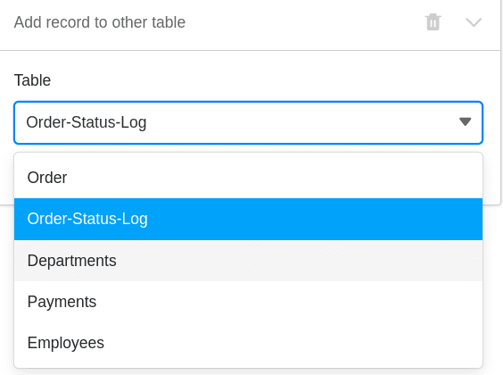

Anschließend definieren Sie die **Werte**, mit denen bestimmte Felder vorausgefüllt werden sollen. Damit stets der jeweilige **Zeitpunkt einer Statusänderung** automatisch der Datum-Spalte "last status change" hinzugefügt wird, definieren Sie für diese Spalte den Wert **Tag der Ausführung**.

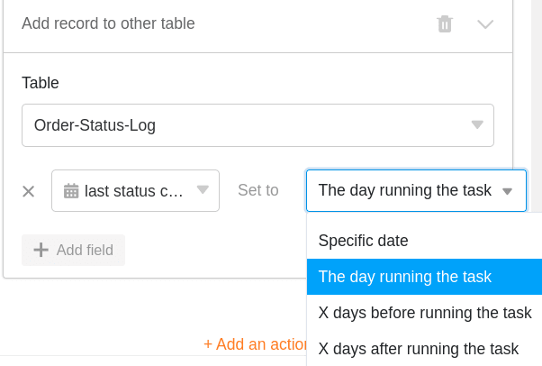

Um die verschiedenen **Bestellnummern** und die dazugehörigen **Beträge** in der Tabelle "Order-Status-Log" zu **zitieren**, schreiben Sie die Spaltennamen in geschweiften Klammern in das jeweilige Textfeld: {Order-ID} & {Amount}

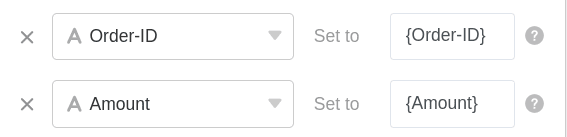

### Testen der Automation

Wenn Sie nach der Bestätigung der Automation den **Status** verschiedener Bestellungen in Ihrer Tabelle **verändern**, ...

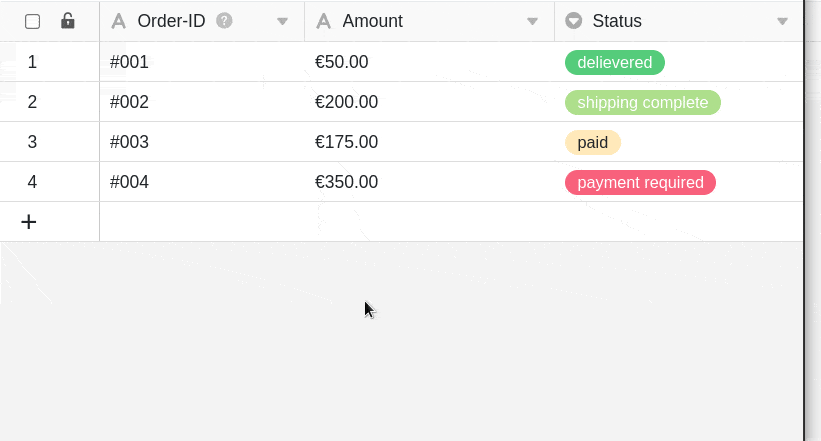

... werden sowohl die Zeitpunkte der Statusänderungen als auch die definierten Einträge (Bestellnummer & Betrag) automatisch in die Tabelle "Order-Status-Log" eingetragen.

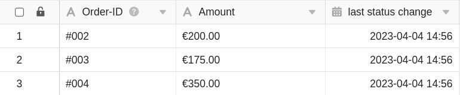
