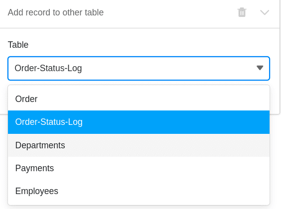
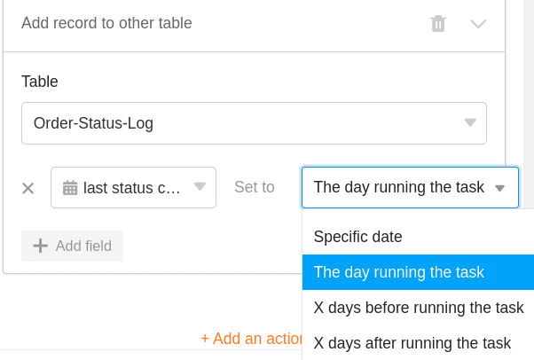

With the help of [automations](), you no longer have to **manually** record the times of a status change, but can have SeaTable do this **automatically**.

## Record times of status changes via automation

1. In the base header, click  and then click **Automation Rules**.
2. Click **Add Rule**.
3. Give the automation a **name** and specify the **table** and **view in** which it should act.
4. Define the **trigger event that triggers** the automation.
5. Click **Add action** and select **Add new entry in other table** as automated action.
6. Define the **table** where the entry should be inserted and the pre-filled **fields**.
7. Confirm with **Submit**.

## Creating the automation

First define the appropriate **trigger event** for the automation.



Then select **Add new entry in other table** as automated action.

 

In the next step, select the **table** to which the entry will be added after the trigger is fired.

Next, click **Add Field** to select the columns for which you want to define specified values in the new entry.

Now select a corresponding **column** from the drop-down menu and define the pre-filled **value** in the input field. Depending on the selected [column type](), you have different **options** to choose from.

Finally, confirm the automation by clicking **Submit**.

## Application example

A concrete **use case** for this type of automation could occur, for example, when you want to record the various **orders for** your company in a table.

In doing so, you want to automatically record the **times** at which **changes to the order status** occur for one or more orders in your table in another table. This way, you can keep track of the **status of** your orders at all times and track every **status change** from "Payment required" to "Product successfully delivered".

In concrete terms, this can be implemented with the help of a table ("Order") in which you record the various **orders** that you have placed for your company. In this context, you could collect the **order number**, the **amount** and the **status of** the individual orders.

In another table ("Order status log") you also want to see the different **order numbers** together with the corresponding **amounts**. In addition, the [date column]() "last status change" in this table contains the **time of the last status change**.

Using an automation, every time you change the **status of** an order in the Order table, the **time of** the status change should be added to the last status change column in the Order Status Log table. In addition, the automation will also automatically add the order **numbers** and **amounts to** the Order Status Log table.

### Creating the automation

First, give the automation a **name** and select both the **table** ("Order") and the **view** ("All Orders").

As a **trigger event of** the automation, select the option **Entries fulfill certain conditions after processing**.

Add as a **filter condition** that the **Status** column in the Orders table must not be **empty** after editing to capture the status changes.

As an **automated action** you define the action **Add new entry in other table**.

In the next step, select the "Order status log" **table** as the table to which the time of the status change will be added after the automation is triggered.

Then define the **values** with which certain fields are to be pre-filled. To ensure that the respective **time of a status change** is always automatically added to the date column "last status change", define the value **Day of execution** for this column.

Um die verschiedenen **Bestellnummern** und die dazugehörigen **Beträge** in der Tabelle “Order-Status-Log” zu **zitieren**, schreiben Sie die Spaltennamen in geschweiften Klammern in das jeweilige Textfeld: {Order-ID} & {Amount}

### Testing the automation

When you **change** the **status of** various orders in your table after confirming automation, ...

... both the times of the status changes and the defined entries (order number & amount) are automatically entered in the "Order Status Log" table.

