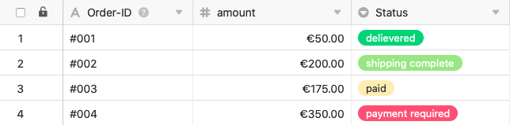

Grâce à l'[automatisation](), vous n'avez plus besoin de saisir **manuellement** les dates de changement d'état, SeaTable s'en charge **automatiquement**.

## Saisir les moments des changements de statut par automatisation

1. Cliquez sur  dans l'en-tête de base, puis sur **Règles d'automatisation**.
2. Cliquez sur **Ajouter une règle**.
3. Donnez un **nom** à l'automatisation et définissez le **tableau** et la **vue** dans lesquels elle doit agir.
4. Définir l'**événement déclencheur** qui déclenchera l'automatisation.
5. Cliquez sur **Ajouter une action** et sélectionnez **Ajouter une nouvelle entrée dans un autre tableau** comme action automatisée.
6. Définissez le **tableau** dans lequel l'entrée doit être insérée, ainsi que les **champs** pré-remplis.
7. Confirmez en cliquant sur **Envoyer**.

## Création de l'automation

Définissez d'abord l'**événement déclencheur** approprié pour l'automatisation.



Sélectionnez ensuite **Ajouter une nouvelle entrée dans un autre tableau** comme action automatisée.

 

L'étape suivante consiste à sélectionner le **tableau** dans lequel l'entrée doit être ajoutée après le déclenchement du trigger.

Cliquez ensuite sur **Ajouter un champ** pour sélectionner les colonnes pour lesquelles vous souhaitez définir des valeurs fixes dans la nouvelle entrée.

Sélectionnez maintenant une **colonne** correspondante dans le menu déroulant et définissez la **valeur** pré-remplie dans le champ de saisie. Selon le [type de colonne]() sélectionné, vous avez le choix entre différentes **options**.

Pour finir, confirmez l'automatisation en cliquant sur **Envoyer**.

## Exemple d'application

Une **application** concrète de ce type d'automatisation pourrait par exemple se produire si vous souhaitez consigner dans un tableau les différentes **commandes** pour votre entreprise.

Vous souhaitez enregistrer automatiquement dans un autre tableau les **moments** où **le statut d'** une ou de plusieurs commandes de votre tableau a été **modifié**. Ainsi, vous pouvez à tout moment avoir un aperçu du **statut** de vos commandes et suivre dans le temps chaque **changement de statut**, de "paiement requis" à "produit livré avec succès".

Concrètement, cela peut se faire à l'aide d'un tableau ("Order") dans lequel vous saisissez les différentes **commandes** que vous avez passées pour votre entreprise. Vous pouvez relever le **numéro de commande**, le **montant** et le **statut** de chaque commande.

Dans un autre tableau ("Order-Status-Log"), vous souhaitez également voir les différents **numéros de commande** ainsi que les **montants** correspondants. De plus, dans ce tableau, la [colonne de date]() "last status change" indique l'**heure du dernier changement de statut**.

A l'aide d'une automatisation, chaque fois que vous modifiez le **statut** d'une commande dans le tableau "Order", le **moment** du changement de statut doit être ajouté dans la colonne "last status change" du tableau "Order-Status-Log". De plus, l'automatisation permet d'ajouter automatiquement les **numéros de commande** et **les montants** dans le tableau "Order-Status-Log".

### Création de l'automation

Tout d'abord, donnez un **nom** à l'automation et sélectionnez à la fois le **tableau** ("Order") et la **vue** ("All Orders").

Comme **événement déclencheur** de l'automatisation, sélectionnez l'option **Les entrées remplissent certaines conditions après traitement**.

Ajoutez comme **condition de filtrage** que la colonne **Statut** dans le tableau "Ordres" ne doit **pas** être **vide** après le traitement, afin de pouvoir saisir les changements de statut.

Comme **action automatisée**, vous définissez l'action **Ajouter une nouvelle entrée dans un autre tableau**.

Dans l'étape suivante, sélectionnez le **tableau** "Journal des statuts des ordres" comme tableau dans lequel le moment du changement de statut sera ajouté après le déclenchement de l'automatisation.

Ensuite, vous définissez les **valeurs** avec lesquelles certains champs doivent être pré-remplis. Pour que le **moment d'un changement de statut** soit toujours ajouté automatiquement à la colonne de date "last status change", vous définissez pour cette colonne la valeur **jour d'exécution**.

Pour **citer** les différents **numéros de commande** et les **montants** correspondants dans le tableau "Order-Status-Log", écrivez les noms de colonne entre accolades dans la zone de texte correspondante : `{Order-ID} & {Amount}`

### Tester l'automatisation

Si vous **modifiez** le **statut** de différentes commandes dans votre tableau après avoir confirmé l'automatisation, ...

... les moments des changements de statut ainsi que les entrées définies (numéro de commande & montant) sont automatiquement saisis dans le tableau "Order-Status-Log".

