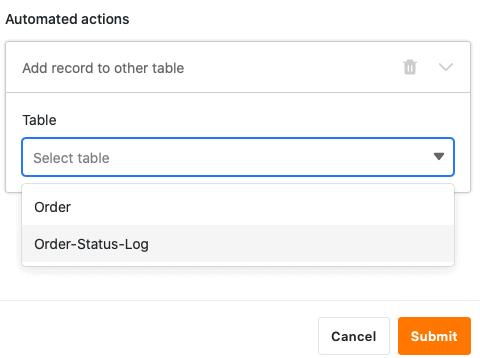

Com a ajuda das [automatizações](https://seatable.io/pt/docs/automationen/uebersicht-ueber-automationen/), já não é necessário registar **manualmente** as horas de uma alteração de estado, mas o SeaTable pode fazê-lo **automaticamente**.

## Registar as horas das alterações de estado através da automatização

1. Clique em  no cabeçalho da Base e depois nas **Regras de Automatização**.
2. Clique em **Add Rule (Adicionar regra)**.
3. Dê um **nome** à automatização e defina a **tabela** e a **vista em** que esta deve funcionar.
4. Defina o **evento de accionamento que desencadeia** a automatização.
5. Clique em **Add Action** e seleccione **Add New Entry in Other Table** como a acção automatizada.
6. Definir a **tabela** na qual a entrada deve ser inserida e os **campos** pré-preenchidos.
7. Confirmar com **Submeter**.

## Criar a automatização

Primeiro, defina o **evento de accionamento** adequado para a automatização.



Depois seleccionar **Adicionar nova entrada noutra tabela** como a acção automatizada.

 

No passo seguinte, seleccionar a **tabela** na qual a entrada deve ser acrescentada após o gatilho ter sido accionado.

Depois clique em **Adicionar Campo** para seleccionar as colunas para as quais pretende definir valores fixos na nova entrada.

Agora seleccione uma **coluna** correspondente no menu pendente e defina o **valor** pré-preenchido no campo de entrada. Dependendo do [tipo de coluna](https://seatable.io/pt/docs/arbeiten-mit-spalten/uebersicht-alle-spaltentypen/) seleccionada, tem diferentes **opções** à sua escolha.

Finalmente, confirmar a automatização clicando em **Enviar**.

## Exemplo de aplicação

Um **caso de utilização** concreto para este tipo de automatização pode ocorrer, por exemplo, se pretender registar as várias **encomendas da** sua empresa numa tabela.

Ao fazê-lo, pretende registar automaticamente noutro quadro os **momentos** em que ocorrem **alterações** no **estado da encomenda de** uma ou mais encomendas do seu quadro. Desta forma, pode acompanhar o **estado das** suas encomendas em qualquer altura e seguir todas as **alterações de estado**, desde "pagamento necessário" até "produto entregue com êxito".

Em termos concretos, isto pode ser feito com a ajuda de uma tabela ("Ordem") na qual se registam as várias **ordens** que foram feitas para a empresa. Neste contexto, é possível recolher o **número da encomenda**, o **montante** e o **estado das** encomendas individuais.

Noutro quadro ("Registo do estado das encomendas") também se pretende ver os diferentes **números de encomenda** juntamente com os **montantes** correspondentes. Além disso, a **hora da última** alteração de estado é registada nesta tabela na [coluna de](https://seatable.io/pt/docs/datum-dauer-und-personen/die-datum-spalte/) data "última **alteração de estado** ".

Utilizando uma automatização, sempre que alterar o **estado de** uma encomenda na tabela "Encomenda", a **hora da** alteração de estado deve ser adicionada à coluna "última alteração de estado" na tabela "Registo do estado da encomenda". Além disso, a automatização também adicionará automaticamente os **números** e **montantes** das encomendas **à** tabela "Registo do estado das encomendas".

### Criar a automatização

Em primeiro lugar, dê um **nome** à automatização e seleccione a **tabela** ("Order") e a **vista** ("All Orders").

Como **evento de activação da** automatização, seleccionar a opção **Entradas preenchem determinadas condições após processamento**.

Adicionar como **condição de filtro** que a coluna **Estado** na tabela "Encomendas" não deve estar **vazia** após a edição, para registar as alterações de estado.

Como **acção automatizada**, definir a acção **Adicionar nova entrada noutra tabela**.

Na etapa seguinte, selecionar a **tabela**"Order Status Log" como a tabela em que a hora da alteração de estado é adicionada após a automatização ter sido accionada.

Em seguida, definir os **valores** com que determinados campos devem ser pré-preenchidos. Para que a **hora** respectiva **de uma alteração de estado** seja sempre adicionada automaticamente à coluna de data "última alteração de estado", defina o valor **dia de execução** para esta coluna.

Um die verschiedenen **Bestellnummern** und die dazugehörigen **Beträge** in der Tabelle “Order-Status-Log” zu **zitieren**, schreiben Sie die Spaltennamen in geschweiften Klammern in das jeweilige Textfeld: {Order-ID} & {Amount}

### Teste da automatização

Se **alterar** **o estado de** várias encomendas na sua tabela depois de confirmar a automatização, ...

... tanto as horas das mudanças de estado como as entradas definidas (número de encomenda e montante) são automaticamente introduzidas na tabela "Registo do estado da encomenda".

