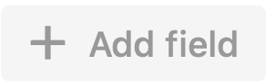
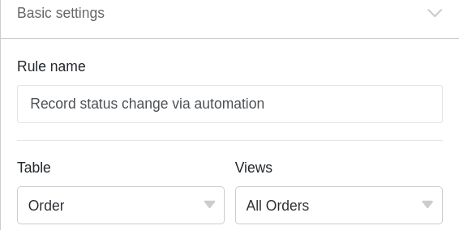

С помощью [автоматизации]() вам больше не придется записывать время изменения статуса **вручную**, а можно поручить SeaTable делать это **автоматически**.

## Запись времени изменения состояния с помощью автоматизации

1. Нажмите на  в заголовке Base, а затем на **Automation Rules**.
2. Нажмите кнопку **Добавить правило**.
3. Дайте автоматизации **имя** и определите **таблицу** и **представление, в** которых она должна работать.
4. Определите **триггерное событие, которое запускает** автоматизацию.
5. Нажмите **Добавить действие** и выберите **Добавить новую запись в другую таблицу** в качестве автоматического действия.
6. Определите **таблицу**, в которую будет вставлена запись, и предварительно заполненные **поля**.
7. Подтвердите с помощью кнопки **Отправить**.

## Создание автоматизации

Сначала определите соответствующее **триггерное событие** для автоматизации.



Затем в качестве автоматического действия выберите **Добавить новую запись в другую таблицу**.

 

На следующем шаге выберите **таблицу**, в которую будет добавлена запись после срабатывания триггера.

Затем нажмите кнопку **Добавить поле**, чтобы выбрать столбцы, для которых вы хотите определить фиксированные значения в новой записи.

Теперь выберите соответствующий **столбец** из выпадающего меню и определите предварительно заполненное **значение** в поле ввода. В зависимости от выбранного [типа столбца](), у вас есть различные **варианты** на выбор.

Наконец, подтвердите автоматизацию, нажав на кнопку **Отправить**.

## Пример применения

Конкретный **случай использования** такого типа автоматизации может возникнуть, например, если вы хотите записывать различные **заказы** вашей компании в таблицу.

При этом вы хотите автоматически записывать в другую таблицу **моменты времени**, когда происходит **изменение статуса заказа** одного или нескольких заказов в вашей таблице. Таким образом, вы сможете постоянно следить за **состоянием** заказов и отслеживать каждое **изменение статуса** от "требуется оплата" до "товар успешно доставлен".

Конкретно это можно сделать с помощью таблицы ("Order"), в которую записываются различные **заказы**, сделанные для вашей компании. В этом контексте можно собирать информацию о **номере заказа**, **сумме** и **статусе** отдельных заказов.

В другой таблице ("Журнал состояния заказов") также необходимо видеть различные **номера заказов** вместе с соответствующими **суммами**. Кроме того, в этой таблице в [столбце]() даты "Последнее изменение статуса" указывается **время последнего** изменения статуса.

С помощью автоматизации при каждом изменении **статуса** заказа в таблице "Заказы" необходимо добавлять **время** изменения статуса в колонку "Последнее изменение статуса" таблицы "Журнал состояния заказов". Кроме того, автоматизация автоматически добавит **номера** и **суммы** заказов в таблицу "Журнал состояния заказов".

### Создание автоматизации

Сначала дайте автоматике **имя** и выберите как **таблицу** ("Заказ"), так и **представление** ("Все заказы").

В качестве **триггерного события** автоматизации выберите опцию **Записи выполняют определенные условия после обработки**.

Добавьте в качестве **условия фильтрации**, что колонка **Status** в таблице "Orders" не должна быть **пустой** после редактирования, чтобы фиксировать изменения статуса.

В качестве **автоматического действия** определите действие **Добавить новую запись в другую таблицу**.

На следующем шаге выберите **таблицу**"Журнал состояния заказов" в качестве таблицы, в которую будет добавляться время изменения состояния после срабатывания автоматизации.

Затем задайте **значения**, которыми будут предварительно заполнены определенные поля. Чтобы соответствующее **время изменения статуса** всегда автоматически добавлялось в колонку даты "последнее изменение статуса", определите для этой колонки значение **день выполнения**.

Um die verschiedenen **Bestellnummern** und die dazugehörigen **Beträge** in der Tabelle “Order-Status-Log” zu **zitieren**, schreiben Sie die Spaltennamen in geschweiften Klammern in das jeweilige Textfeld: {Order-ID} & {Amount}

### Тестирование автоматизации

Если вы **измените** **статус** различных заказов в своей таблице после подтверждения автоматизации, ...

...В таблицу "Журнал состояния заказов" автоматически заносятся как время изменения статуса, так и определенные записи (номер и сумма заказа).

