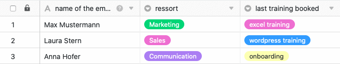



Wenn Sie über ein Enterprise-Abo verfügen, können Sie Benachrichtigungen auch per Automation an ausgewählte Benutzer versenden. Definieren Sie hierfür einfach eine entsprechende Automatisierungsregel für eine beliebige Tabellenansicht.

## Benachrichtigungen per Automation versenden

1. Klicken Sie im Base-Header auf  und im Anschluss auf **Automatisierungsregeln**.
2. Klicken Sie auf **Regel hinzufügen**.
3. Geben Sie der Automation einen **Namen** und legen Sie die **Tabelle** und die **Ansicht** fest, in der diese wirken soll.
4. Definieren Sie ein **Trigger-Ereignis**, welches die Automation auslöst.
5. Klicken Sie auf **Aktion hinzufügen** und wählen Sie als automatisierte Aktion **Benachrichtigung versenden** aus.
6. Bestätigen Sie mit **Abschicken**.

## Anlegen der Automation

Definieren Sie für die Automation zunächst ein **Trigger-Ereignis**.

Die **vier Optionen** sind:

- Einträge erfüllen nach Bearbeitung bestimmte Bedingungen
- Ein neuer Eintrag wird hinzugefügt
- Periodischer Trigger
- Periodischer Trigger für Einträge, die eine bestimmte Bedingung erfüllen

Wählen Sie anschließend als automatisierte Aktion **Benachrichtigung versenden** aus. Diese steht Ihnen bei allen vier Trigger-Optionen als Aktion zur Verfügung.

 

Im nächsten Schritt wählen Sie die **Benutzer** aus, die benachrichtigt werden sollen, wenn das Trigger-Ereignis eintritt. Beachten Sie dabei, dass Sie hier ausschließlich Benutzer auswählen können, die mindestens **Lesezugriff** auf die Tabelle oder Ansicht haben.

Im letzten Schritt fügen Sie den **Inhalt** der Benachrichtigung in das vorgesehene **Textfeld** ein. Um auf Einträge in der Tabelle zu verweisen, schreiben Sie einfach den Namen der Spalten in geschweiften Klammern in den Text.

Speichern Sie die Automation mit einem Klick auf **Abschicken**.

## Anwendungsbeispiel

Ein konkreter **Anwendungsfall** für diese Art von Automation könnte beispielsweise auftreten, wenn Sie als Führungskraft in einem Unternehmen arbeiten und für Ihre Mitarbeiter die Buchung von diversen Schulungen in Auftrag geben möchten. Dabei möchten Sie die Personalabteilung, welche die Schulungen letztlich bucht, automatisch darüber informieren, welche Schulung Ihre Mitarbeiter besuchen möchten.

Konkret umsetzen lässt sich dies mithilfe einer Tabelle, in der verschiedene **Daten** der Mitarbeiter Ihres Unternehmens gepflegt werden. Erheben könnten Sie in diesem Zusammenhang unter anderem die **Namen** der Mitarbeiter, die **Abteilung** und die letzte von ihnen gebuchte Schulung.

Mithilfe einer Automation soll nun automatisch bei jeder neu beantragten Buchung in der Tabelle eine **Benachrichtigung** an ausgewählte Mitarbeiter der Personalabteilung versandt werden, damit diese die Buchung der beantragten Schulung für den entsprechenden Mitarbeiter in die Wege leiten.

### Anlegen der Automation

Als Erstes geben Sie der Automation einen **Namen** (z. B. notification if training is booked) und wählen sowohl die Tabelle (hier: employees & trainings) als auch die Ansicht aus, in der die Automation wirken soll.

Als **Trigger-Ereignis** der Automation wählen Sie die Option "Einträge erfüllen nach Bearbeitung bestimmte Bedingungen".

Damit die Benachrichtigungen ausschließlich im Falle der Beantragung einer neuen Schulung versandt werden, fügen Sie als **Filter-Bedingung** hinzu, dass der Eintrag in der Spalte "last training booked" auf eine der möglichen **Auswahloptionen** in dieser Spalte geändert werden muss.

Als **automatisierte Aktion** definieren Sie anschließend die Aktion "Benachrichtigung versenden".

Im nächsten Schritt wählen Sie im Drop-down-Feld die **Mitarbeiter** der Personalabteilung aus, an welche die **Benachrichtigung** bei Auslösung des Triggers gesendet werden soll.

Im letzten Schritt können Sie den **Inhalt** der zu versendenden Benachrichtigung in das vorgesehene Textfeld schreiben.



### Testen der Automation

Wenn Sie im Anschluss in der ausgewählten Tabelle eine neue Schulung für einen Mitarbeiter beantragen, d.h. den Eintrag in der Spalte "**last training booked**" auf die zuletzt beantragte Schulung ändern, wird die vorgefertigte **Benachrichtigung** automatisch an die ausgewählten Benutzer der Personalabteilung versandt.

Die Mitarbeiter in der Personalabteilung erhalten in der Benachrichtigung, die sie über das Glocken-Symbol  erreichen, die Information, dass eine Schulung beantragt wurde, und können die ausgewählte Schulung für den entsprechenden Mitarbeiter in die Wege leiten.

### Weitere interessante Beispiele für Automationen:

- [Zeilen per Automation sperren]()
- [Verlinken von Einträgen per Automation]()
- [Zeilen per Automation hinzufügen]()
- [Einträge in andere Tabellen per Automation hinzufügen]()
- [E-Mail-Versand per Automation]()
