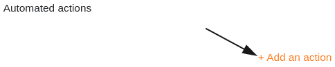



If you have an Enterprise subscription, you can also send notifications to selected users via automation. To do this, simply define an appropriate automation rule for any table view.

## Send notifications via automation

1. In the base header, click  and then click **Automation Rules**.
2. Click **Add Rule**.
3. Give the automation a **name** and specify the **table** and the **view in** which it should act.
4. Define a **trigger event that triggers** the automation.
5. Click **Add Action** and select **Send Notification** as the automated action.
6. Confirm with **Submit**.

## Creating the automation

First define a **trigger event** for the automation.

The **four options** are:

- Entries meet certain conditions after editing
- A new entry is added
- Periodic trigger
- Periodic trigger for entries that meet a certain condition

Then select **Send notification** as the automated action. This is available as an action for all four trigger options.

  

In the next step, you select the **users** to be notified when the trigger event occurs. Note that you can only select users who have at least **read access to** the table or view.

In the last step, paste the **content of** the notification into the **text field** provided. To refer to entries in the table, simply write the name of the columns in curly brackets in the text.

Save the automation by clicking **Submit**.

## Application example

A concrete **use case** for this type of automation could occur, for example, if you work as a manager in a company and want to order the booking of various training courses for your employees. In doing so, you would like to automatically inform the HR department, which ultimately books the trainings, about which training your employees would like to attend.

In concrete terms, this can be implemented with the help of a table in which various **data on** your company's employees is maintained. In this context, you could collect, among other things, the **names of** the employees, the **department** and the last training booked by them.

With the help of an automation, a **notification** should now be sent automatically to selected employees in the HR department whenever a new booking is requested in the table, so that they can initiate the booking of the requested training for the corresponding employee.

### Creating the automation

First, give the automation a **name** (e.g. notification if training is booked) and select both the table (here: employees & trainings) and the view in which the automation should work.

As a **trigger event of** the automation, select the option "Entries meet certain conditions after processing".

In order to send the notifications only in case of requesting a new training, add as a **filter condition** that the entry in the column "last training booked" must be changed to one of the possible **selection options** in this column.

You then define the action "Send notification" as the **automated** action.

In the next step, in the drop-down field, select the **employees of** the HR department to whom the **notification** should be sent when the trigger is triggered.

In the last step you can write the **content of** the notification to be sent in the provided text field.



### Testing the automation

If you subsequently request a new training for an employee in the selected table, i.e. change the entry in the "**last training booked**" column to the last training requested, the prefabricated **notification** is automatically sent to the selected users of the HR department.

The employees in the HR department receive the information that a training has been requested in the notification, which they reach via the bell icon , and can initiate the selected training for the corresponding employee.

### Other interesting examples of automations:

- [rows Lock by automation]()
- [Linking entries via automation]()
- [rows Add via automation]()
- [Add entries to other tables via automation]()
- [E-mail dispatch via automation]()
