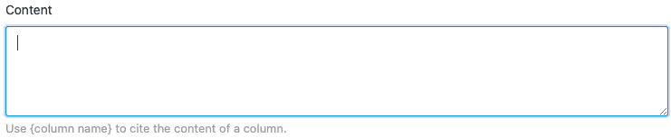



Si dispone de una suscripción Enterprise, también puede enviar notificaciones a usuarios seleccionados mediante automatización. Basta con definir una regla de automatización correspondiente para cualquier vista de tabla.

## Enviar notificaciones mediante automatización

1. Haga clic en  en la cabecera Base y luego en **Reglas de automatización**.
2. Haga clic en **Añadir Regla**.
3. Dé un **nombre** a la automatización y defina la **tabla** y la **vista en la** que debe funcionar.
4. Defina un **evento desencadenante que active** la automatización.
5. Haga clic en **Añadir acción** y seleccione **Enviar notificación** como acción automatizada.
6. Confirme con **Enviar**.

## Creación de la automatización

En primer lugar, defina un **evento desencadenante** para la automatización.

Las **cuatro opciones** son:

- Las entradas cumplen determinadas condiciones tras la edición
- Se añade una nueva entrada
- Activador periódico
- Activación periódica de entradas que cumplen una determinada condición

A continuación, seleccione **Enviar notificación** como acción automatizada. Esto está disponible como acción para las cuatro opciones de activación.

  

En el siguiente paso, seleccione los **usuarios** a los que se notificará cuando se produzca el evento desencadenante. Tenga en cuenta que sólo puede seleccionar usuarios que tengan al menos **acceso de lectura a** la tabla o vista.

En el último paso, inserte el **contenido de** la notificación en el **campo de** texto previsto. Para hacer referencia a las entradas de la tabla, basta con escribir el nombre de las columnas entre llaves en el texto.

Guarde la automatización haciendo clic en **Enviar**.

## Ejemplo de aplicación

Un **caso de uso** concreto para este tipo de automatización podría darse, por ejemplo, si usted trabaja como directivo en una empresa y desea ordenar la reserva de varios cursos de formación para sus empleados. Le gustaría informar automáticamente al departamento de RRHH, que en última instancia es el que reserva la formación, sobre a qué formación les gustaría asistir a sus empleados.

En concreto, esto puede llevarse a cabo con la ayuda de una tabla en la que se mantengan diversos **datos de** los empleados de su empresa. En este contexto, podrías recoger, entre otras cosas, los **nombres de** los empleados, el **departamento** y la última formación que reservaron.

Con la ayuda de una automatización, ahora se enviará automáticamente una **notificación** a los empleados seleccionados del departamento de RR.HH. por cada nueva reserva solicitada en la tabla, para que inicien la reserva de la formación solicitada para el empleado correspondiente.

### Creación de la automatización

En primer lugar, dé un **nombre** a la automatización (por ejemplo, notificación si se ha reservado una formación) y seleccione tanto la tabla (aquí: empleados y formaciones) como la vista en la que debe funcionar la automatización.

Como **evento desencadenante de** la automatización, seleccione la opción "Las entradas cumplen determinadas condiciones tras el procesamiento".

Para que las notificaciones se envíen sólo en caso de solicitud de un nuevo entrenamiento, añada como **condición de** filtro que la entrada de la columna "último entrenamiento reservado" se cambie por una de las posibles **opciones de selección** de esta columna.

A continuación, defina la acción "Enviar notificación" como acción **automatizada**.

En el siguiente paso, seleccione en el campo desplegable los miembros del **personal** del departamento de RRHH a los que debe enviarse la **notificación** cuando se active el activador.

En el último paso, puede escribir el **contenido de** la notificación que se enviará en el campo de texto proporcionado.



### Probar la automatización

Si posteriormente solicita una nueva formación para un empleado en la tabla seleccionada, es decir, cambia la entrada de la columna**"última formación reservada**" por la última formación solicitada, la **notificación** prefabricada se envía automáticamente a los usuarios seleccionados del departamento de RRHH.

Los empleados del departamento de RRHH reciben la información de que se ha solicitado una formación en la notificación, a la que llegan a través del símbolo de campana , y pueden iniciar la formación seleccionada para el empleado correspondiente.

### Otros ejemplos interesantes de automatización:

- [Bloquear líneas mediante automatización]()
- [Vinculación de entradas mediante automatización]()
- [Añadir líneas mediante automatización]()
- [Añadir entradas a otras tablas mediante automatización]()
- [Envío automatizado de correos electrónicos]()
