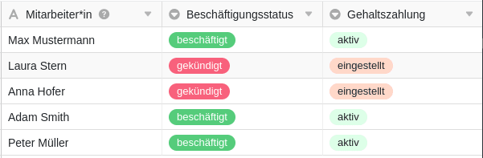



Automationen sind ein mächtiges Feature von SeaTable, mit dem Sie Prozesse automatisieren können. Durch die Automatisierung von Arbeitsschritten sparen Sie nicht nur Zeit, sondern minimieren auch menschliche Fehler bei der Arbeit mit Daten.

## Grundlegende Informationen

- Automationen werden immer individuell für eine **Tabelle** und eine **Ansicht** angelegt. Sie wirken folglich **ausschließlich** in der ausgewählten Tabellenansicht.
- Die beiden wichtigsten Komponenten einer Automation stellen das **Trigger-Ereignis** und die **automatisierte(n) Aktion(en)** dar.

## Trigger-Ereignisse

Als sogenannter Trigger wird ein Ereignis bezeichnet, das als **Auslöser** der Automation fungiert. Dieses Ereignis legen Sie für jede Automatisierungsregel individuell fest. Als Trigger kann fungieren, dass in einer Tabellenansicht **Einträge hinzugefügt werden** oder **nach der Bearbeitung bestimmte Bedingungen erfüllen**. Ebenso kann ein **periodischer Trigger**, also ein bestimmter Zeitpunkt in einem festgelegten Intervall (täglich, wöchentlich oder monatlich), eine Automation auslösen.

Für bestimmte Ereignisse, wie zum Beispiel das Hinzufügen von Einträgen, können Sie darüber hinaus noch weitere **Einstellungen** vornehmen. So können Sie beispielsweise festlegen, ob **alle Spalten** in der Tabellenansicht oder lediglich ausgewählte Spalten auf das Eintreten des Trigger-Ereignisses hin **überwacht** werden sollen. Wenn Sie in diesem Zusammenhang vereinzelte Spalten auswählen, wird die Automation auch nur dann ausgelöst, wenn das Ereignis in den ausgewählten Spalten eintritt.

Zusätzlich können Sie die **Bedingungen** des Trigger-Ereignisses so weit eingrenzen, dass die Automation ausschließlich ausgelöst wird, wenn in bestimmten Spalten **bestimmte Daten** zu finden sind. Zum Beispiel können Sie exakte Werte definieren, die in einer ausgewählten Spalte nach dem Hinzufügen oder der Änderung eines Eintrags vorliegen müssen, damit die Automation ausgelöst wird.

Alles Weitere erfahren Sie im Artikel [Automations-Trigger]().

## Automatisierte Aktionen

Als automatisierte Aktionen werden jene **Aktionen** bezeichnet, die durch Eintreten des festgelegten Trigger-Ereignisses **ausgelöst werden**. Automatisierte Aktionen sind daher immer eine **Folge** von Trigger-Ereignissen und treten **nur** auf, wenn jene Ereignisse unter den festgelegten Bedingungen eintreten.

Je nach ausgewähltem Ereignis stehen Ihnen dabei unterschiedliche Aktionen zur Auswahl, wie zum Beispiel das **Versenden einer E-Mail** oder **Benachrichtigung** an einen oder mehrere Benutzer oder das **Hinzufügen, Ändern oder Sperren eines Eintrags**.

Für bestimmte Aktionen können Sie darüber hinaus weitere **Einstellungen** vornehmen. So können Sie etwa für das Hinzufügen und die Änderung eines Eintrags festlegen, welcher Wert in welcher Spalte der Tabelle neu hinzugefügt wird bzw. zu welchem Wert Sie einen bereits bestehenden Wert ändern möchten, sobald ein bestimmter Fall eintritt. 

Wenn Sie mehr über automatisierte Aktionen lernen möchten, lesen Sie den Artikel [Automations-Aktionen]().

## Funktionsweise von Automationen

Die [Funktionsweise von Automationen]() wird im Folgenden anhand eines Beispiels ausführlicher erläutert. 

Die im Bild zu sehende Beispiel-Tabelle könnten Sie in der Personal-Abteilung eines Unternehmens verwenden, um neben den **Namen** von Mitarbeitern deren **Beschäftigungsstatus** sowie den Status ihrer **Gehaltszahlungen** zu erfassen.

Für die Tabellenansicht erstellen Sie anschließend eine **Automation**, die einen Arbeitsschritt automatisieren soll. Konkret soll dabei automatisiert werden, dass im Falle der Kündigung eines Mitarbeiters (und der damit verbundenen Änderung des Eintrags in der Spalte **Beschäftigungsstatus** von "beschäftigt" zu "gekündigt") der Eintrag in der Spalte **Gehaltszahlung** von "aktiv" auf "eingestellt" angepasst wird.

Um diesen Prozessschritt zu automatisieren, definieren Sie als **Trigger** zunächst das Ereignis "Eintrag erfüllt nach Änderung bestimmte Bedingungen". Als **zu überprüfende Spalte** geben Sie die Spalte "Beschäftigungsstatus" an. Als konkrete **Bedingung** für die Auslösung der Automation legen Sie fest, dass der Eintrag in der entsprechenden Spalte zu "gekündigt" geändert werden muss.

Als **automatisierte Aktion** wählen Sie im Anschluss die Option **Eintrag bearbeiten** aus. Konkret soll nach Auslösung des Trigger-Ereignisses der Eintrag in der Spalte "Gehaltszahlung" von "aktiv" zu "eingestellt" geändert werden.

Nachdem Sie die Automation angelegt haben, führt die manuell vorgenommene Änderung in der Spalte "Beschäftigungsstatus" **automatisch** zur gewünschten **Anpassung des Eintrags** in der Spalte "Gehaltszahlung".
