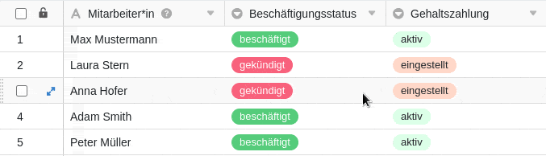



Las automatizaciones son una potente función de SeaTable que le permite automatizar procesos. Al automatizar los pasos, no sólo se ahorra tiempo, sino que también se minimizan los errores humanos al trabajar con datos.

## Información básica

- Las automatizaciones se crean siempre individualmente para una **tabla** y una **vista**. Por lo tanto, **sólo** funcionan en la vista de tabla seleccionada.
- Los dos componentes más importantes de una automatización son el **evento desencadenante** y la(s) **acción(es) automatizada(s)**.

## Eventos desencadenantes

Un disparador es un evento que actúa como **desencadenante de** la automatización. Este evento se define individualmente para cada regla de automatización. Un desencadenante puede ser la **adición de entradas en** una vista de tabla o el **cumplimiento de determinadas condiciones tras la edición**. Del mismo modo, un **disparador periódico**, es decir, un momento determinado a un intervalo fijo (diario, semanal o mensual), puede activar una automatización.

Para determinados eventos, como la adición de entradas, también puede realizar otros **ajustes**. Por ejemplo, puede determinar si **todas las columnas** de la vista de tabla o sólo las columnas seleccionadas deben **supervisarse** para detectar la aparición del evento desencadenante. Si selecciona columnas individuales en este contexto, la automatización sólo se activa si el evento se produce en las columnas seleccionadas.

Además, puede limitar las **condiciones** del evento desencadenante para que la automatización sólo se active si se encuentran **determinados datos** en determinadas columnas. Por ejemplo, puede definir los valores exactos que deben estar presentes en una columna seleccionada después de añadir o modificar una entrada para que se active la automatización.

Puede consultar todo lo demás en el artículo [Desencadenante de automatización]().

## Acciones automatizadas

Las acciones automatizadas son aquellas **que** **se desencadenan** al producirse el evento desencadenante especificado. Por tanto, las acciones automatizadas son siempre una **secuencia de** eventos desencadenantes y **sólo** se producen cuando esos eventos se dan en las condiciones especificadas.

En función del evento seleccionado, puede elegir entre distintas acciones, como **enviar un correo electrónico** o una **notificación** a uno o varios usuarios o **añadir, modificar o bloquear una entrada**.

Para determinadas acciones, también puede añadir más **Ajustes** para hacer cambios. Por ejemplo, al añadir y modificar una entrada, puede especificar qué valor debe añadirse en qué columna de la tabla o a qué valor desea cambiar un valor ya existente en cuanto se produzca un determinado caso.



Si desea obtener más información sobre las acciones [automatizadas](https://seatable.io/es/docs/arbeiten-mit-automationen/automations-aktionen/), lea el artículo [Acciones de automatización](https://seatable.io/es/docs/arbeiten-mit-automationen/automations-aktionen/).

## Cómo funcionan las automatizaciones

En [Cómo funcionan las automatizaciones](https://seatable.io/es/docs/arbeiten-mit-automationen/funktionsweise-von-automationen/) se explica con más detalle a continuación con la ayuda de un ejemplo.



Podría utilizar la tabla de ejemplo que se muestra en la imagen en el departamento de recursos humanos de una empresa para registrar no sólo los **nombres de los** empleados, sino también su **situación laboral** y el estado de sus **pagos salariales**.

Para la vista de tabla, cree una **automatización** que automatice un paso de trabajo. En concreto, desea automatizar que, en caso de baja de un empleado (y el cambio asociado de la entrada en la columna de **estado laboral** de "empleado" a "dado de baja"), la entrada en la columna de **pago de salario** se ajuste de "activo" a "discontinuado".

Para automatizar este paso del proceso, defina primero el evento "La entrada cumple determinadas condiciones tras la modificación" como **desencadenante**. Especifique la columna "situación laboral" como columna a **comprobar**. Como **condición concreta para** activar la automatización, defina que la entrada en la columna correspondiente debe cambiarse a "finalizado".

Como **acción automatizada**, seleccione la opción **Editar entrada**. En concreto, tras activarse el evento desencadenante, la entrada de la columna "Pago de salario" debe cambiarse de "activa" a "fijada".

Una vez creada la automatización, el cambio realizado manualmente en la columna "Situación laboral" conlleva **automáticamente** el **ajuste deseado de la entrada** en la columna "Pago de salario".
