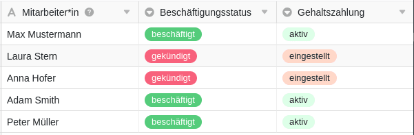
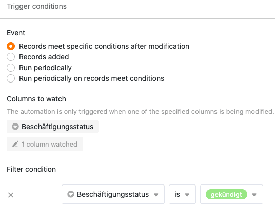
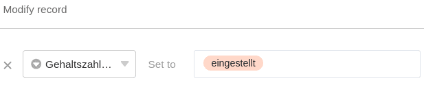
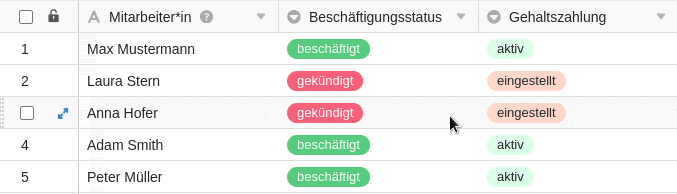



L'automatisation est une fonctionnalité puissante de SeaTable qui vous permet d'automatiser les processus. L'automatisation des étapes de travail vous permet non seulement de gagner du temps, mais aussi de minimiser les erreurs humaines lorsque vous travaillez avec des données.

## Informations de base

- Les automatisations sont toujours créées individuellement pour un **tableau** et une **vue**. Elles n'agissent donc **que** dans la vue de tableau sélectionnée.
- Les deux composantes principales d'une automatisation sont l'**événement déclencheur** et la ou les **actions automatisées**.

## Événements déclencheurs

On appelle déclencheur un événement qui fait office de **déclencheur** de l'automatisation. Vous définissez cet événement individuellement pour chaque règle d'automatisation. Un déclencheur peut être l'**ajout d'entrées** dans une vue de tableau ou la réalisation de **certaines conditions après le traitement**. De même, un **déclencheur périodique**, c'est-à-dire un moment précis dans un intervalle défini (quotidien, hebdomadaire ou mensuel), peut déclencher une automatisation.

Pour certains événements, comme par exemple l'ajout d'entrées, vous pouvez également définir d'autres **paramètres**. Vous pouvez par exemple déterminer si **toutes les colonnes** de la vue du tableau ou seulement des colonnes sélectionnées doivent être **surveillées** pour la survenue de l'événement déclencheur. Si vous sélectionnez des colonnes isolées, l'automatisation ne sera déclenchée que si l'événement se produit dans les colonnes sélectionnées.

En outre, vous pouvez limiter les **conditions** de l'événement déclencheur de telle sorte que l'automatisation ne soit déclenchée que si **certaines données** se trouvent dans certaines colonnes. Par exemple, vous pouvez définir les valeurs exactes qui doivent être présentes dans une colonne sélectionnée après l'ajout ou la modification d'une entrée pour que l'automatisation soit déclenchée.

Pour en savoir plus, consultez l'article [Déclencheurs d'automatisation]().

## Actions automatisées

Les **actions** automatisées sont celles qui **sont déclenchées** par la survenue de l'événement déclencheur défini. Les actions automatisées sont donc toujours une **suite** d'événements déclencheurs et ne se produisent **que** si ces événements se produisent dans les conditions définies.

Selon l'événement sélectionné, vous avez le choix entre différentes actions, comme par exemple l'**envoi d'un e-mail** ou **d'une notification** à un ou plusieurs utilisateurs ou l'**ajout, la modification ou le blocage d'une entrée**.

Pour certaines actions, vous pouvez en outre utiliser d'autres **Réglages** de la colonne. Ainsi, pour l'ajout et la modification d'une entrée, vous pouvez définir quelle valeur doit être ajoutée dans quelle colonne du tableau ou pour quelle valeur vous souhaitez modifier une valeur existante dès qu'un cas particulier se présente.



Si vous souhaitez en savoir plus sur les actions automatisées, lisez l'article [Actions automatisées]().

## Fonctionnement des automatisations

Le site [Fonctionnement des automatisations]() est expliquée plus en détail ci-dessous à l'aide d'un exemple.



L'exemple de tableau présenté dans l'image pourrait être utilisé par le service du personnel d'une entreprise pour saisir, outre les **noms** des collaborateurs, leur **statut d'emploi** ainsi que le statut de leur **paiement de salaire**.

Pour la vue tableau, vous créez ensuite une **automatisation** qui doit automatiser une étape de travail. Concrètement, il s'agit d'automatiser le fait qu'en cas de licenciement d'un collaborateur (et donc de modification de l'entrée dans la colonne **Statut d'emploi** de "occupé" à "licencié"), l'entrée dans la colonne **Paiement du salaire** soit adaptée de "actif" à "suspendu".

Pour automatiser cette étape du processus, définissez d'abord comme **déclencheur** l'événement "L'entrée remplit certaines conditions après modification". Comme **colonne à contrôler**, vous indiquez la colonne "Statut d'emploi". Comme **condition** concrète pour le déclenchement de l'automatisation, vous définissez que l'entrée dans la colonne correspondante doit être modifiée en "résilié".

Comme **action automatisée**, sélectionnez ensuite l'option **Modifier l'entrée**. Concrètement, après le déclenchement de l'événement déclencheur, l'entrée dans la colonne "Paiement du salaire" doit passer de "actif" à "réglé".

Après avoir créé l'automation, la modification apportée manuellement dans la colonne "Statut d'emploi" entraîne **automatiquement** l'**adaptation** souhaitée **de l'entrée** dans la colonne "Paiement du salaire".
