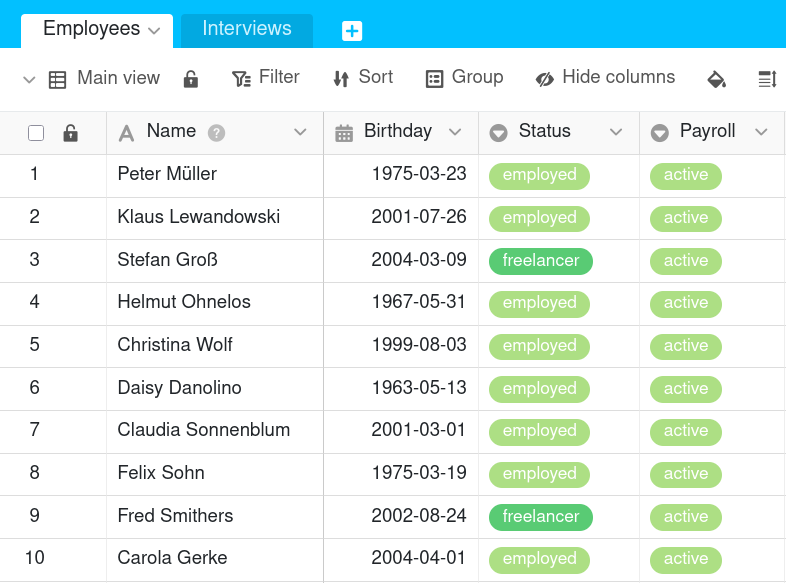
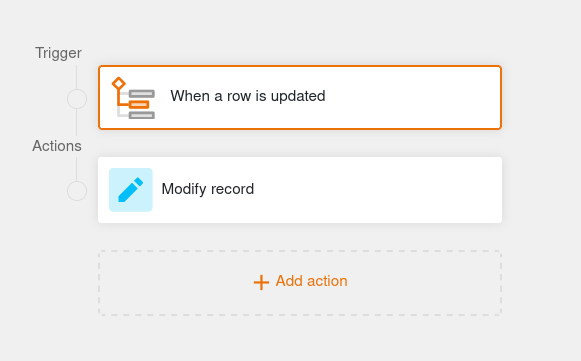
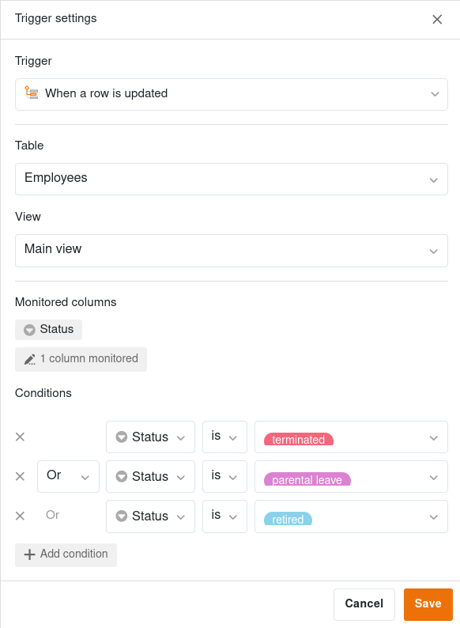
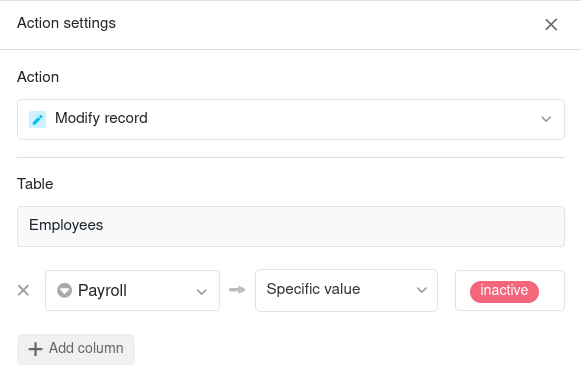
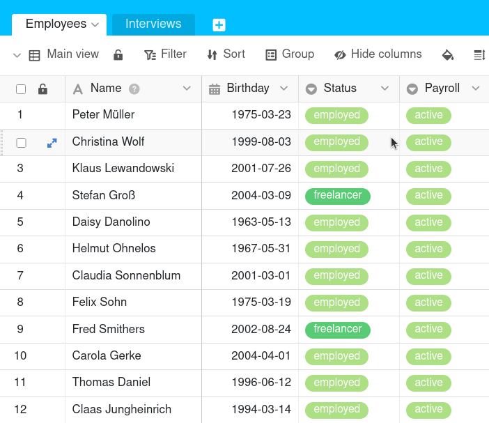



L'automatisation est une fonctionnalité puissante de SeaTable qui vous permet d'automatiser les processus. L'automatisation des étapes de travail vous permet non seulement de gagner du temps, mais aussi de minimiser les erreurs humaines lorsque vous travaillez avec des données.

## Informations de base

- Les automatisations sont toujours créées en tant que règles d'automatisation individuelles qui se rapportent à une **vue de tableau** spécifique.
- Les deux composantes principales d'une automatisation sont l'**événement déclencheur** et la ou les **action(s) automatisée(s)**.

## Événements déclencheurs

On appelle déclencheur un événement qui fait office de **déclencheur** de l'automatisation. Vous définissez cet événement individuellement pour chaque règle d'automatisation. Un déclencheur peut être **l'ajout ou la modification de lignes dans une vue de tableau**. De même, une **heure** spécifique à un intervalle défini (quotidien, hebdomadaire ou mensuel) peut déclencher une automatisation.

Pour certains événements, comme par exemple l'ajout d'enregistrement, vous pouvez également définir d'autres **paramètres**. Vous pouvez par exemple déterminer si **toutes les colonnes** de la vue du tableau ou seulement des colonnes sélectionnées doivent être **surveillées** pour la survenue de l'événement déclencheur. Si vous sélectionnez des colonnes, l'automatisation ne sera déclenchée que si l'événement se produit dans les colonnes sélectionnées.

En outre, vous pouvez limiter les **conditions** de l'événement déclencheur de telle sorte que l'automatisation ne soit déclenchée que si **certaines données** se trouvent dans certaines colonnes. Par exemple, vous pouvez définir les valeurs exactes qui doivent être présentes dans une colonne sélectionnée après l'ajout ou la modification d'un enregistrement pour que l'automatisation soit déclenchée.

Pour en savoir plus, consultez l'article [Déclencheurs d'automatisation]().

## Actions automatisées

Les **actions** automatisées sont celles qui **sont déclenchées** par la survenue de l'événement déclencheur défini. Les actions automatisées sont donc toujours une **suite** d'événements déclencheurs et ne se produisent que si ces événements se produisent dans les conditions définies.

Selon l'événement sélectionné, vous avez le choix entre différentes actions, comme par exemple l'**envoi d'un e-mail** ou **d'une notification** à un ou plusieurs utilisateurs, **l'ajout, la modification ou le blocage d'un enregistrement** ou **l'exécution de scripts Python ou de fonctions d'IA**

Pour de nombreuses actions, d'autres **conditions préalables** doivent être remplies. Par exemple, vous avez besoin de certains types de colonnes, d'un compte de messagerie ou de modèles dans le plug-in de conception de pages ou de rapports pour permettre des automatisations plus complexes.



Si vous souhaitez en savoir plus sur les actions automatisées, lisez l'article [Actions automatisées]().

## Fonctionnement des automatisations

Le fonctionnement des automatisations est expliqué plus en détail ci-dessous à l'aide d'un exemple.



L'exemple de tableau présenté dans l'image pourrait être utilisé par le service des ressources humaines d'une entreprise pour enregistrer, outre les données des employés, leur **statut d'emploi** ainsi que le statut des **paiements de salaire**.

Pour la vue de la table, vous créez ensuite une **automation** qui doit automatiser une étape de travail. Concrètement, en cas de départ d'un employé, c'est-à-dire chaque fois que l'entrée dans la colonne **Statut** passe de "employé" ou "freelance" à "terminé", "congé parental" ou "à la retraite", l'entrée dans la colonne **Payroll** doit passer d'"actif" à "inactif".

Pour automatiser cette étape du processus, définissez d'abord comme **trigger** l'événement "Lorsqu'une ligne est mise à jour". Dans les paramètres du déclencheur, sélectionnez la **Table** et la **Vue** et indiquez la colonne "Statut" comme **Colonne surveillée**. Comme **condition** concrète pour le déclenchement de l'automation, vous définissez que la ligne modifiée doit avoir la valeur "terminé", "congé parental" ou "à la retraite" dans la colonne correspondante.

Comme **action automatisée**, sélectionnez ensuite l'option **Modifier l'enregistrement**. Concrètement, après le déclenchement de l'événement déclencheur, l'entrée dans la colonne "Payroll" doit passer d'"active" à "inactive".

Après avoir créé l'automation, la modification manuelle dans la colonne "Statut" déclenche **automatiquement l'ajustement souhaité de l'entrée** dans la colonne "Payroll".

