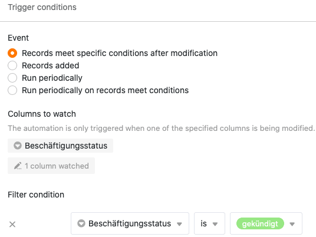



As automatizações são uma característica poderosa do SeaTable que lhe permite automatizar processos. Ao automatizar passos, não só poupa tempo, como também minimiza o erro humano ao trabalhar com dados.

## Informação básica

- As automatizações são sempre criadas individualmente para uma **mesa** e uma **vista**. Trabalham, portanto, **apenas** na vista da tabela seleccionada.
- Os dois componentes mais importantes de uma automatização são o **evento de disparo** e a **(s) acção(ões) automatizada** (s).

## Eventos de desencadeamento

O chamado gatilho é um evento que actua como um **gatilho para** a automatização. Define-se este evento individualmente para cada regra de automatização. Um gatilho pode ser a **adição de entradas** numa vista de tabela ou o **cumprimento de certas condições após a edição**. Do mesmo modo, um **disparo periódico**, ou seja, um determinado momento num intervalo fixo (diário, semanal ou mensal), pode desencadear uma automatização.

Para certos eventos, tais como a adição de entradas, também é possível fazer outras **configurações**. Por exemplo, pode determinar se **todas as colunas** da vista de tabela ou apenas as colunas seleccionadas devem ser **monitorizadas** para a ocorrência do evento de disparo. Se seleccionar colunas individuais neste contexto, a automatização só é accionada se o evento ocorrer nas colunas seleccionadas.

Além disso, é possível limitar as **condições do** evento de disparo para que a automatização só seja disparada se **determinados dados** forem encontrados em determinadas colunas. Por exemplo, é possível definir valores exactos que devem estar presentes numa coluna seleccionada após adicionar ou alterar uma entrada para que a automatização seja accionada.

Pode descobrir tudo o resto no artigo [Automation Trigger]().

## Acções automatizadas

As acções automatizadas são aquelas **acções** que são **desencadeadas** pela ocorrência do evento de desencadeamento especificado. As acções automatizadas são portanto sempre uma **sequência de** eventos de desencadeamento e **só** ocorrem quando esses eventos ocorrem sob as condições especificadas.

Dependendo do evento seleccionado, pode escolher entre diferentes acções, tais como **enviar um e-mail** ou **notificação** a um ou mais utilizadores ou **acrescentar, alterar ou bloquear uma entrada**.

Para certas acções, pode também acrescentar mais **Definições** para fazer alterações. Por exemplo, ao acrescentar e alterar uma entrada, pode especificar que valor deve ser acrescentado em que coluna da tabela ou a que valor pretende alterar um valor já existente, logo que ocorra um determinado caso.



Se quiser saber mais sobre acções automatizadas, leia o artigo [Acções de Automatização]().

## Funcionalidade das automatizações

O [Funcionalidade das automatizações]() é explicado em mais detalhe abaixo, com a ajuda de um exemplo.



Poderá utilizar o quadro de exemplo apresentado na figura no departamento de recursos humanos de uma empresa para registar, para além dos **nomes dos** empregados, o seu **estatuto profissional**, bem como o estatuto dos seus **pagamentos salariais**.

Para a vista de tabela, cria-se uma **automatização** que deve automatizar uma etapa de trabalho. Especificamente, pretende automatizar que, no caso da rescisão de um empregado (e a alteração associada da entrada na coluna **do estado de emprego** de "empregado" para "rescindido"), a entrada na coluna do **pagamento do salário** seja ajustada de "ativo" para "descontinuado".

Para automatizar esta etapa do processo, definir primeiro o evento "A entrada satisfaz determinadas condições após a modificação" como um **acionador**. Especificar a coluna "status de emprego" como a coluna a ser **verificada**. Como **condição** concreta **para** acionar a automatização, definir que a entrada na coluna correspondente deve ser alterada para "rescindido".

Como **ação automática**, selecionar a opção **Processar entrada**. Especificamente, depois de o evento de acionamento ter sido acionado, a entrada na coluna "Pagamento do salário" deve ser alterada de "ativo" para "definido".

Depois de ter criado a automatização, a alteração efectuada manualmente na coluna "Situação profissional" conduz **automaticamente** ao **ajustamento** desejado **da entrada** na coluna "Pagamento do salário".
