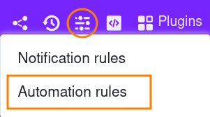
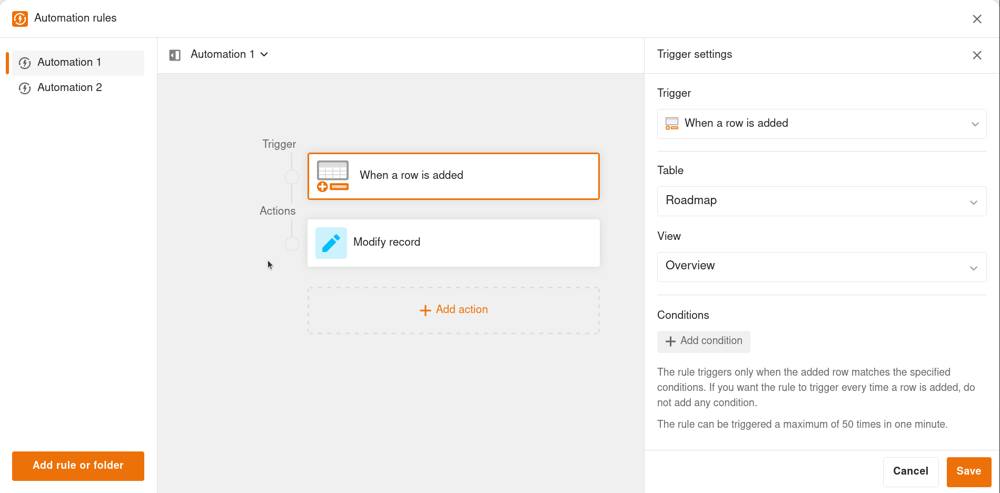



Автоматизации – это полезная функция SeaTable, которая помогает вам **автоматизировать рабочие процессы**. С помощью автоматизации можно не только **сэкономить время**, но и **свести к минимуму** количество **человеческих ошибок** при обслуживании данных, поскольку автоматически выполненные этапы процесса больше не должны выполняться пользователем вручную.

Соответственно, автоматизация дает особенно большой эффект в **больших массивах данных**, в которых она может обрабатывать большое количество рабочих процессов.

Следующая статья призвана дать вам обзор темы автоматизации в SeaTable и содержит ссылки на различные справочные статьи по этой функции.

## Редактор автоматизации SeaTable

Вы можете получить доступ к редактору автоматизации базы через соответствующую иконку в заголовке базы.

Редактор автоматизации занимает всю ширину окна и поэтому обеспечивает четкую компоновку: **список всех существующих правил автоматизации** расположен с левой стороны. Поэтому переключение между двумя правилами осуществляется одним щелчком мыши. Здесь Вы также можете добавлять новые правила и управлять существующими.

В центральной области Вы можете увидеть конфигурацию выбранной в данный момент автоматизации. Она состоит из **триггера** и одного или нескольких **действий**. Настройки триггера или действий отображаются динамически с правой стороны - в зависимости от того, на какой элемент Вы только что нажали.

Вы также можете свернуть список правил автоматизации, чтобы освободить больше места в центральной области. Еще один фактор удобства – **переменная высота панели редактора**. Это позволяет Вам видеть вид, названия столбцов и записи данных, пока Вы работаете над автоматизацией.

## Создать автоматизацию

Первый шаг к автоматизации рабочих процессов – это создание автоматизации. Чтобы убедиться, что все идет по плану и что созданные правила автоматизации дают желаемый эффект, мы обобщили самую важную информацию для вас в этой статье.

Узнайте, как создать автоматизацию, [здесь]().

## Управление автоматизаций

Вы, конечно, можете редактировать уже созданные, активные автоматизации впоследствии. В этой статье мы покажем вам, какие настройки вы можете сделать при автоматизации рабочих процессов.

Узнайте больше об управлении автоматизациями [здесь]().

## Функциональные возможности автоматики

Эта статья объясняет основы работы автоматизаций в SeaTable и поэтому подходит в качестве **введения в тему автоматизаций**.

Подробнее о том, как работают автоматизированные системы, можно узнать [здесь]().

## Триггер автоматизации

Триггеры автоматизации - это первый из двух основных компонентов автоматизации. Триггеры, которые вы можете установить индивидуально для каждой автоматизации, запускают различные типы автоматических действий.

Узнайте больше о триггерах автоматизации [здесь]().

## Действия автоматизации

Автоматизированные действия представляют собой второй из двух основных компонентов автоматизаций. Действия запускаются определенными триггерными событиями. В зависимости от триггера SeaTable может выполнять различные действия по автоматизации.

Узнать больше о действиях по автоматизации можно [здесь]().

## Отображение журнала выполнения автоматизации

Чтобы проверить выполнение автоматизаций, у вас есть возможность отобразить журнал выполнения для каждого правила автоматизации. Здесь вы можете просмотреть информацию о каждом запуске автоматизации.

Подробнее о журнале выполнения автоматизации можно узнать [здесь]().

## Остановить автоматизацию

Активные автоматизации, которые больше не нужны в течение определенного периода времени, можно просто приостановить и снова активировать по мере необходимости.

Узнать, как остановить автоматизацию, можно [здесь]().

## Удалить автоматизацию

Вы также можете удалить автоматизацию, которая больше не нужна. Обратите внимание, что восстановить удаленные автоматизации невозможно.

Узнать, как удалить автоматизацию, можно [здесь]().

## Блокировать строки с помощью автоматизации

С помощью автоматизаций вам больше не придется блокировать строки в таблицах вручную, а можно сделать так, чтобы блокировка выполнялась автоматически. Это очень полезно, если вы всегда хотите предотвратить дальнейшее редактирование строки после определенного момента времени (например, когда процесс завершен).

Узнайте [здесь](), как блокировать строки с помощью автоматизации.

## Добавлять строки с помощью автоматизации

С помощью автоматизаций вам больше не придется вручную добавлять строки с определенными записями в таблицы, эти действия могут выполняться автоматически. Это особенно удобно, если вы хотите автоматизировать различные этапы процесса в ваших таблицах.

Узнать, как добавлять строки с помощью автоматизации, можно [здесь]().

## Добавление записей в другие таблицы с помощью автоматизации

С помощью автоматизаций вам больше не придется вносить записи в другие таблицы вручную, эти действия будут выполняться автоматически. Большим преимуществом этого является то, что триггер не обязательно должен находиться в той же таблице, что и запускаемое действие. Такая автоматизация особенно выгодна, если вы используете различные таблицы, содержимое которых связано друг с другом.

Узнайте [здесь](), как добавить записи в другие таблицы с помощью автоматизации.

## Отправка по электронной почте с помощью автоматики

С помощью автоматизаций вам больше не придется вручную отправлять электронные письма выбранным пользователям, а можно сделать так, чтобы они отправлялись автоматически. Это особенно полезно, если, например, вы хотите немедленно информировать пользователей об изменениях в данных определенных таблиц.

Узнайте [здесь](), как можно отправлять электронные письма с помощью автоматизации.

## Связывание записей с помощью автоматизации

С помощью автоматизаций вам больше не придется связывать записи в таблицах вручную, эти действия могут выполняться автоматически. Это полезно, если вам нужны определенные данные в нескольких таблицах.

Узнайте [здесь](), как связать записи с помощью автоматизации.

## Почему я не могу найти автоматизацию в своей базе?

Не можете найти функцию автоматизации в своих базах? Возможно, это как-то связано с вашей подпиской на SeaTable.

Узнайте [здесь](), почему это может быть так.