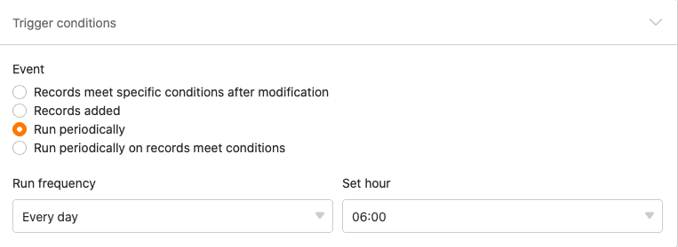

With the help of automations, you no longer have to perform a data processing operation manually, but can have it performed automatically. The variety of [data processing operations](https://seatable.io/en/docs/datenverarbeitung/datenverarbeitungsoperationen-in-seatable/) available - from mathematical calculations to creating links between values in different tables - opens up new possibilities for automating your work processes.

## Perform a data processing operation by automation

1. In the Base header, click  and then click **Automation Rules**.
2. Click **Add Rule**.
3. Give the automation a **name** and specify the **table** and **view in** which it should be triggered.
4. Define a **trigger event that triggers** the automation.
5. Click **Add Action** and select **Run Data Processing Operation** as the automated action.
6. Select any **data processing operation**.
7. Make the necessary **settings** (e.g. table, source column, result column) on the **data processing operation**.
8. Confirm with **Submit**.

## Creating the automation

After you have defined in which **table** and **view the** automation should be triggered, you define the [trigger event](https://seatable.io/en/docs/automationen/automations-trigger/). Currently, only a **periodic trigger** can result in a data processing operation. Therefore, you need to define a **time when** the automation should be triggered daily, weekly or monthly.



