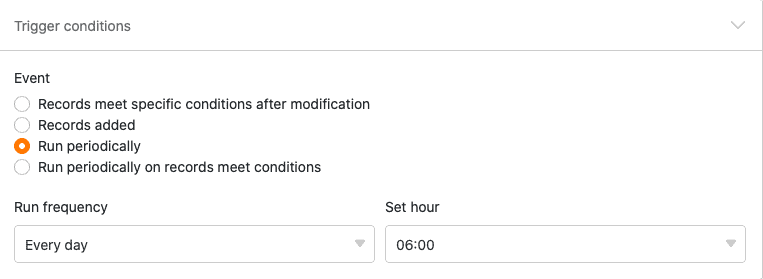

Com a ajuda da automatização, já não é necessário executar uma operação de processamento de dados manualmente, mas sim automaticamente. A variedade de [operações de processamento de dados](https://seatable.io/pt/docs/datenverarbeitung/datenverarbeitungsoperationen-in-seatable/) disponíveis - desde cálculos matemáticos até à criação de ligações entre valores em diferentes tabelas - abre novas possibilidades para automatizar os seus processos de trabalho.

## Efectuar uma operação de tratamento de dados por automatização

1. Clique em  no cabeçalho da Base e depois nas **Regras de Automatização**.
2. Clique em **Add Rule (Adicionar regra)**.
3. Dê um **nome** à automatização e defina a **tabela** e a **vista em** que esta deve ser accionada.
4. Definir um **evento de disparo que desencadeia** a automatização.
5. Clique em **Adicionar acção** e seleccione **Executar operação de processamento de dados** como a acção automatizada.
6. Seleccionar qualquer **operação de processamento de dados**.
7. Efectuar as **opções** necessárias (por exemplo, tabela, coluna de origem, coluna de resultados) na **operação de processamento de dados**.
8. Confirmar com **Submeter**.

## Criar a automatização

Depois de determinar em que **tabela** e **visão a** automatização deve ser accionada, definir o [evento de accionamento](https://seatable.io/pt/docs/automationen/automations-trigger/). Atualmente, apenas um **acionador periódico** pode resultar em uma operação de processamento de dados. Portanto, é necessário definir um **momento** em que a automação deve ser acionada diariamente, semanalmente ou mensalmente.



