Con la ayuda de [las automatizaciones](https://seatable.io/es/docs/automationen/uebersicht-ueber-automationen/), ya no tiene que registrar **manualmente** las horas de un cambio de estado, sino que puede hacer que SeaTable lo haga **automáticamente**.

## Registre las horas de los cambios de estado mediante automatización

1. Haga clic en  en la cabecera Base y luego en **Reglas de automatización**.
2. Haga clic en **Añadir Regla**.
3. Dé un **nombre** a la automatización y defina la **tabla** y la **vista en las** que debe funcionar.
4. Defina el **evento desencadenante que activa** la automatización.
5. Haga clic en **Añadir Acción** y seleccione **Añadir Nueva Entrada en Otra Tabla** como acción automatizada.
6. Defina la **tabla** en la que se insertará la entrada y los **campos** precumplimentados.
7. Confirme con **Enviar**.

## Creación de la automatización

En primer lugar, defina el **evento desencadenante** adecuado para la automatización.



A continuación, seleccione **Añadir nueva entrada en otra** tabla como acción automatizada.

 

En el siguiente paso, seleccione la **tabla** en la que se añadirá la entrada tras activarse el disparador.

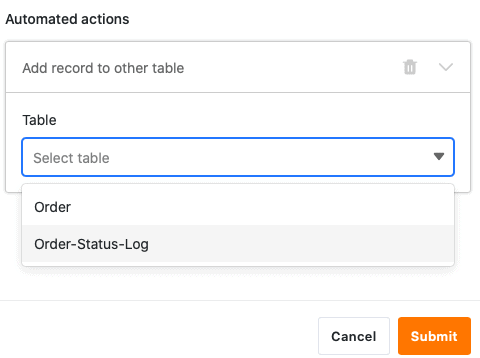

A continuación, haga clic en **Añadir campo** para seleccionar las columnas para las que desea definir valores fijos en la nueva entrada.

Seleccione ahora la **columna** correspondiente en el menú desplegable y defina el **valor** precargado en el campo de entrada. Dependiendo del [tipo de columna](https://seatable.io/es/docs/arbeiten-mit-spalten/uebersicht-alle-spaltentypen/) seleccionado, tiene diferentes **opciones** para elegir.

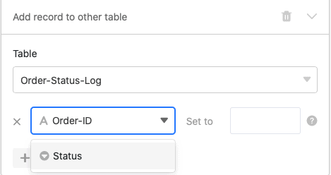

Por último, confirme la automatización haciendo clic en **Enviar**.

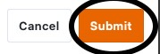

## Ejemplo de aplicación

Un **caso de uso** concreto para este tipo de automatización podría darse, por ejemplo, si desea registrar los distintos **pedidos de** su empresa en una tabla.

Al hacerlo, desea registrar automáticamente en otra tabla los **momentos** en los que se producen **cambios** en el estado del pedido de uno o varios pedidos de su tabla. De este modo, podrá controlar el **estado** de sus pedidos en todo momento y realizar un seguimiento de cada **cambio de estado**, desde "pago requerido" hasta "producto entregado correctamente".

Concretamente, esto puede hacerse con la ayuda de una tabla ("Pedido") en la que registre los distintos **pedidos** que ha realizado para su empresa. En este contexto, podría recoger el **número de** pedido, el **importe** y el **estado de** cada uno de los pedidos.

En otra tabla ("Registro del estado de los pedidos") también desea ver los distintos **números de pedido** junto con los **importes** correspondientes. Además, en esta tabla se introduce la **hora del último** cambio de estado en la [columna de](https://seatable.io/es/docs/datum-dauer-und-personen/die-datum-spalte/) fecha "último **cambio de estado** ".

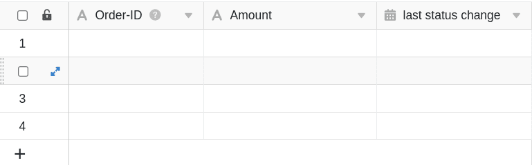

Mediante una automatización, cada vez que cambie el **estado** de un pedido en la tabla "Pedidos", la **hora del** cambio de estado se añadirá a la columna "último cambio de estado" de la tabla "Registro de estado de pedidos". Además, la automatización también añadirá automáticamente los **números de** pedido y los **importes a** la tabla "Registro de estado de pedidos".

### Creación de la automatización

En primer lugar, asigne un **nombre** a la automatización y seleccione tanto la **tabla** ("Pedidos") como la **vista** ("Todos los pedidos").

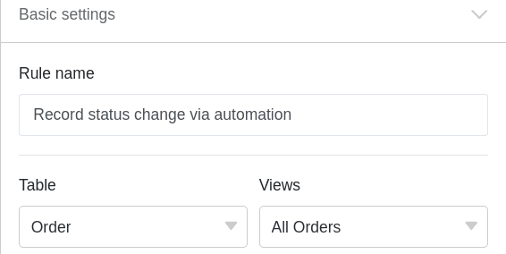

Como **evento desencadenante de** la automatización, seleccione la opción **Requiere el cumplimiento de determinadas condiciones tras el procesamiento**.

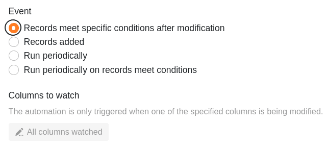

Añadir como **condición de filtrado** que la columna **Estado** de la tabla "Pedidos" no debe estar **vacía** tras la edición para poder registrar los cambios de estado.

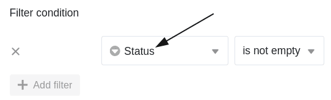

Como **acción automatizada**, defina la acción **Añadir nueva entrada en otra tabla**.

En el siguiente paso, seleccione la **tabla**"Registro de estado de pedidos" como tabla en la que se añadirá la hora del cambio de estado una vez activada la automatización.

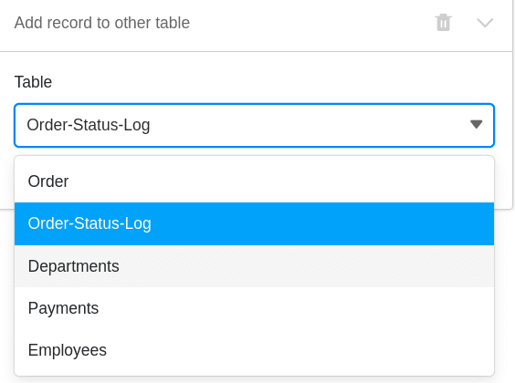

A continuación, defina los **valores** con los que deben rellenarse previamente determinados campos. Para que la **hora** correspondiente **a un cambio de estado** se añada siempre automáticamente a la columna de fecha "último cambio de estado", defina el valor **día de ejecución** para esta columna.

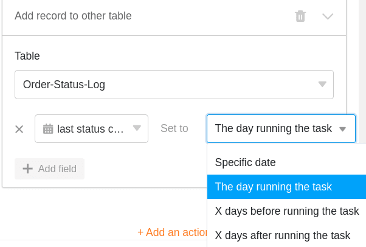

Um die verschiedenen **Bestellnummern** und die dazugehörigen **Beträge** in der Tabelle “Order-Status-Log” zu **zitieren**, schreiben Sie die Spaltennamen in geschweiften Klammern in das jeweilige Textfeld: {Order-ID} & {Amount}

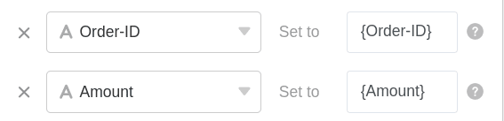

### Probar la automatización

Si **modifica** el **estado de** varios pedidos en su mesa después de confirmar la automatización, ...

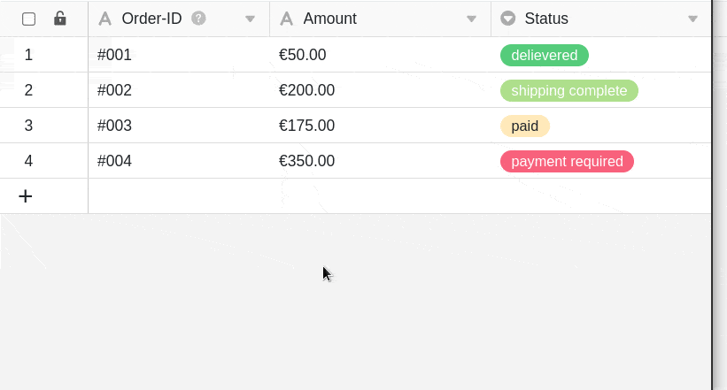

... tanto las horas de los cambios de estado como las entradas definidas (número de pedido e importe) se introducen automáticamente en la tabla "Registro de estado de pedidos".

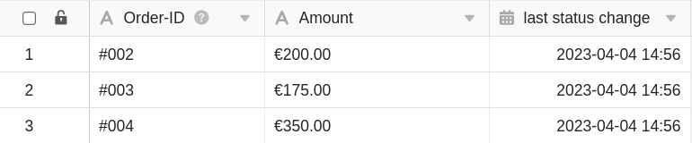
