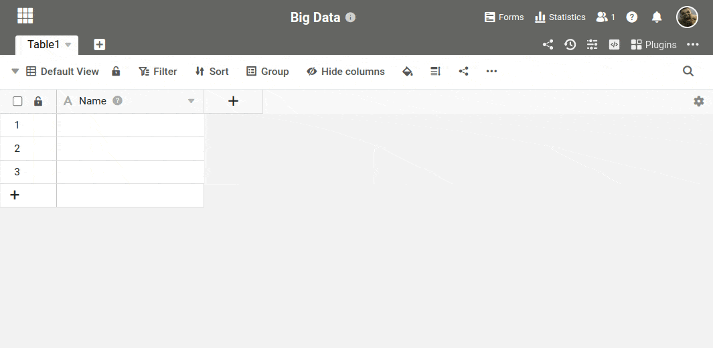



Без активированного хранилища больших данных вы можете записать в базу не более 100 000 строк. Как только вы активируете его в базе, предыдущее ограничение на количество строк отменяется, и вы можете сохранять в базе неограниченное количество данных. О том, как активировать память больших данных, вы можете узнать из этой статьи.

## Активируйте хранилище больших данных в базе

1. Откройте любую **базу**, в которой вы хотите активировать **хранилище больших данных**.
2. Щелкните на **трех точках** в заголовке базы в правом верхнем углу.
3. Выберите опцию **Big Data Management**.
4. Нажмите на кнопку **Activate Big Data Function (Активировать функцию больших данных**).

## Назначение в качестве архива/резервного копирования

Раньше хранилище больших данных также называли _бэкендом_ или _архивом_ _больших данных_. Эти термины еще могут иногда встречаться на форуме или в разделе помощи, но они всегда относятся к **хранилищу больших данных**.
