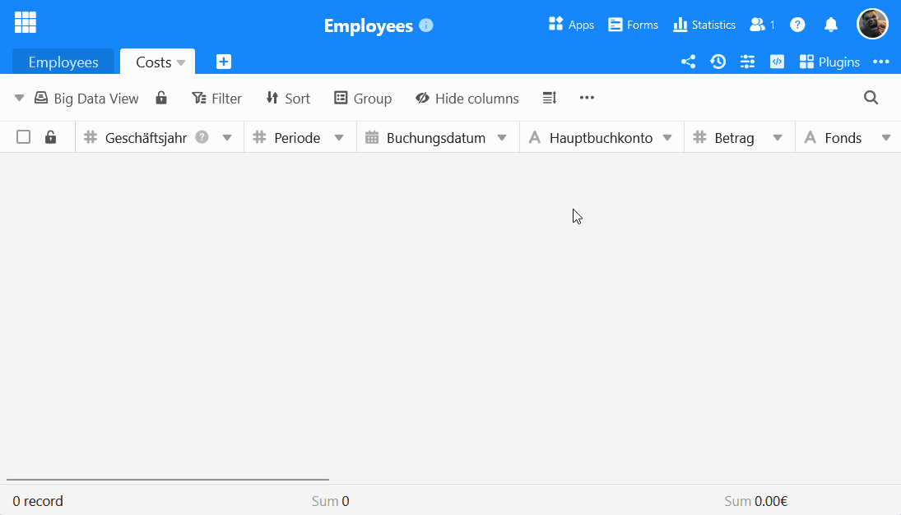
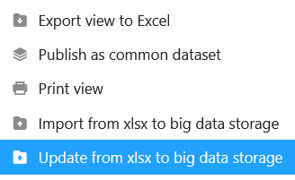
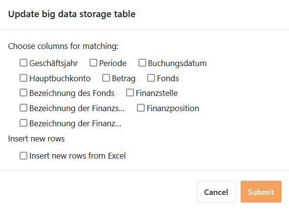



Por defecto, SeaTable permite almacenar **hasta 100.000 filas** en una base. Si desea importar conjuntos de datos aún mayores en SeaTable, puede utilizar el almacenamiento **de** big data. Aquí puede averiguar cómo importar un **archivo XLSX** al almacenamiento de big data.

) big data dentro de la base." />}}

## Preparativos para la importación

- En las vistas de [big]().
- Especifique [tipos de columna]() **compatibles** con los datos de la hoja de cálculo Excel.
- Para garantizar una importación sin problemas, los nombres de las **columnas** en SeaTable deben ser **idénticos a los nombres de las columnas en la tabla de Excel**.

## Importar un archivo XLSX en una vista de Big Data

1. [Cree una vista de big data](https://seatable.io/es/docs/big-data/so-erstellen-sie-ein-big-data-ansicht/) o cambie a una vista de big data existente.
2. Haga clic en los **tres puntos** de las opciones de visualización.
3. Seleccione la opción **Importar desde archivo XLSX a almacenamiento Big Data**.
4. En la vista general de archivos que se abre, busca el **archivo XLSX deseado en tu dispositivo**.
5. Confirme **haciendo doble clic** en el archivo seleccionado o pulsando **Seleccionar** o **Abrir** para iniciar la importación.
6. **Ahora se importan las líneas**. Esto puede tardar un poco. Mientras tanto, se le mostrará el progreso en tiempo real.
7. Por último, un **mensaje** confirma que la importación se ha realizado correctamente.

## Actualización de datos en almacenamiento de big data con archivo XLSX

También puede sincronizar de la misma manera los datos de la memoria de Big Data con un archivo XLSX de su dispositivo.

1. Cambiar a una **vista de big data** existente.
2. Haga clic en los **tres puntos** de las opciones de visualización.
3. Seleccione la opción **Actualizar datos en almacenamiento de big data con archivo XLSX**.

5. En la vista general de archivos que se abre, busca el **archivo XLSX deseado en tu dispositivo**.
6. Confírmelo **haciendo doble clic** en el archivo seleccionado o pulsando **Seleccionar** o **Abrir**.
7. Seleccione las **columnas para la comparación** y decida si desea **insertar nuevas filas desde el archivo XLSX**.

9. Confirme con **Enviar**. Un **mensaje** le indicará que la importación se ha realizado correctamente.
