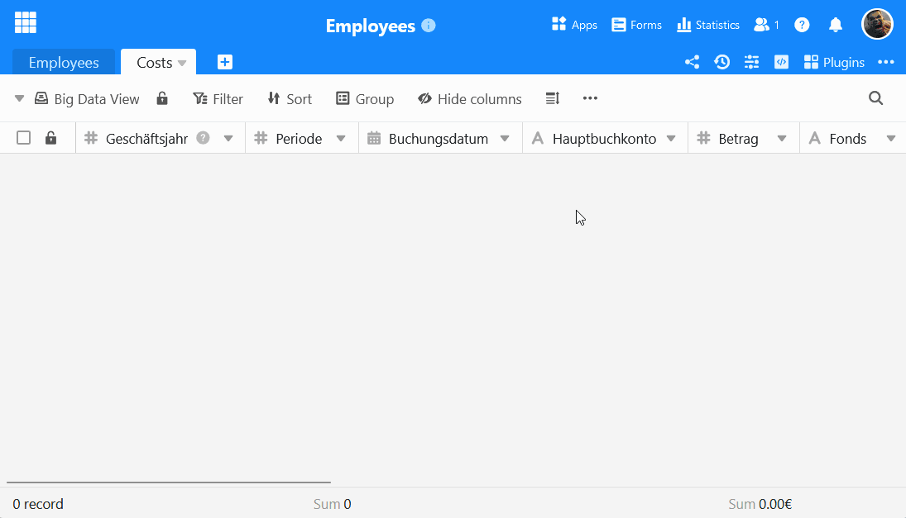
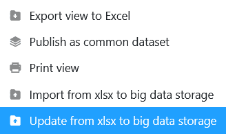



Par défaut, SeaTable permet de stocker **jusqu'à 100 000 lignes** dans une base. Si vous souhaitez importer des ensembles de données encore plus importants dans SeaTable, vous pouvez utiliser le **stockage de données volumineuses**. Cliquez ici pour savoir comment importer un **fichier XLSX** dans la mémoire Big Data.



Une **vue** spéciale **Big Data** est nécessaire pour importer plus de 100.000 lignes dans SeaTable. Vous ne pouvez la créer que si vous [avez déjà activé]() au sein de la base.



## Préparatifs pour l'importation

- Il n'est **pas** possible de créer **de nouvelles colonnes** dans [les vues Big Data]().
- Pour ce faire, définissez [des types de colonnes]() **compatibles** avec les données de la feuille de calcul Excel.
- Pour que l'importation se fasse sans problème, les noms des colonnes dans SeaTable doivent être **identiques** aux **noms des colonnes dans la feuille de calcul Excel**.

## Importer un fichier XLSX dans un affichage Big Data

1. [Créez une vue Big Data]() ou passez à une vue Big Data existante.
2. Cliquez sur les **trois points** dans les options d'affichage.
3. Sélectionnez l'option **Importer du fichier XLSX dans le stockage Big Data**.
4. Dans l'aperçu des fichiers qui s'ouvre, recherchez le **fichier XLSX** souhaité **sur votre appareil**.
5. Confirmez soit en **double-cliquant** sur le fichier sélectionné, soit en cliquant sur **Select** ou **Ouvrir** pour démarrer l'importation.
6. **Les lignes sont maintenant importées**. Cela peut prendre un certain temps. Pendant ce temps, la progression est affichée en temps réel.
7. Enfin, un **message** vous confirme la réussite de l'importation.

## Mettre à jour les données dans le stockage Big Data avec un fichier XLSX

Vous pouvez également utiliser la même méthode pour comparer les données de la mémoire Big Data avec un fichier XLSX sur votre appareil.

1. Passer à une **vue Big Data** existante.
2. Cliquez sur les **trois points** dans les options d'affichage.
3. Sélectionnez l'option **Mettre à jour les données dans l'espace de stockage Big Data avec un fichier XLSX**.

5. Dans l'aperçu des fichiers qui s'ouvre, recherchez le **fichier XLSX** souhaité **sur votre appareil**.
6. Confirmez soit par un **double-clic** sur le fichier sélectionné, soit par un clic sur **Select** ou **Ouvrir**.
7. Sélectionnez les **colonnes à comparer** et décidez si vous souhaitez **insérer de nouvelles lignes à partir du fichier XLSX**.

9. Confirmez en cliquant sur **Envoyer**. Un **message** vous indique alors que l'importation a été effectuée avec succès.
