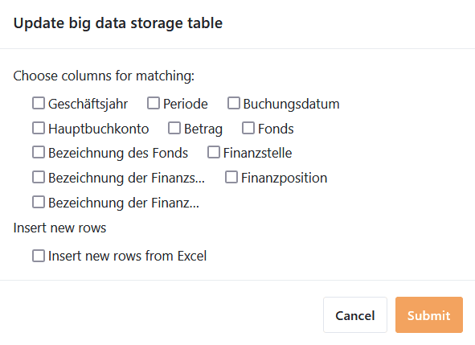



Por predefinição, o SeaTable permite o armazenamento de **até 100 000 linhas** numa base. Se pretender importar conjuntos de dados ainda maiores para o SeaTable, pode utilizar o **armazenamento** de grandes volumes de dados. Aqui pode descobrir como importar um **ficheiro XLSX** para o armazenamento de grandes volumes de dados.



É necessária uma **vista** especial de grandes volumes de dados para importar mais de 100 000 linhas para o SeaTable. Só é possível criá-la se [já tiver ativado]() de grandes volumes de dados na base.



## Preparativos para a importação

- **Não** podem ser criadas **novas colunas** nas [vistas de megadados]().
- Especificar [tipos de colunas]() **compatíveis** com os dados da folha de cálculo do Excel.
- Para garantir uma importação sem problemas, os nomes das colunas no SeaTable devem ser **idênticos aos nomes das colunas na tabela do Excel**.

## Importar um arquivo XLSX para uma exibição de Big Data

1. [Criar uma vista de grandes]() volumes de dados ou mudar para uma vista de grandes volumes de dados existente.
2. Clique nos **três pontos** nas opções de visualização.
3. Seleccione a opção **Importar do ficheiro XLSX para o armazenamento de Grandes Dados**.
4. Na vista geral dos ficheiros que se abre, procure o **ficheiro XLSX** pretendido **no seu dispositivo**.
5. Confirme clicando **duas vezes no** ficheiro selecionado ou clicando em **Selecionar** ou **Abrir** para iniciar a importação.
6. **As linhas são agora importadas**. Isto pode demorar algum tempo. Entretanto, ser-lhe-á mostrado o progresso em tempo real.
7. Por fim, uma **mensagem** confirma o êxito da importação.

## Atualizar dados no armazenamento de grandes volumes de dados com o ficheiro XLSX

Pode também sincronizar os dados da memória Big Data com um ficheiro XLSX no seu dispositivo da mesma forma.

1. Mudar para uma **vista de grandes volumes de dados** existente.
2. Clique nos **três pontos** nas opções de visualização.
3. Seleccione a opção **Atualizar dados no armazenamento de grandes volumes de dados com o ficheiro XLSX**.

5. Na vista geral dos ficheiros que se abre, procure o **ficheiro XLSX** pretendido **no seu dispositivo**.
6. Confirmar com **um duplo clique** no ficheiro seleccionado ou clicando em **Seleccionar** ou **Abrir**.
7. Seleccione as **colunas para a comparação** e decida se pretende **inserir novas linhas a partir do ficheiro XLSX**.

9. Confirme com **Enviar**. Uma **mensagem** indica-lhe que a importação foi bem sucedida.
