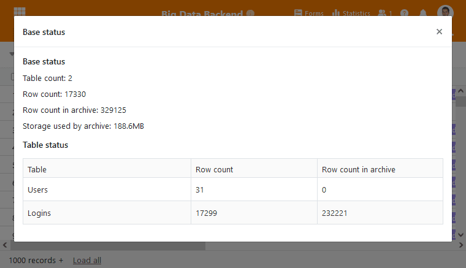



SeaTable offre deux possibilités de stockage des enregistrements dans une base : **Par défaut**, une Base peut contenir un **maximum de 100 000 lignes**, ce qui est suffisant pour la plupart des cas d'utilisation. Si vous avez besoin d'une capacité encore plus grande, vous pouvez activer le **stockage de données volumineuses** avec un [abonnement Enterprise](), qui peut contenir un nombre presque illimité de lignes. Le fait que des millions de lignes soient possibles dans une base fait de SeaTable une alternative aux bases de données SQL classiques.

Cet article vous donne un premier aperçu de la fonction Big Data de SeaTable, tandis que vous trouverez des articles d'aide séparés pour les différents détails.

## Une solution pour chaque besoin

En tant qu'utilisateur, vous gagnez en flexibilité grâce à l'utilisation de deux solutions de stockage. La solution standard de SeaTable est idéale pour le travail **collaboratif** sur des projets, tandis que le stockage de données volumineuses convient parfaitement aux applications à forte intensité de données avec collecte automatique de données (par ex. fichiers journaux ou valeurs de mesure statiques).

Une fois que vous [avez activé](), les deux solutions sont disponibles et vous pouvez déplacer vos ensembles de données entre la solution standard et le stockage des données volumineuses. L'avantage d'un stockage illimité de lignes présente toutefois l'inconvénient [de capacités collaboratives limitées]().

## Vues séparées pour les deux mémoires

Comme nous l'avons déjà mentionné, la mémoire Big Data doit être activée dans une base. Ensuite, vous pouvez créer une nouvelle vue qui vous permettra d'accéder aux entrées de la mémoire Big Data. Vous trouverez plus de détails sur cette **vue Big Data** dans [cet article d'aide]().

## Des possibilités infinies

Le stockage de données volumineuses est une fonction unique que vous ne trouverez pas dans d'autres solutions sans code ou à code réduit. Alors que d'autres plates-formes et fournisseurs ont des plafonds et des limites sévères pour le nombre maximal de lignes, SeaTable ne vous limite pas dans votre travail.

Grâce à la fonction Big Data, il est possible de mettre en œuvre des processus et des applications qui ne seraient pas réalisables avec [Airtable](), par exemple. Faites-en l'expérience. Vous serez enthousiasmé par le potentiel et les possibilités que vous offre le stockage de données volumineuses.
