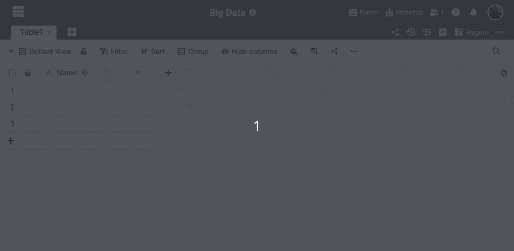



Строки, хранящиеся в **памяти** больших **данных**, не сразу видны каждому пользователю. Для доступа к данным в хранилище больших данных требуется специальное **представление**. Но не волнуйтесь: создать представление больших данных так же просто, как и обычное представление.



## Добавьте представление больших данных

1. Щелкните по названию **текущего представления** в вашей Базе.
2. Затем выберите опцию **Добавить вид или папку**.
3. В новом меню выберите **Добавить представление больших данных**.
4. Дайте новому представлению любое **имя** и подтвердите его нажатием кнопки **Submit**.

## Различия между обычным и частным видом

При создании новых представлений можно **определить** их **как частные**. [Приватные представления](https://seatable.io/ru/docs/grundlagen-von-ansichten/unterschiede-zwischen-privaten-und-normalen-ansichten/) видны только Вам и не отображаются другим пользователям. Поскольку вы можете индивидуально определять фильтры, сортировку и группировку в частном представлении, частное представление используется в основном для собственного анализа данных.
