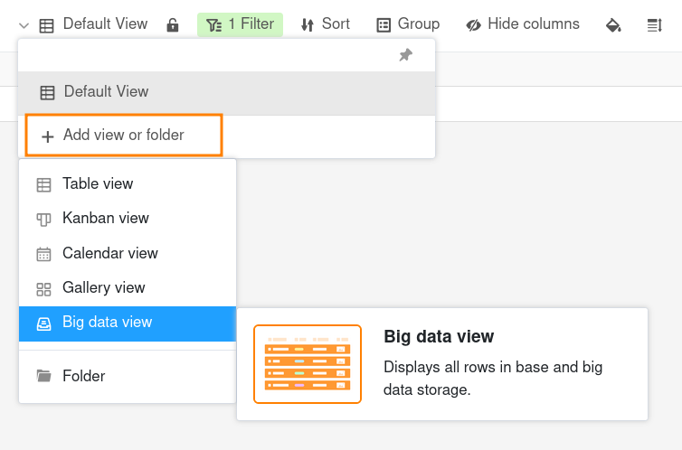
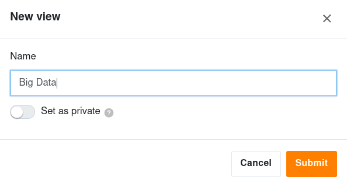



As linhas armazenadas na **memória de Big Data** não são imediatamente visíveis para todos os utilizadores. É necessária uma **vista** especial para aceder aos dados no armazenamento de Big Data. Mas não se preocupe: criar uma vista de Big Data é tão fácil como criar uma vista normal.



Só é possível criar uma vista de Big Data se [já tiver ativado o armazenamento de Big Data]() na base.



## Adicionar uma vista de Big Data

1. Clique no **Nome da vista atual**.
2. Clique em **Adicionar vista ou pasta** e selecione o **Tipo de vista** pretendido.

3. Atribua um **nome** à nova vista.
4. Active o seletor se a nova vista não deve ser visível para todos mas **privada**.
5. Confirme com **Submeter**.

## Diferenças entre uma visão normal e uma visão privada

Ao criar novas vistas, pode defini-las **como privadas**. [As vistas privadas]() só são visíveis para o utilizador e não são apresentadas a nenhum outro utilizador. Uma vez que pode definir individualmente os filtros, a ordenação e o agrupamento numa vista privada, esta é utilizada principalmente para a sua própria análise de dados.
