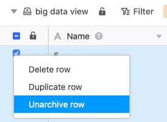

Para recuperar filas de la memoria de big data, se necesita una vista de [big data]() las filas deseadas y volver a moverlas a una **vista normal**.

1. Abra una **vista de big data**.
2. **Haga clic con el botón derecho del ratón en una línea archivada**.
3. Seleccione la opción **Recuperar línea del archivo**.

En unos segundos, las filas seleccionadas se vuelven a escribir desde la memoria de big data a la vista normal y pierden así su **triángulo gris** , que identifica las filas como entradas de big data.
