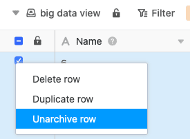

Para recuperar linhas da memória de grandes volumes de dados, é necessária uma [vista de grandes volumes de dados]() as linhas desejadas e movê-las de volta para uma **vista normal**.

1. Abrir uma **vista de grandes volumes de dados**.
2. **Clique com o botão direito do rato numa linha arquivada**.
3. Seleccione a opção **Recuperar linha do arquivo**.

Em poucos segundos, as linhas seleccionadas são reescritas da memória de grandes volumes de dados para a visualização normal, perdendo assim o seu **triângulo cinzento** , que identifica as linhas como entradas de grandes volumes de dados.
