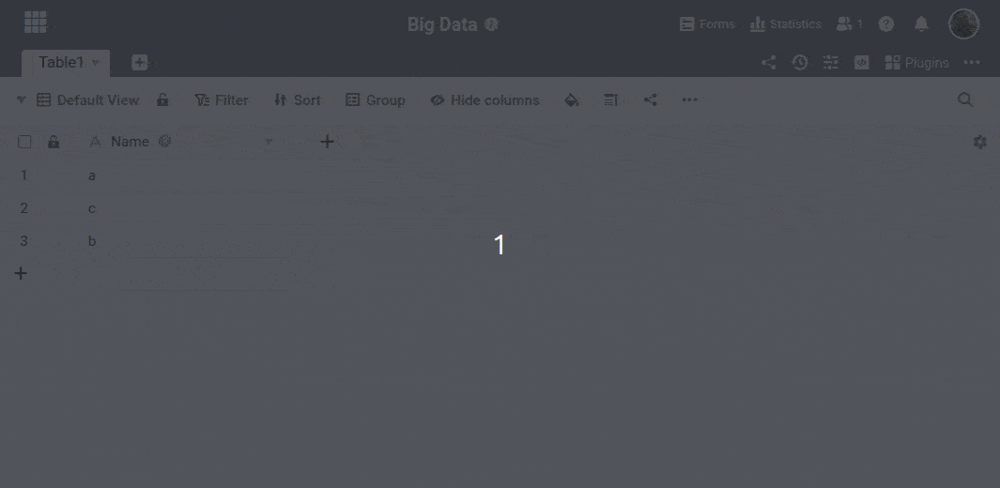



Sólo se pueden crear **nuevas filas** en **las vistas normales** de SeaTable. A continuación, debe mover manualmente las filas deseadas a la memoria de big data.



Sólo puede mover filas a la memoria [de big]() data dentro de la base.



## Mover filas a la memoria de big data

1. Haga clic en los **tres puntos** de las opciones de visualización.
2. Seleccione la opción **Vista de archivo**.
3. **Confirme** el traslado de todas las filas visibles al almacenamiento de big data.



Por ejemplo, si desea **archivar entradas antiguas**, puede filtrar previamente la vista con los tipos de columna [Creado]() o [Último editado]().



A continuación, las filas se transfieren a la memoria de big data. Como resultado, ya no son visibles en la vista normal. [Cree una]() vista de big data para mostrar los datos en la memoria de big data.

## ¿Cómo reconocer si los datos están almacenados en big data o no?

Las filas almacenadas en la memoria de big data tienen un pequeño **triángulo gris en la columna de numeración** .

**Es bueno saberlo:**

- En una [vista normal](), **no** se muestra ninguna **fila de la memoria de big data**.
- En una [vista de big]() data, se pueden mostrar **todas las filas**, independientemente de dónde estén guardadas en ese momento.

## Recuperar entradas de la memoria de big data

[En este]() artículo se explica cómo recuperar entradas de la memoria de big data.
