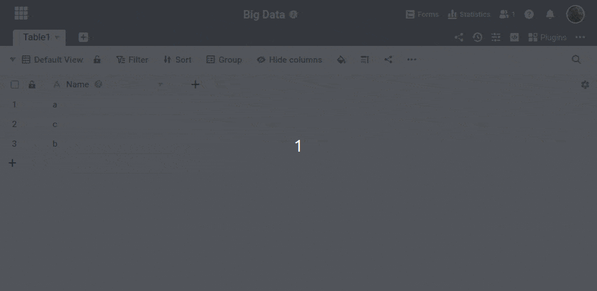



Вы можете создавать **новые строки** только в **обычных представлениях** SeaTable. Затем вы должны вручную переместить нужные строки в память больших данных.



Вы можете перемещать строки в память больших данных только в том случае, если вы [уже активировали память больших данных]() в базе.



## Переместите строки в память больших данных

1. Нажмите на **три точки** в опциях просмотра.
2. Выберите опцию **Просмотр архива**.
3. **Подтвердите** перемещение всех видимых строк в хранилище больших данных.



Например, если необходимо **архивировать старые записи**, можно предварительно отфильтровать представление с помощью типов колонок [Создано]() или [Последнее редактирование]().



Затем строки переносятся в память больших данных. В результате они больше не видны в обычном представлении. [Создайте представление больших данных]() для отображения данных в хранилище больших данных.

## Как распознать, находятся ли данные в хранилище больших данных или нет?

Строки, сохраненные в памяти больших данных, имеют маленький **серый треугольник в колонке нумерации**.

**Полезно знать:**

- При [обычном просмотре]() **ни одна строка из памяти больших данных не** отображается.
- В [представлении больших данных]() можно отобразить **все строки**, независимо от того, где они сохранены в данный момент.

## Извлечение записей из памяти больших данных

О том, как извлекать записи из памяти больших данных, вы узнаете из [этой статьи]().
