Le **gestionnaire de fichiers** révolutionne l'utilisation des fichiers dans votre base. Vous pouvez y télécharger directement **des fichiers**, les renommer, les copier, les déplacer, les télécharger et les supprimer. Vous pouvez même y créer **de nouveaux documents** (par exemple des fichiers Excel, Word ou PowerPoint) et les modifier grâce à l'éditeur intégré.

Dans cet article de synthèse, vous trouverez toutes les informations sur la structure et les différentes fonctions du gestionnaire de fichiers.

## Aperçu de la gestion des fichiers

Dans le gestionnaire de fichiers se trouvent différents dossiers qui contiennent à leur tour différents fichiers. En principe, on peut distinguer **trois types de dossiers**:

- **Les dossiers personnels** sont indépendants de la structure d'une base et peuvent être créés et organisés librement par l'utilisateur.

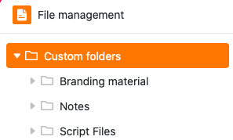

- **Les dossiers système** sont créés automatiquement par SeaTable lorsque vous créez des colonnes, des Apps ou des formulaires web spécifiques. Ils contiennent [les fichiers](https://seatable.io/fr/docs/dateien-und-bilder/die-datei-spalte/), les [images](https://seatable.io/fr/docs/dateien-und-bilder/die-bild-spalte/) et les [signatures](https://seatable.io/fr/docs/dateien-und-bilder/die-signatur-spalte/) des colonnes respectives de la base, ainsi que les fichiers de configuration des [applications universelles](https://seatable.io/fr/docs/apps/universelle-app/) et [des formulaires web](https://seatable.io/fr/docs/webformulare/webformulare/).

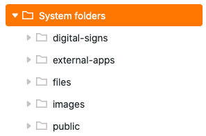

- Dans un **dossier Seafile** se trouvent tous les fichiers que vous avez téléchargés auparavant dans le stockage en nuage externe du même nom. Vous apprendrez [ici](https://seatable.io/fr/docs/integrationen-innerhalb-von-seatable/eine-seafile-bibliothek-an-seatable-anbinden/) comment fonctionne exactement l'intégration des bibliothèques Seafile et quels sont les avantages qu'elle apporte.

Le schéma suivant présente une vue d'ensemble de la **structure** complète **des dossiers du gestionnaire de fichiers**:

## Accéder au gestionnaire de fichiers

1. Ouvrez une **base** dans laquelle vous souhaitez gérer des fichiers.
2. Cliquez sur les trois points dans l'en-tête de la base pour ouvrir les **options avancées de la base**.
3. Allez sur **Gestion des fichiers**.

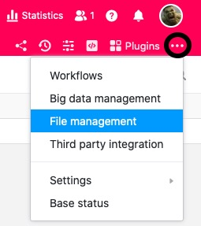

5. Ensuite, une fenêtre redimensionnable s'ouvre automatiquement avec la **structure des dossiers** - la gestion des fichiers de la base.

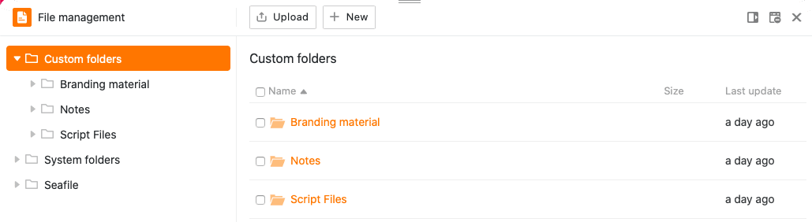

En cliquant sur l'**icône centrale** en haut à droite de la fenêtre, vous pouvez également **ajouter** le gestionnaire de fichiers **à la barre d'outils**.

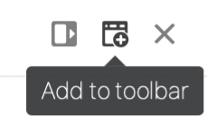

Ainsi, vous pouvez toujours accéder au **gestionnaire de fichiers** en un seul clic depuis votre barre d'outils.

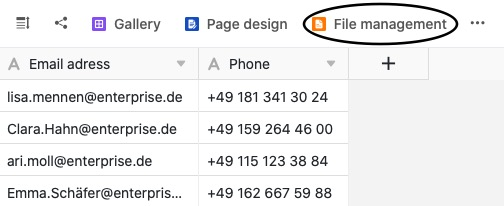

Si vous souhaitez **supprimer** le gestionnaire de fichiers de votre barre d'outils, il vous suffit de cliquer à nouveau sur l'icône située sur le bord de la fenêtre.

## Adapter la taille de la fenêtre et la position du gestionnaire de fichiers

Pour que vous puissiez garder un œil sur vos tableaux et vos données pendant la gestion de vos fichiers et [faire glisser les fichiers du gestionnaire de fichiers directement dans les colonnes appropriées de vos tableaux](https://seatable.io/fr/?post_type=docs&p=26594#8-toc-title), vous avez la possibilité d'adapter la taille de la fenêtre du gestionnaire de fichiers.

Pour ce faire, ouvrez simplement le gestionnaire de fichiers et déplacez le curseur de la souris sur les **deux traits** en haut de la fenêtre jusqu'à ce qu'une **double flèche** apparaisse. Faites ensuite glisser la fenêtre vers la position souhaitée en maintenant le bouton de la souris enfoncé et relâchez dès que vous l'avez atteinte.

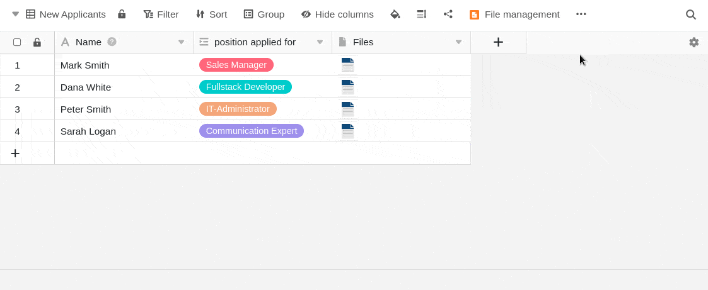

En plus de l'adaptation de la taille de la fenêtre, vous avez également la possibilité d'**épingler** le gestionnaire de fichiers **sur le bord droit de la page**. Pour ce faire, cliquez sur le **premier symbole à partir de la gauche** dans le bord supérieur droit.

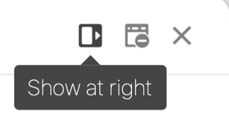

Le gestionnaire de fichiers apparaît ensuite dans une fenêtre sur le bord droit de la page.

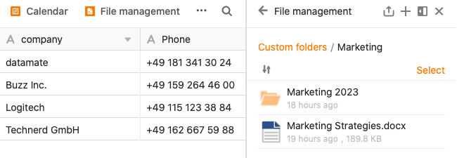

De la même manière, vous pouvez épingler à nouveau le gestionnaire de fichiers en bas.

## Les différentes fonctions de la gestion de fichiers en détail

Diverses possibilités de gestion sont à votre disposition au sein du gestionnaire de fichiers.

### Créer un nouveau fichier dans le gestionnaire de fichiers

Vous pouvez créer et modifier de nouveaux fichiers directement dans le gestionnaire de fichiers en quelques clics seulement. Pour ce faire, cliquez d'abord sur **Nouveau** et sélectionnez ensuite soit l'option **Nouveau fichier**, soit directement les différents **types de fichiers** proposés.

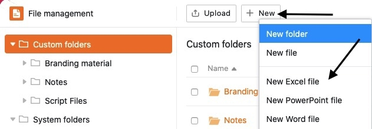

Le fichier nouvellement créé apparaît ensuite dans le **propre dossier** correspondant. Cliquez sur le nom du fichier pour l'ouvrir et le modifier dans l'éditeur.

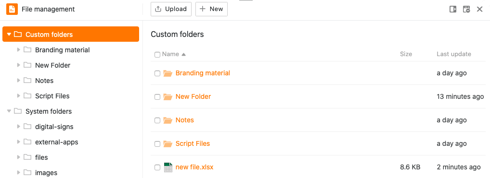

### Créer son propre dossier dans le gestionnaire de fichiers

Outre les fichiers, vous pouvez également créer **vos propres dossiers** directement dans le gestionnaire de fichiers. Pour ce faire, cliquez sur **Nouveau** dans la zone **Mes dossiers** et sélectionnez ensuite l'option **Nouveau dossier**.

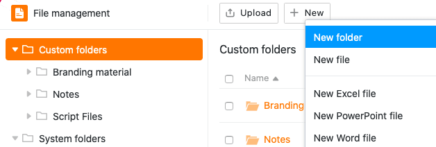

Le dossier nouvellement créé est ensuite ajouté à la navigation dans la zone **Mes dossiers**.

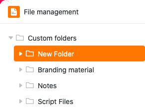

### Télécharger des fichiers et des dossiers dans le gestionnaire de fichiers

Vous pouvez également télécharger les fichiers enregistrés sur votre appareil vers le gestionnaire de fichiers en quelques clics. Pour ce faire, cliquez d'abord sur **Télécharger** et sélectionnez ensuite l'option **Télécharger des fichiers**.

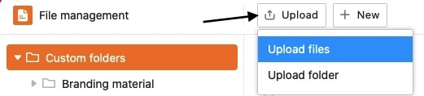

Les fichiers téléchargés dans la gestion des fichiers sont toujours enregistrés dans **Mes dossiers**. De plus, une fenêtre de téléchargement s'ouvre, qui indique la progression en cas de volumes de données importants et dans laquelle vous pouvez, le cas échéant, annuler ou recommencer le téléchargement.

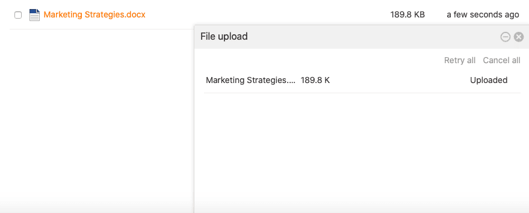

De plus, vous avez la possibilité de télécharger des **dossiers entiers** de fichiers dans la gestion des fichiers.

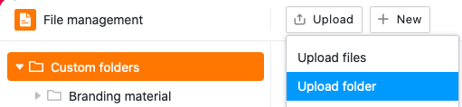

Les dossiers téléchargés sont toujours automatiquement ajoutés à **Mes dossiers**.

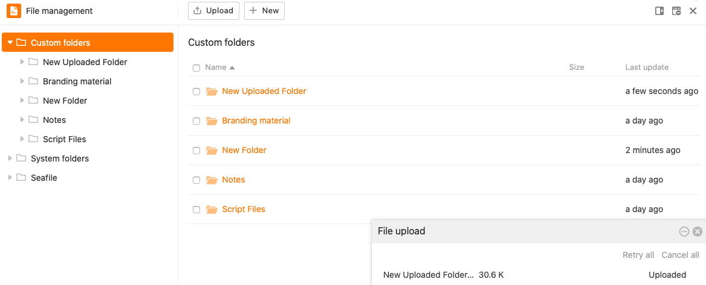



### Déplacer les fichiers par glisser-déposer dans les colonnes appropriées du tableau

Une autre fonction utile du gestionnaire de fichiers est le **déplacement** aisé **des fichiers**. Par **glisser-déposer**, vous pouvez non seulement faire glisser les fichiers dans le gestionnaire de fichiers, mais aussi les insérer depuis le gestionnaire de fichiers dans les colonnes de fichiers du tableau.



### Renommer un fichier ou un dossier



Vous pouvez **renommer** les fichiers et les dossiers de la section **Mes dossiers** en quelques clics seulement. Pour ce faire, il suffit de passer la souris sur un fichier ou un dossier, de cliquer sur les **trois points** qui apparaissent et de sélectionner **Renommer**.

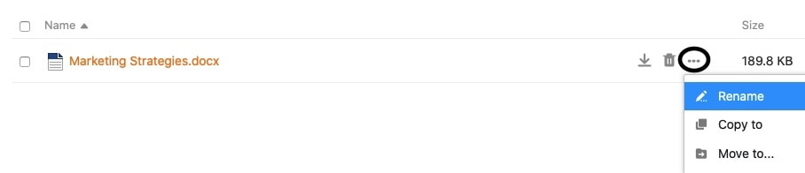

Ensuite, saisissez le nouveau **nom** du fichier ou du dossier dans le **champ de texte** et confirmez-le en appuyant **sur la touche Entrée**.

### Copier un fichier dans un dossier



Un fichier peut être copié dans son propre dossier en quelques clics seulement. Le fichier copié est ensuite présent à la fois dans le dossier d'origine et dans le dossier de destination.

Pour ce faire, il suffit de passer la souris sur un fichier, de cliquer sur les **trois points** qui apparaissent et de sélectionner **Copier vers**.

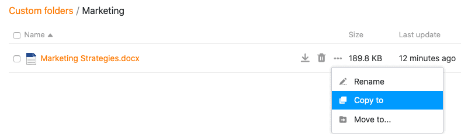

Sélectionnez ensuite le **dossier de destination** et confirmez en cliquant sur **Envoyer**.

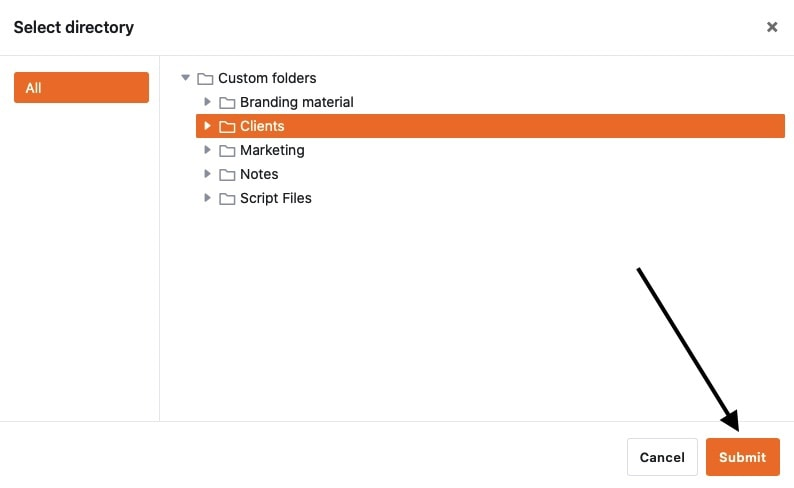

### Copier un dossier personnel dans un autre dossier



Comme pour la copie de fichiers, il est possible de copier ses propres dossiers dans un autre dossier en quelques clics. Le dossier copié est ensuite disponible aussi bien à l'endroit d'origine qu'à l'endroit de destination.

Pour ce faire, il suffit de passer la souris sur un dossier personnel, de cliquer sur les **trois points** qui apparaissent et de sélectionner **Copier vers**.

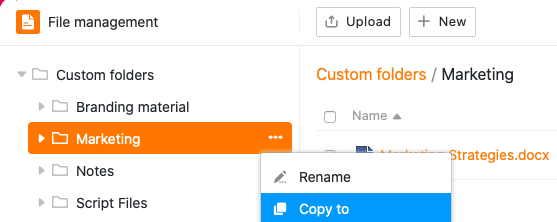

Sélectionnez ensuite le **dossier de destination** et confirmez en cliquant sur **Envoyer**.

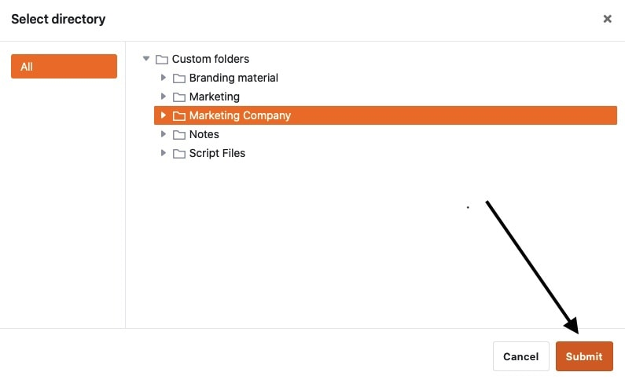

### Déplacer des fichiers dans un dossier



Un fichier peut être déplacé vers son propre dossier en quelques clics seulement. Le fichier déplacé n'est ensuite **plus** présent dans le dossier d'origine, mais **uniquement dans le dossier de destination**.

Pour ce faire, il suffit de passer la souris sur un fichier, de cliquer sur les **trois points** qui apparaissent et de sélectionner **Déplacer l'affichage**.

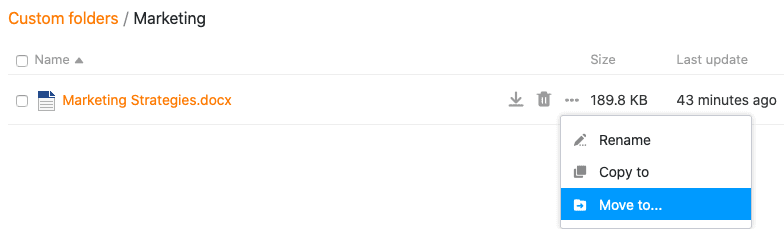

Sélectionnez ensuite le **dossier de destination** et confirmez en cliquant sur **Envoyer**.

### Déplacer un dossier personnel vers un autre dossier



Comme pour le déplacement de fichiers, il est possible de déplacer des dossiers dans le gestionnaire de fichiers vers un autre dossier en quelques clics. Le dossier déplacé n'existe **plus** à l'endroit d'origine, mais **seulement dans le dossier de destination**.

Pour ce faire, il suffit de passer la souris sur un dossier, de cliquer sur les **trois points** et de sélectionner **Déplacer l'affichage**.

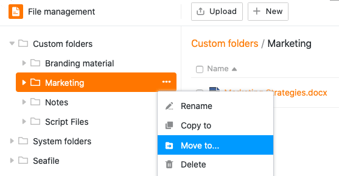

Sélectionnez ensuite le **dossier de destination** et confirmez en cliquant sur **Envoyer**.



### Télécharger des fichiers

Vous pouvez **télécharger** tous les fichiers à tout moment en quelques clics à partir du gestionnaire de fichiers. Utilisez cette fonction pour sauvegarder les fichiers importants sur votre appareil.

Passez la souris sur un fichier et cliquez sur l'**icône de téléchargement** . Le fichier sélectionné est ensuite automatiquement enregistré sur votre appareil.

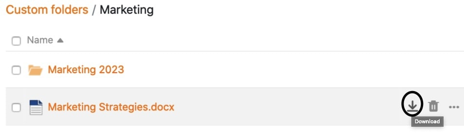

### Supprimer et restaurer des fichiers

Vous pouvez **supprimer** n'importe quel fichier de la gestion des fichiers en quelques clics seulement. Pour ce faire, il suffit de passer la souris sur un fichier et de cliquer sur l'**icône de la corbeille**.

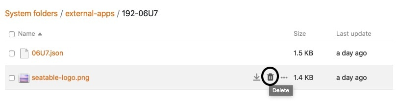

Confirmez ensuite l'opération en cliquant à nouveau sur **Supprimer**.

Les fichiers que vous supprimez du gestionnaire de fichiers disparaissent également de votre base (par exemple des colonnes de signatures, de fichiers, d'images, de formulaires web ou d'applications universelles) et sont placés dans la **corbeille**, où ils restent pendant 60 jours.



Si vous souhaitez restaurer un fichier de la Corbeille, par exemple parce qu'il a été supprimé par erreur, cliquez sur **Restaurer**. Vous trouverez ensuite le fichier dans le dossier où il se trouvait avant d'être supprimé. Si vous **videz** la **corbeille**, tous les fichiers et dossiers supprimés seront définitivement perdus.

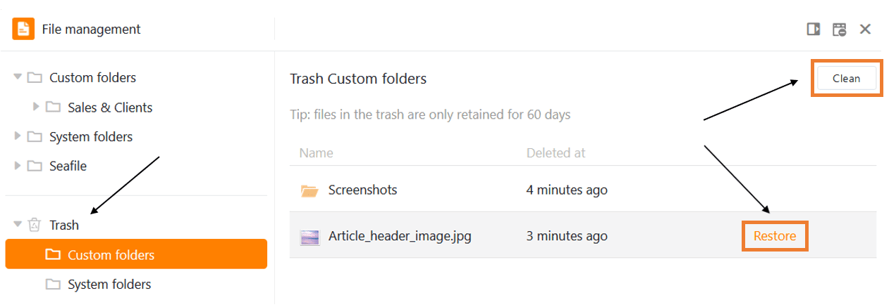

### Supprimer et restaurer des dossiers

Vous pouvez à tout moment supprimer **vos propres dossiers** dans le gestionnaire de fichiers en quelques clics. Pour ce faire, passez dans la **navigation** avec la souris sur un dossier quelconque, cliquez sur les **trois points** qui apparaissent et sélectionnez l'option **Supprimer**.

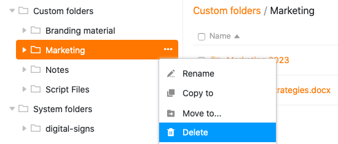

Confirmez ensuite la suppression en cliquant sur **Supprimer**.

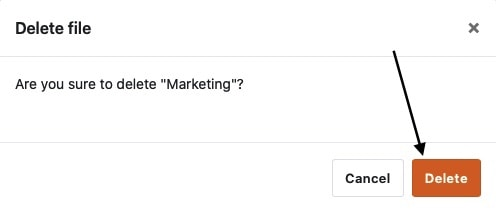



En général, vous pouvez également supprimer **des sous-dossiers d'** une autre manière. Pour ce faire, cliquez d'abord sur le dossier dans lequel se trouve le dossier à supprimer. Vous obtenez alors un aperçu de tous les dossiers et fichiers qui se trouvent dans le dossier sélectionné. Passez ici avec la souris sur le dossier à supprimer et cliquez sur le **symbole de la corbeille**.

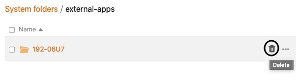

Confirmez l'opération en cliquant sur **Supprimer**.

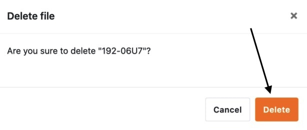

Les dossiers que vous supprimez de la gestion des fichiers atterrissent dans la **corbeille**, où ils restent pendant 60 jours.

{{< warning  headline="Remarques importantes"  text="Veuillez noter que si vous supprimez un dossier, **tous les fichiers** qu'il contient seront également **supprimés**. Il en va de même pour les sous-dossiers qui se trouvent dans un dossier supprimé. Les fichiers supprimés disparaîtront donc également de votre base (p. ex. des colonnes de signatures, de fichiers et d'images, des formulaires web ou des applications universelles). Veillez à ne supprimer de la gestion des fichiers **que** les dossiers contenant des fichiers qui ne sont plus nécessaires. Après **60 jours** dans la corbeille, tant les dossiers que les fichiers sont définitivement supprimés du système." />}}

Si vous souhaitez restaurer un dossier de la Corbeille, par exemple parce que vous l'avez supprimé par erreur, cliquez sur **Restaurer**. Le dossier apparaît ensuite à l'endroit où il se trouvait avant d'être supprimé. Si vous **videz** la **corbeille**, tous les fichiers et dossiers supprimés seront définitivement perdus.

