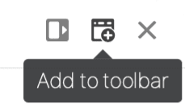
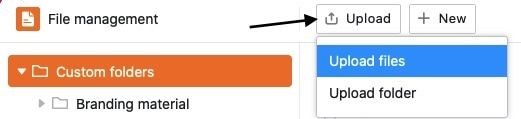
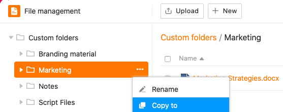
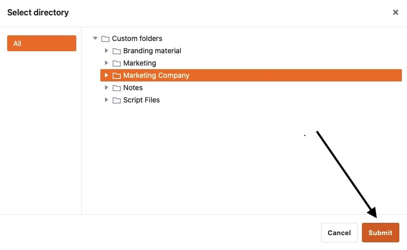

**A gestão de ficheiros** revoluciona a forma como trata os ficheiros na sua Base. Pode carregar, renomear, copiar, mover, descarregar e apagar **ficheiros** diretamente na Base. Pode até criar **novos documentos** (por exemplo, ficheiros Excel, Word ou PowerPoint) e editá-los utilizando o editor integrado.

Neste artigo de síntese, encontrará todas as informações sobre a estrutura e as funções individuais do gestor de ficheiros.

## Visão geral da gestão de ficheiros

O gestor de ficheiros contém várias pastas, que por sua vez contêm vários ficheiros. Pode ser feita uma distinção básica entre **três tipos de pastas**:

- **As pastas próprias** são independentes da estrutura de uma base e podem ser criadas e organizadas livremente pelo utilizador.

- **As pastas do sistema** são criadas automaticamente pelo SeaTable quando cria determinadas colunas, aplicações ou formulários Web. Estas pastas contêm [ficheiros](https://seatable.io/pt/docs/dateien-und-bilder/die-datei-spalte/), [imagens](https://seatable.io/pt/docs/dateien-und-bilder/die-bild-spalte/) e [assinaturas](https://seatable.io/pt/docs/dateien-und-bilder/die-signatur-spalte/) das respectivas colunas da Base e os ficheiros de configuração das [Aplicações Universais](https://seatable.io/pt/docs/apps/universelle-app/) e dos [formulários Web](https://seatable.io/pt/docs/webformulare/webformulare/).

- Uma **pasta Seafile** contém todos os ficheiros que carregou anteriormente para o armazenamento externo na nuvem com o mesmo nome. Pode descobrir [aqui](https://seatable.io/pt/docs/integrationen-innerhalb-von-seatable/eine-seafile-bibliothek-an-seatable-anbinden/) como funciona exatamente a integração das bibliotecas Seafile e quais as vantagens que traz.

O diagrama seguinte mostra uma visão geral da **estrutura** completa de **pastas do gestor de ficheiros**:

## Aceder ao gestor de ficheiros

1. Abra uma **base** na qual pretende gerir ficheiros.
2. Clique nos três pontos no cabeçalho da base para abrir as **opções avançadas da base**.
3. Ir para **Gestão de ficheiros**.

5. Uma janela redimensionável com a **estrutura de pastas** abrir-se-á automaticamente - o gestor de ficheiros Base.

Também pode **adicionar** o gestor de ficheiros **à barra de ferramentas** clicando no **ícone central** no canto superior direito da janela.

Isto significa que pode sempre aceder ao **gestor de ficheiros** com apenas um clique a partir da sua barra de ferramentas.

Se pretender **remover** o gestor de ficheiros da sua barra de ferramentas, basta clicar novamente no ícone na extremidade da janela.

## Ajustar o tamanho e a posição da janela do gestor de ficheiros

Tem a opção de ajustar o tamanho da janela do gestor de ficheiros para que possa manter um olho nas suas tabelas e dados enquanto gere os seus ficheiros e [arrastar ficheiros do gestor de ficheiros diretamente para as colunas apropriadas das suas tabelas](https://seatable.io/pt/?post_type=docs&p=26594#8-toc-title).

Para isso, basta abrir o gestor de ficheiros e mover o ponteiro do rato sobre as **duas linhas** na parte superior da janela até aparecer uma **seta dupla**. Em seguida, mantenha premido o botão do rato e arraste a janela para a posição pretendida e solte-a assim que a alcançar.

Para além de ajustar o tamanho da janela, também tem a opção de **fixar** o gestor de ficheiros **no lado direito da página**. Para o fazer, clique no **primeiro ícone a contar da esquerda**, no canto superior direito.

O gestor de ficheiros aparece então numa janela no lado direito da página.

Pode fixar novamente o gestor de ficheiros na margem inferior da mesma forma.

## As várias funções de gestão de ficheiros em pormenor

Existem várias opções de gestão disponíveis na gestão de ficheiros.

### Criar um novo ficheiro no gestor de ficheiros

Pode criar e editar novos ficheiros diretamente no gestor de ficheiros com apenas alguns cliques. Para tal, clique primeiro em **Novo** e, em seguida, seleccione a opção **Novo ficheiro** ou os vários **tipos de ficheiros** disponíveis para seleção.

O ficheiro recém-criado aparece então na sua **própria pasta** correspondente. Clique no nome do ficheiro para o abrir e editar no editor.

### Criar a sua própria pasta no gestor de ficheiros

Para além dos ficheiros, também pode criar as **suas próprias pastas** diretamente no gestor de ficheiros. Para o fazer, clique em **Novo** na área **As minhas pastas** e, em seguida, seleccione a opção **Nova pasta**.

A pasta recém-criada é então adicionada à navegação na área **As minhas pastas**.

### Carregar ficheiros e pastas para o gestor de ficheiros

Também pode carregar ficheiros guardados no seu dispositivo para o gestor de ficheiros com apenas alguns cliques. Para tal, clique primeiro em **Carregar** e, em seguida, seleccione a opção **Carregar ficheiros**.

Os ficheiros carregados no gestor de ficheiros são sempre guardados nas **Minhas pastas**. Além disso, abre-se uma janela de carregamento, que mostra o progresso de grandes quantidades de dados e na qual pode cancelar ou repetir o carregamento, se necessário.

Para além de carregar ficheiros, também tem a opção de carregar **pastas inteiras** com ficheiros para o gestor de ficheiros.

As pastas carregadas são sempre adicionadas automaticamente a **As minhas past** as.



### Arrastar e largar ficheiros nas colunas de tabela adequadas

Outra função útil do gestor de ficheiros é a **movimentação** conveniente **de ficheiros**. Pode não só **arrastar e largar** ficheiros no gestor de ficheiros, mas também inseri-los a partir do gestor de ficheiros em colunas de ficheiros na tabela.



### Mudar o nome de um ficheiro ou pasta



Pode **mudar o nome de** ficheiros e pastas na área **As minhas pastas** com apenas alguns cliques. Basta mover o rato sobre um ficheiro ou pasta, clicar nos **três pontos** que aparecem e selecionar **Mudar** o nome.

Em seguida, introduza o novo **nome do** ficheiro ou **da** pasta no **campo de texto** e confirme-o com a **tecla Enter**.

### Copiar um ficheiro para uma pasta



Um ficheiro pode ser copiado para a sua própria pasta com apenas alguns cliques. O ficheiro copiado fica então disponível tanto na pasta de origem como na pasta de destino.

Basta passar o rato sobre um ficheiro, clicar nos **três pontos** que aparecem e selecionar **Copiar** para.

Em seguida, seleccione a **pasta de destino** e confirme com **Enviar**.

### Copiar a sua própria pasta para outra pasta



Tal como acontece com a cópia de ficheiros, as pastas próprias também podem ser copiadas para outra pasta com apenas alguns cliques. A pasta copiada fica então disponível na localização original, bem como no destino.

Para tal, basta mover o rato sobre a sua própria pasta, clicar nos **três pontos** que aparecem e selecionar **Copiar para**.

Em seguida, seleccione a **pasta de destino** e confirme com **Enviar**.

### Mover ficheiros para uma pasta



Um ficheiro pode ser movido para a sua própria pasta com apenas alguns cliques. O ficheiro movido deixa **de** estar disponível na pasta original e passa a estar disponível **apenas na pasta de destino**.

Para tal, basta passar o rato sobre um ficheiro, clicar nos **três pontos** que aparecem e selecionar **Mover vista**.

Em seguida, seleccione a **pasta de destino** e confirme com **Enviar**.

### Mover uma pasta própria para outra pasta



Da mesma forma que a deslocação de ficheiros, as pastas no gestor de ficheiros também podem ser deslocadas para outra pasta com apenas alguns cliques. A pasta movida deixa **de** estar disponível na sua localização original, mas **apenas na pasta de destino**.

Para tal, basta passar o rato sobre uma pasta, clicar nos **três pontos** e selecionar **Mover vista**.

Em seguida, seleccione a **pasta de destino** e confirme com **Enviar**.



### Descarregar ficheiros

Pode **transferir** todos os ficheiros do gestor de ficheiros em qualquer altura com apenas alguns cliques. Utilize esta função para fazer cópias de segurança de ficheiros importantes no seu dispositivo.

Mova o rato sobre um ficheiro e clique no **símbolo de transferência** . O ficheiro selecionado será então automaticamente guardado no seu dispositivo.

### Eliminar e restaurar ficheiros

Pode **eliminar** qualquer ficheiro do gestor de ficheiros com apenas alguns cliques. Para tal, basta passar o rato sobre um ficheiro e clicar no **ícone da reciclagem**.

Em seguida, confirme o processo novamente com **Delete.**

Os ficheiros eliminados do gestor de ficheiros também desaparecem da sua Base (por exemplo, da assinatura, do ficheiro, das colunas de imagens, dos formulários Web ou das aplicações universais) e vão parar à **reciclagem**, onde permanecem durante 60 dias.



Se pretender restaurar um ficheiro da reciclagem, por exemplo, porque foi apagado por engano, clique em **Restaurar**. O ficheiro será então encontrado na pasta onde se encontrava antes de ser apagado. Quando **esvazia** a reciclagem, todos os ficheiros e pastas eliminados são perdidos permanentemente.

### Eliminar e restaurar a pasta

Pode eliminar as **suas próprias pastas** no gestor de ficheiros em qualquer altura com apenas alguns cliques. Para tal, passe o rato sobre qualquer pasta na barra de **navegação**, clique nos **três pontos** que aparecem e seleccione **Apagar**.

Confirmar a eliminação com **Delete**.



Em geral, também é possível eliminar **subpastas** de outra forma. Primeiro, clique na pasta em que se encontra a pasta a eliminar. Aparecerá uma visão geral de todas as pastas e ficheiros da pasta selecionada. Mova o rato sobre a pasta a eliminar e clique no **símbolo da reciclagem**.

Confirmar a operação com **Apagar.**

As pastas que elimina do gestor de ficheiros vão para a **reciclagem**, onde permanecem durante 60 dias.

{{< warning  headline="Notas importantes"  text="Tenha em atenção que, ao eliminar pastas, **todos os ficheiros** nas respectivas pastas também são **eliminados**. O mesmo se aplica às subpastas de uma pasta eliminada. Por conseguinte, os ficheiros eliminados também desaparecem da sua base (por exemplo, da assinatura, do ficheiro, das colunas de imagens, dos formulários Web ou das aplicações universais). Certifique-se de que **só** elimina do gestor de ficheiros as pastas com ficheiros que já não são necessários. Após **60 dias** na reciclagem, tanto as pastas como os ficheiros são removidos permanentemente do sistema." />}}

Se pretender restaurar uma pasta da reciclagem, por exemplo, porque a apagou por engano, clique em **Restaurar**. A pasta aparece então no local onde estava antes de ser apagada. Quando **esvazia** a reciclagem, todos os ficheiros e pastas eliminados são perdidos permanentemente.

