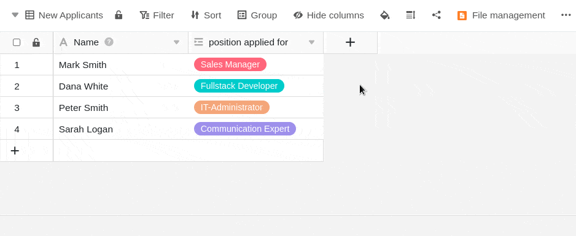
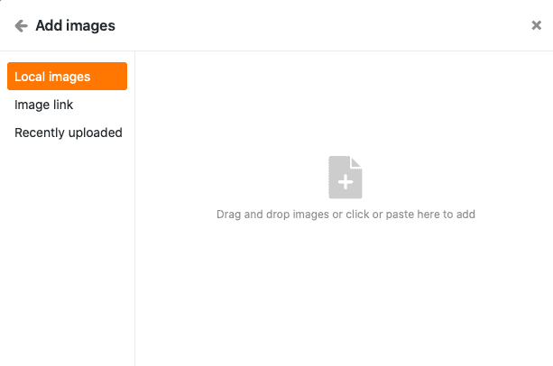
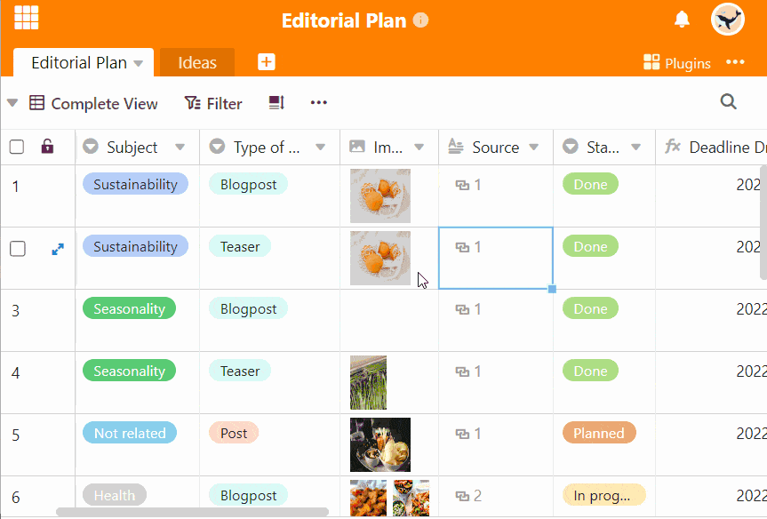

With the help of an **image column** you can upload, save and manage new images in your tables with just a few clicks.

## How to create an image column

1. Click the **\[+\] symbol** to the right of the last column in your table.
2. Give the column a **name** in the upper field.
3. Select the **Image** column type from the drop-down menu.
4. Confirm with **Submit**.

## Add images

In an image column, you have several options for **adding** images. Here's how:

1. Click in the **cell of** an image column.
2. Click on the **plus icon** that appears.
3. A new window will open. Here you can upload **images from your device**, embed them via **URL** or add them from the [file manager](https://seatable.io/en/docs/dateien-und-bilder/das-dateimanagement-einer-base/).

### Local images

In the **Local Images** section you can click in the field with the Add Documents icon, select one or more **image files on your device** and upload them to the Image column.



### Image link

In the **Image Link** section you can add images to the image column by entering the image **URL**. To do this, paste the URL into the empty field and click the **link icon** .



### Last uploaded

In the **Recently uploaded** section, you have access to the [file management](https://seatable.io/en/docs/dateien-und-bilder/das-dateimanagement-einer-base/) of the base. Images that you have already uploaded to **image** or **file columns** or to **your own folders** are saved there. Select an image and insert it into the image column by clicking **Submit**.

### By drag and drop

You can also **insert** images **directly into a table**. To do this, select any number of **images on your device** and drag them into the **cell of** an image column while holding down the mouse button.

## Preview image files

As soon as you insert an image file into the **image column**, the uploaded image is displayed as a **reduced thumb** nail. You can **enlarge** this **thumbnail** by **double-clicking** on the displayed image.

In **full screen mode**, you can zoom in and out of the images using the **magnifying glasses** and switch between multiple images in a row or column using the **arrows**. You can also **delete** or **download** the displayed image file using the  and  icons.

## Image management

In addition to uploading images, you also have various options for managing your images in an image column.

### Download images

You can **download** images stored in an image column with just a few clicks. To do this, first **double-click** in a cell that already contains images _or_ on the **blue double arrow icon**.

Then select the desired **image** and click on the **download icon**  in the image.

If you want to download **all images in a column**, open the drop-down menu above the column header and select **Download all**.

You can then specify **your own file name** and the **number of files** contained in the export will be displayed.

If you click on the **three dots**, you have two options for saving the file: A **download** will save a zip file on your device from which you can extract all the images. You can also save the images **in Seafile**. To do this, you must first [connect a Seafile library to your Base](https://seatable.io/en/docs/integrationen-innerhalb-von-seatable/eine-seafile-bibliothek-an-seatable-anbinden/).

### Delete images

You can also **delete** all images that are stored in an image column. To do this, first **double-click** in a cell that already contains images _or_ on the **blue double arrow symbol**.

Then select the desired **image** and click on the  **icon**. Confirm the process by clicking **Delete**.


