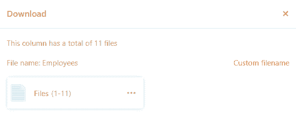

Grâce à une **colonne d'images**, vous pouvez télécharger, enregistrer et gérer de nouvelles images dans vos tableaux en quelques clics seulement.

## Comment créer une colonne d'images

1. Cliquez sur le **symbole \[+\]** à droite de la dernière colonne de votre tableau.
2. Donnez un **nom** à la colonne dans le champ supérieur.
3. Sélectionnez le type de colonne **Image** dans le menu déroulant.
4. Confirmez en cliquant sur **Envoyer**.

## Ajouter des images

Dans une colonne d'images, vous disposez de différentes possibilités pour **ajouter** des images. Voici comment procéder :

1. Cliquez dans la **cellule** d'une colonne d'images.
2. Cliquez sur le **symbole plus** qui apparaît.
3. Une nouvelle fenêtre s'ouvre. Ici, vous pouvez télécharger **des images de votre appareil**, les intégrer par **URL** ou les ajouter depuis le [gestionnaire de fichiers](https://seatable.io/fr/docs/dateien-und-bilder/das-dateimanagement-einer-base/).

### Images locales

Dans la section **Images locales**, vous pouvez cliquer dans le champ avec l'icône Ajouter des documents, sélectionner un ou plusieurs **fichiers image sur votre appareil** et les télécharger dans la colonne Image.



### Lien vers l'image

Dans la zone **Lien image**, vous pouvez ajouter des images à la colonne d'images en saisissant l'**URL de l'image**. Pour ce faire, insérez l'URL dans le champ libre et cliquez sur l'**icône de lien** .



### Dernièrement téléchargé

Dans la zone **Dernier chargement**, vous avez accès à la [gestion des fichiers](https://seatable.io/fr/docs/dateien-und-bilder/das-dateimanagement-einer-base/) de la base. C'est là que sont enregistrées les images que vous avez déjà téléchargées dans des **colonnes** **d'images** ou **de fichiers** ou dans **vos propres dossiers**. Sélectionnez une image et insérez-la dans la colonne des images en cliquant sur **Envoyer**.

### Par glisser-déposer

En outre, vous pouvez également **insérer** des images **directement dans un tableau**. Pour ce faire, sélectionnez autant d'**images** que vous le souhaitez **sur votre appareil** et faites-les glisser dans la **cellule** d'une colonne d'images en maintenant le bouton de la souris enfoncé.

## Aperçu des fichiers image

Dès que vous insérez un fichier image dans la **colonne des images**, l'image téléchargée s'affiche sous la forme d'une **vignette réduite**. Vous pouvez **agrandir** cette **miniature** en **double-cliquant** sur l'image représentée.

En **mode plein écran**, vous pouvez agrandir et réduire les images à l'aide des **loupes** et passer d'une image à l'autre sur une même ligne ou une même colonne à l'aide des **flèches**. Vous pouvez également utiliser les icônes  et  pour **supprimer** ou **télécharger** le fichier image affiché.

## Gestion des images

Outre le téléchargement d'images, vous disposez également de différentes possibilités de gestion de vos images dans une colonne d'images.

### Télécharger les images

Vous pouvez **télécharger** des images stockées dans une colonne d'images en quelques clics. Pour ce faire, **double-cliquez** d'abord dans une cellule qui contient déjà des images _ou_ sur l'**icône bleue à double flèche**.

Sélectionnez ensuite l'**image** souhaitée et cliquez sur l'**icône de téléchargement**  dans l'image.

Si vous souhaitez télécharger **toutes les images d'une colonne**, ouvrez le menu déroulant au-dessus de l'en-tête de la colonne et sélectionnez **Tout télécharger**.

Ensuite, vous pouvez encore définir **votre propre nom de fichier** et le système vous indique **combien de fichiers** seront inclus dans l'exportation.

En cliquant sur les **trois points**, vous avez deux options pour enregistrer le fichier : En cas de **téléchargement**, un fichier zip est enregistré sur votre appareil, à partir duquel vous pouvez extraire toutes les images. En outre, vous pouvez également **enregistrer** les images **dans Seafile**. Pour ce faire, vous devez au préalable [connecter une bibliothèque Seafile à votre base](https://seatable.io/fr/docs/integrationen-innerhalb-von-seatable/eine-seafile-bibliothek-an-seatable-anbinden/).

### Supprimer des images

Vous pouvez également **supprimer** toutes les images enregistrées dans une colonne d'images. Pour ce faire, **double-cliquez** dans une cellule contenant déjà des images _ou_ cliquez sur l'**icône bleue à double flèche**.

Sélectionnez ensuite l'**image** souhaitée et cliquez sur l'**icône** . Confirmez ensuite l'opération en cliquant sur **Supprimer**.


