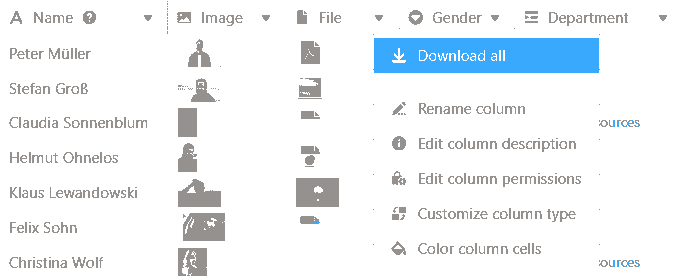

En una **columna de archivos** puede guardar uno o varios archivos y añadir así documentos a la fila correspondiente.

## Cómo crear una columna de archivos

1. Haga clic en el **símbolo \[+**\] situado a la derecha de la última columna de la tabla.
2. Dé un **nombre** a la columna en el campo superior.
3. Seleccione el tipo de columna **Fichero** en el menú desplegable.

## Cargar nuevos archivos

Puedes **cargar archivos** en la columna de archivos haciendo clic con el ratón en una **celda** y seleccionando el **símbolo más** que aparece. Puedes **arrastrar y soltar** archivos en la ventana recién abierta o hacer clic con el ratón para cargar archivos desde tu dispositivo.



### Cargar varios archivos nuevos al mismo tiempo

1. Haga clic en la **celda de** una columna de archivo.
2. Haz clic en el **símbolo más** que aparece.
3. Se abre una nueva ventana. Aquí puedes cargar archivos desde tu dispositivo mediante **arrastrar y soltar** o **hacer clic**.
4. Seleccione varios archivos a la vez seleccionando todos los documentos que desea cargar y cargándolos juntos.



## Añadir archivos existentes

Además de los archivos nuevos que subas localmente a la celda de una columna de archivos, también puedes añadir archivos existentes, que pueden proceder de **tres fuentes**:

- Últimos **subidos**: Aquí encontrarás los últimos archivos subidos que están guardados en el [gestor de archivos](https://seatable.io/es/docs/dateien-und-bilder/das-dateimanagement-einer-base/) Base.
- **Mis carpetas**: aquí tienes acceso a los archivos de tus propias carpetas, que puedes crear y rellenar en el [gestor de archivos](https://seatable.io/es/docs/dateien-und-bilder/das-dateimanagement-einer-base/).
- **Seafile**: Aquí puede seleccionar los archivos de [las bibliotecas](https://seatable.io/es/docs/integrationen-innerhalb-von-seatable/eine-seafile-bibliothek-an-seatable-anbinden/) Seafile que están conectados a su base.

1. Haga clic en la **celda de** una columna de archivos y, a continuación, en el **símbolo más** que aparece.
2. Se abre una nueva ventana. En la navegación de la izquierda, seleccione la **fuente** desde la que desea añadir un archivo.
3. Haga clic en la **estructura de carpetas hasta llegar** al archivo deseado.
4. Seleccione el **archivo** e insértelo en la celda con **Enviar**.

## Descarga de archivos

1. En la columna de archivos, **haga doble clic** en la celda que contiene los documentos que desea descargar.
2. Se abre una nueva ventana. Aquí se enumeran **todos los archivos** almacenados en la celda.
3. De este modo, se puede crear un **archivo único** descargar:
    - Sitúe el puntero del ratón sobre el documento y haga clic en el **icono de descarga** .
4. Así que puedes **varios archivos** descargar:
    - Haga clic en **Seleccionar.**
    - Seleccione la opción **Seleccionar todo** o **marque** las casillas situadas delante de los archivos.
    - A continuación, haga clic en **Descargar**.

Si desea descargar todos los archivos de una columna, abra el menú desplegable situado encima de la cabecera de la columna y seleccione **Descargar todo**.

A continuación, puede especificar **su propio nombre de archivo** y se mostrará el **número de archivos** que contiene la exportación.

Si pulsa sobre los **tres puntos**, tiene dos opciones para guardar el archivo: Al **descargarlo**, se guarda en tu dispositivo un archivo zip del que puedes extraer todos los archivos. También puedes guardar los archivos **en Seafile**. Para ello, primero debes [conectar una biblioteca Seafile a tu Base](https://seatable.io/es/docs/integrationen-innerhalb-von-seatable/eine-seafile-bibliothek-an-seatable-anbinden/).

## Renombrar archivos

1. Abra la ventana **Todos los ficheros** **haciendo doble clic** en una celda de la columna Fichero.
2. Sitúe el puntero del ratón sobre el archivo cuyo nombre desea cambiar y haga clic en los **tres puntos**.
3. Seleccione la opción **Renombrar** e introduzca un nuevo **nombre de archivo**.

## Eliminar archivos

1. Abra la ventana **Todos los ficheros** **haciendo doble clic** en una celda de la columna Fichero.
2. De este modo, se puede crear un **archivo único** Borrar
    - Mueva el puntero del ratón sobre el archivo que desea eliminar y haga clic en los **tres puntos**.
    - Seleccione la opción **Borrar**.
3. Así que puedes **varios archivos** Borrar
    - Haga clic en **Seleccionar.**
    - Seleccione la opción **Seleccionar todo** o **marque** las casillas situadas delante de los archivos.
    - Haga clic en **Eliminar.**



## Preguntas frecuentes



¿Se puede descargar un archivo durante una lectura compartida?|||

Sí. Aunque un usuario sólo tenga **permiso de** lectura, puede descargar archivos.

---

¿Se pueden reproducir archivos de audio en SeaTable?|||

No. Para poder reproducir **archivos de** audio, primero debes descargarlos.

---

¿Es posible cambiar el orden de los ficheros en una columna de ficheros?|||

No, el orden **no puede** modificarse dentro de una columna de archivo. El documento cargado en primer lugar es el primero. Según el orden en que cargue los documentos, podrá determinar el orden dentro de la columna de archivos.


