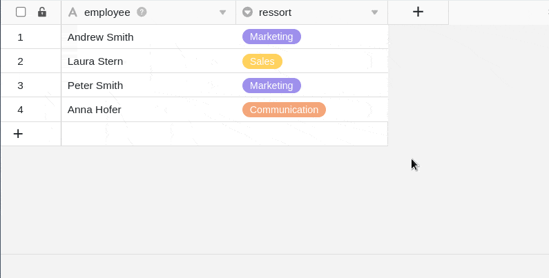

Puede almacenar una firma digital en una **columna de firma**, que se guarda como archivo PNG en el gestor de archivos Base.

## Cómo crear una columna de firmas

1. Haga clic en el **símbolo \[+**\] situado a la derecha de la última columna de la tabla.
2. Dé un **nombre** a la columna en el campo superior.
3. Seleccione el tipo de columna Columna de **firma** en el menú desplegable.

## Capturar una firma digital

Si haces clic en cualquier celda de la **columna de firma**, se abre automáticamente una ventana con un **panel** en el que puedes firmar con el ratón y -en dispositivos con pantalla táctil- con un bolígrafo o el dedo.



## Asegurar una firma digital

Para guardar una firma introducida en el panel, basta con hacer clic en **Guardar**. La firma introducida en el panel se guardará en la celda y podrá recuperarse en cualquier momento haciendo doble clic.

## Modificar una firma digital

Si no está satisfecho con su firma y desea firmar de nuevo, simplemente haga clic en **Firmar de nuevo**. Tenga en cuenta que se sobrescribirá toda la firma que haya introducido. **No** es posible modificar partes individuales de su firma.



## Firmas digitales en el gestor de archivos

Cada firma almacenada también se guarda en la [gestión de archivos](https://seatable.io/es/docs/dateien-und-bilder/das-dateimanagement-einer-base/) de su Base como un archivo PNG en una **carpeta del sistema**.

Desde ahí puedes **descargar** y **eliminar** tus firmas.

