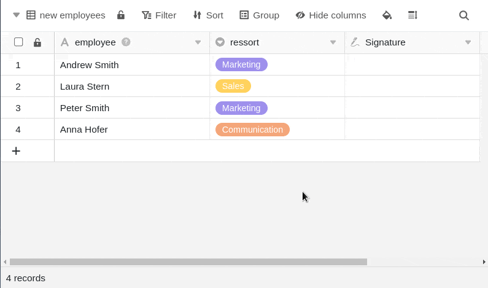

Dans une **colonne de signature**, vous pouvez déposer une signature numérique qui sera enregistrée sous forme de fichier PNG dans le gestionnaire de fichiers de la base.

## Comment créer une colonne de signatures

1. Cliquez sur le **symbole \[+\]** à droite de la dernière colonne de votre tableau.
2. Donnez un **nom** à la colonne dans le champ supérieur.
3. Sélectionnez le type de colonne **Colonne de signature** dans le menu déroulant.

## Saisir une signature numérique

Si vous cliquez dans n'importe quelle cellule de la **colonne Signature**, une fenêtre s'ouvre automatiquement avec un **panneau** dans lequel vous pouvez signer avec votre souris et - sur les appareils à écran tactile - avec un stylo ou un doigt.



## Sécuriser une signature numérique

Pour sauvegarder une signature saisie dans le tableau de bord, il suffit de cliquer sur **Enregistrer**. La signature enregistrée dans le tableau de bord est ensuite sauvegardée dans la cellule et peut être rappelée à tout moment par un double-clic.

## Modifier une signature numérique

Si vous n'êtes pas satisfait de la signature que vous avez enregistrée et que vous souhaitez signer à nouveau, il vous suffit de cliquer sur **Signer à nouveau**. Notez que l'ensemble de la signature saisie sera alors écrasée. Il n'est **pas** possible de modifier des parties individuelles de votre signature.



## Signatures numériques dans le gestionnaire de fichiers

Chaque signature déposée est également enregistrée dans le [gestionnaire de fichiers](https://seatable.io/fr/docs/dateien-und-bilder/das-dateimanagement-einer-base/) de votre base sous forme de fichier PNG dans un **dossier système**.

De là, vous pouvez à la fois **télécharger** et **supprimer** vos signatures.

