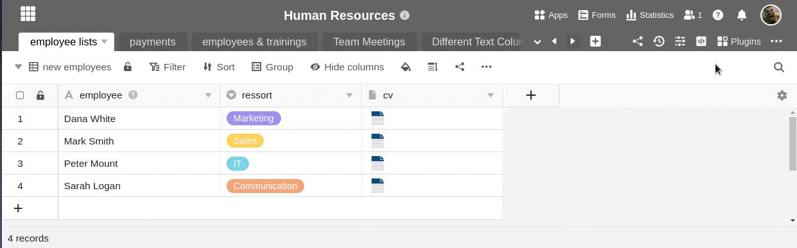

**Les fichiers**, **images** et **signatures** que vous **supprimez** dans un tableau continuent à être présents dans le [gestionnaire de fichiers](https://seatable.io/fr/docs/dateien-und-bilder/das-dateimanagement-einer-base/) de la base. Pour les supprimer définitivement, vous devez également supprimer les fichiers de la gestion des fichiers.

## Supprimer des fichiers du gestionnaire de fichiers

1. Cliquez sur les **trois points** dans l'en-tête de la base et ouvrez le **gestionnaire de fichiers**.
2. Allez dans le **dossier** correspondant dans lequel vous souhaitez supprimer le fichier.
3. Passez la souris sur le **fichier** que vous souhaitez supprimer et cliquez sur l'**icône de la corbeille**.
4. Confirmez à nouveau en cliquant sur **Supprimer**.

## Suppression définitive de fichiers

Dès que vous avez supprimé les fichiers souhaités, ils atterrissent dans **la corbeille** du gestionnaire de fichiers. Ils y restent **pendant 60 jours** et peuvent être restaurés. Si vous souhaitez supprimer définitivement les fichiers du système avant l'expiration de ce délai, vous pouvez **vider** la **corbeille**.

1. Cliquez dans la navigation sur **Corbeille**.
2. Sélectionnez soit **Mes dossiers**, soit **Dossiers système**, selon l'emplacement des fichiers que vous souhaitez supprimer définitivement.
3. Cliquez sur **Vider**.


