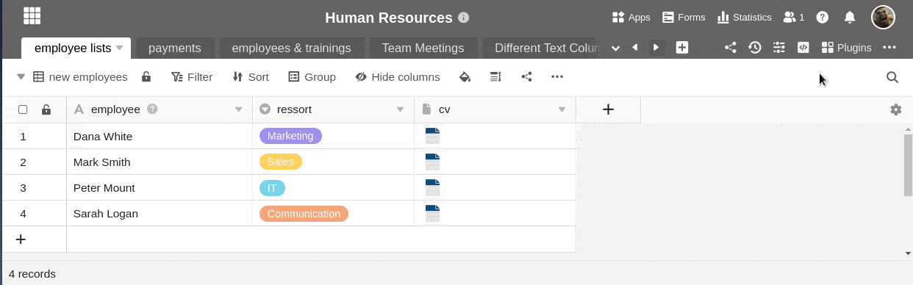
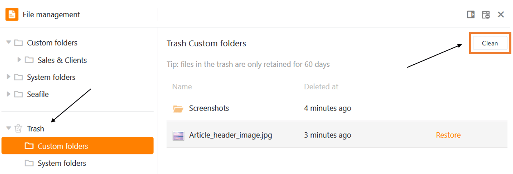

**Os ficheiros**, **imagens** e **assinaturas** que **eliminar** numa tabela podem ainda ser encontrados no gestor de [ficheiros](https://seatable.io/pt/docs/dateien-und-bilder/das-dateimanagement-einer-base/) Base. Para removê-los permanentemente, também é necessário excluir os arquivos do gerenciador de arquivos.

## Eliminar ficheiros do gestor de ficheiros

1. Clique nos **três pontos** no cabeçalho da base e abra a **gestão de ficheiros**.
2. Vá para a **pasta** adequada onde pretende eliminar o ficheiro.
3. Mova o rato sobre o **ficheiro** que pretende eliminar e clique no **ícone da reciclagem**.
4. Confirmar novamente com **Apagar.**

## Eliminação final dos ficheiros

Assim que tiver eliminado os ficheiros pretendidos, estes vão parar à **reciclagem** do gestor de ficheiros. Ficam lá durante **60 dias** e podem ser restaurados. Se pretender remover permanentemente os ficheiros do sistema antes deste período expirar, pode **esvaziar** a reciclagem.

1. Clique em **Lixeira** na navegação.
2. Seleccione **As minhas pastas** ou **Pastas do sistema** - dependendo da localização dos ficheiros que pretende eliminar permanentemente.
3. Clique em **Vazio**.


