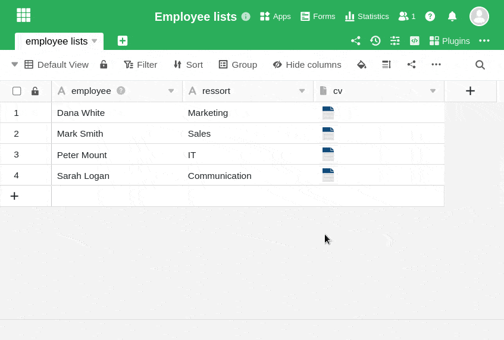
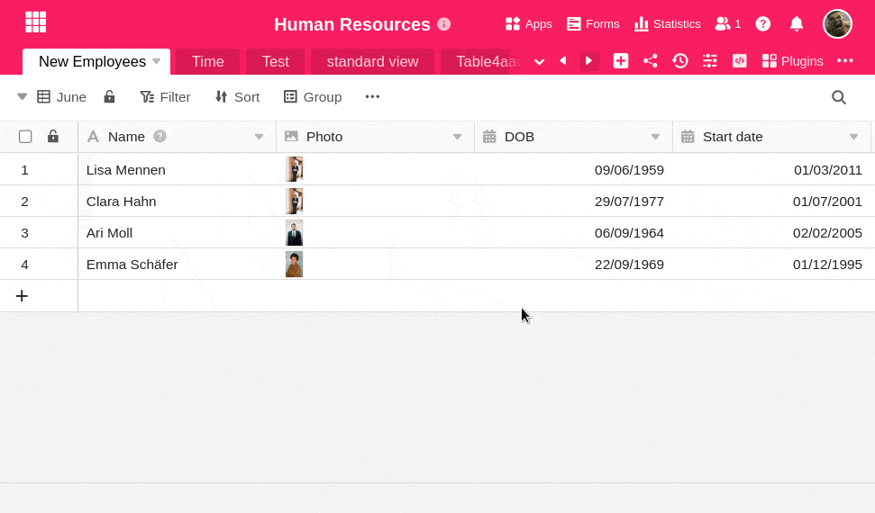

**Files** and **images** that you have removed from an [image](https://seatable.io/en/docs/dateien-und-bilder/die-bild-spalte/) or [file column](https://seatable.io/en/docs/datei-und-bildanhaenge/die-datei-spalte/) are **not permanently deleted**. These deleted files remain in the Base [file manager](https://seatable.io/en/docs/dateien-und-bilder/das-dateimanagement-einer-base/) and can be **restored** in two different ways.

## Last uploaded

1. Open the **All Files** or **All Images** window by **double-clicking** the **cell of** a file or image column.
2. Click the **Add files/images** button and then select the **Last uploaded** option.
3. Select any **(image) file** from one of the folders and click it.
4. Now click **Submit** at the bottom right and the selected (image) file will be added back to the File or Image column.

## Base file management

1. Click on the **three dots** in the Base header and select the **file manager**. You can also add it as a quick access to your toolbar.
2. In the window that opens, you will find a **folder system** with all the files stored in your Base.
3. Simply drag and drop the desired (image) file from the file manager into the appropriate file or image column.

