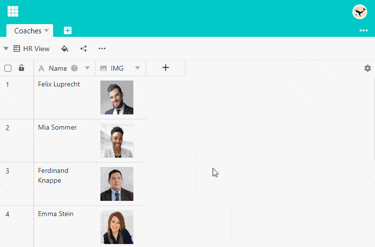

SeaTable erlaubt das **Löschen** von **Dateien** und **Bildern** auf verschiedenen Wegen. Die folgenden Anleitungen gelten sowohl für [Bild-]() als auch für [Datei-Spalten]().

## Dateien und Bilder über die Zeilendetails entfernen

1. Öffnen Sie die Detailansicht einer Zeile, indem Sie auf das **Doppelpfeil-Symbol** klicken, welches erscheint, sobald Sie die Maus auf die Nummerierung der Zeile bewegen.
2. Fahren Sie im Fenster **Zeilendetails** mit der Maus über das **Bild** oder die **Datei**, die Sie löschen möchten.
3. In der rechten oberen Ecke der Miniatur taucht nun ein  auf. Klicken Sie dieses an.
4. Es öffnet sich ein Dialog mit der Frage **Möchten Sie diese Datei/Bild wirklich löschen?** Wenn ja, klicken Sie auf **Löschen**.

## Löschen über die Zelle

1. Öffnen Sie das Fenster **Alle Bilder** oder **Alle Dateien**, indem Sie mit einem **Doppelklick** auf die **Zelle** in einer Bild- oder Datei-Spalte klicken.
2. Bei Bildern funktioniert das Löschen wie über die Zeilendetails. Bei Dateien haben Sie folgende Optionen:
    - Klicken Sie auf **Auswählen** und wählen Sie alle Dateien aus, die Sie löschen möchten. Bestätigen Sie mit **Löschen**.
    - Fahren Sie mit dem Mauszeiger über eine Datei und klicken Sie auf das **Drei-Punkte-Symbol**, um die Option **Löschen** auszuwählen.



Gelöschte Bilder und Dateien sind weiterhin Teil der Base und somit **nicht** endgültig gelöscht. Lesen Sie hierzu die Artikel [Zugriff auf gelöschte Dateien und Bilder]() und [Wie man Dateien dauerhaft entfernt]().


