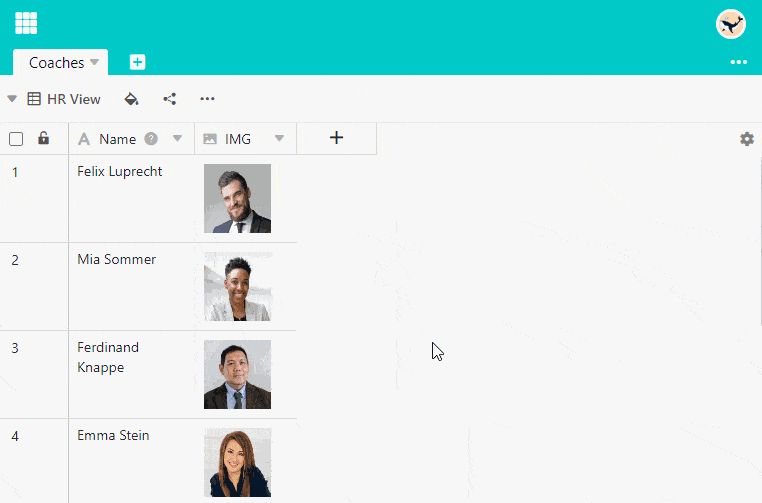

SeaTable le permite **borrar** **archivos** e **imágenes** de diferentes maneras. Las siguientes instrucciones se aplican tanto a las [columnas de]() como a las [de]() archivos.

## Eliminar archivos e imágenes a través de los detalles de la fila

1. Abra la vista detallada de una fila haciendo clic en el **símbolo de la doble flecha** que aparece al pasar el ratón por encima de la numeración de la fila.
2. En la ventana **Detalles de la línea**, sitúe el ratón sobre la **imagen** o el **archivo** que desea eliminar.
3. En la esquina superior derecha de la miniatura aparecerá . Haz clic en él.
4. Se abre un cuadro de diálogo con la pregunta **¿Desea realmente eliminar este archivo/imagen?** En caso afirmativo, haga clic en **Suprimir**.

## Borrar a través de la celda

1. Abra la ventana **Todas las imágenes** o **Todos los archivos** **haciendo doble clic** en la **celda** de una columna de imágenes o archivos.
2. Para las imágenes, el borrado funciona igual que a través de los detalles de la fila. Para los archivos tiene las siguientes opciones:
    - Haga clic en **Seleccionar** y seleccione todos los archivos que desee eliminar. Confirma con **Borrar**.
    - Sitúe el puntero del ratón sobre un archivo y haga clic en el **icono de tres puntos para** seleccionar la opción **Eliminar**.



Las imágenes y archivos borrados siguen formando parte de la base y, por tanto, **no** se eliminan de forma permanente. Lee los artículos [Acceder a archivos]() e imágenes eliminados y [Cómo eliminar archivos]() de forma permanente.


