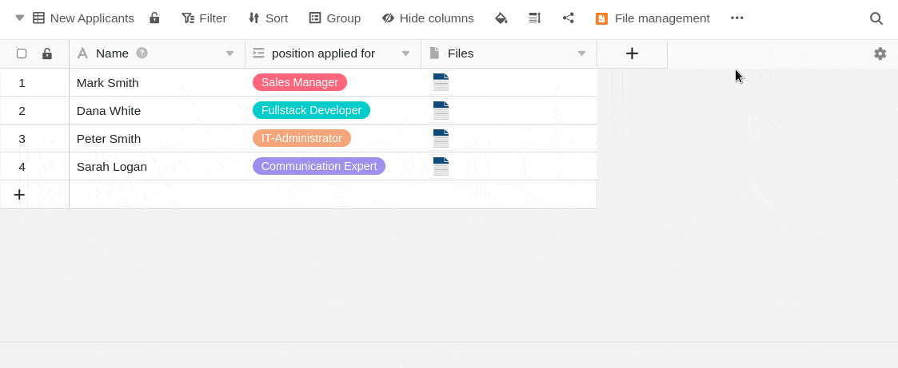
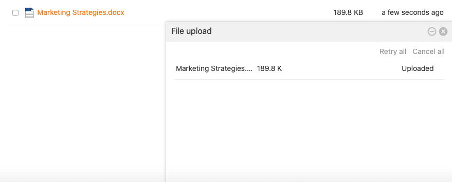
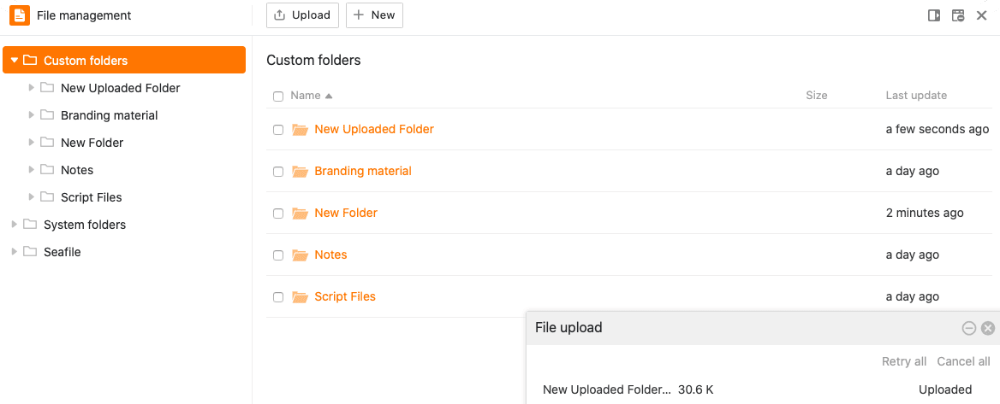
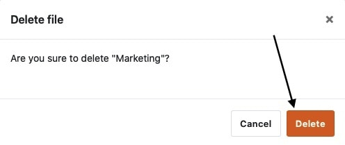

**File management** revolutionizes the way you handle files in your Base. You can upload, rename, copy, move, download and delete **files** there directly. You can even create **new documents** (e.g. Excel, Word or PowerPoint files) and edit them using the integrated editor.

In this overview article you will find all information on the structure and individual functions of the file manager.

## Overview of file management

The file manager contains various folders, which in turn contain various files. A basic distinction can be made between **three folder types**:

- **Custom folders** are independent from the structure of a Base and can be freely created and organized by the user.

- **System folders** are automatically created by SeaTable when you create specific columns, apps or web forms. They contain [files]().

- A **Seafile folder** contains all the files that you have previously uploaded to the external cloud storage of the same name. How exactly the integration of Seafile libraries works and what advantages it brings, you can learn [here]().

The following diagram shows an overview of the complete **folder structure of the file manager**:

## Accessing the file manager

1. Open a **Base** where you want to manage files.
2. Click on the three dots in the Base header to open the **advanced Base options**.
3. Go to **File Management**.

5. A resizable window with the **folder structure** then opens automatically - the Base file management.

You can also **add** the file manager **to the toolbar** by clicking on the **middle icon** at the top right of the window.

This means you can always access the **file manager** with just one click from your toolbar.

If you want to **remove** the file manager from your toolbar, simply click on the icon at the edge of the window again.

## Adjust window size and position of the file manager

You can adjust the window size of the file manager so that you can keep an eye on your tables and data while managing your files and [drag files from the file manager directly into the appropriate columns of your tables](https://seatable.io/en/?post_type=docs&p=26594#8-toc-title).

To do this, simply open the file manager and move the mouse pointer over the **two lines** at the top of the window until a **double arrow** appears. Then hold down the mouse button and drag the window to the desired position and release as soon as this is reached.

In addition to adjusting the window size, you also have the option of **pinning** the file manager **to the right-hand side of the page**. To do this, click on the **first icon from the left** at the top right-hand edge.

The file manager then appears in a window on the right-hand side of the page.

You can pin the file manager to the bottom edge again in the same way.

## The various file management functions in detail

Various management options are available to you within the file management.

### Create a new file in the file manager

You can create and edit new files directly in the file manager with just a few clicks. To do this, first click on **New** and then select either the **New file** option or the various **file types** available for selection.

The newly created file will then appear in its **own** corresponding **folder**. Click the file name to open and edit the file in the editor.

### Create your own folder in the file manager

In addition to files, you can also create **your own folders** directly in the file manager. To do this, click on **New** in the **My folders** area and then select the **New folder** option.

The newly created folder will be added to the navigation in the **My Folders** section afterwards.

### Upload files and folders to the file manager

You can also upload files saved on your device to the file manager with just a few clicks. To do this, first click on **Upload** and then select the **Upload files** option.

Files uploaded in the file manager are always saved in **your own folders**. In addition, an upload window opens, which shows the progress of large amounts of data and in which you can cancel or repeat the upload if necessary.

In addition to uploading files, you also have the option of uploading **entire folders** with files to the file manager.

Uploaded folders are always automatically added to **My Folders**.



### Drag and drop files to appropriate table columns

Another useful function of the file manager is the convenient **moving of files**. You can not only **drag and drop** files into the file manager, but also insert them from the file manager into file columns in the table.



### Rename a file or folder



You can **rename** both files and folders in the **My Folders** section with just a few clicks. Just hover over a file or folder, click the **three dots** that appear and select **Rename**.

Then enter the new **name of** the file or folder in the **text field** and confirm it with the **Enter** key.

### Copy a file to a folder



A file can be copied to its own folder with just a few clicks. The copied file is then available in both the source folder and the destination folder.

To do this, simply hover your mouse over a file, click on the **three dots** that appear and select **Copy To**.

Then select the **destination folder** and confirm with **Submit**.

### Copy an own folder to another folder



Congruent to copying files, you can also copy your own folders to another folder with just a few clicks. The copied folder is then available both at the original location and at the destination.

To do this, simply hover your mouse over a folder of your own, click on the **three dots** that appear and select **Copy** to.

Then select the **destination folder** and confirm with **Submit**.

### Move files to a folder



A file can be moved to its own folder with just a few clicks. The moved file is **no** longer available in the original folder, but **only in the destination folder**.

To do this, simply hover over a file, click on the **three dots** that appear, and select **Move View.**

Then select the **destination folder** and confirm with **Submit**.

### Move an own folder to another folder



In the same way as moving files, folders in the file manager can also be moved to another folder with just a few clicks. The moved folder is then **no** longer available in its original location, but **only in the target folder**.

To do this, simply hover over a folder, click on the **three dots** and select **Move View.**

Then select the **destination folder** and confirm with **Submit**.



### Download files

You can **download** all files from the file manager at any time with just a few clicks. Use this function to back up important files on your device.

Hover your mouse over a file and click the **download icon** . The selected file will then be automatically saved on your device.

### Delete and restore files

You can **delete** any file from the file manager with just a few clicks. Simply move the mouse over a file and click on the **recycle bin icon**.

Then confirm the process again with **Delete**.

Files that you delete from the file manager also disappear from your Base (e.g. from signature, file, image columns, web forms or universal apps) and end up in the **recycle bin**, where they remain for 60 days.



If you want to restore a file from the Recycle Bin, for example because it was accidentally deleted, click **Restore**. You will then find the file in the folder where it was before it was deleted. When you **empty** the Recycle Bin, all deleted files and folders are lost permanently.

### Delete and restore folder

You can delete **your own folders** in the file manager at any time with just a few clicks. To do this, move the mouse over any folder in the **navigation** bar, click on the **three dots** that appear and select **Delete**.

Confirm the deletion afterwards with **Delete**.



In general, you can also delete **subfolders** in another way. To do this, first click on the folder in which the folder you want to delete is located. You will now get an overview with all folders and files that are located in the selected folder. Move the mouse over the folder you want to delete and click on the **trash can icon**.

Confirm the operation with **Delete**.

Folders that you delete from the file manager end up in the **recycle bin**, where they remain for 60 days.

{{< warning  headline="Important notes"  text="Please note that when deleting folders, **all files** in the respective folders are also **deleted**. The same applies to the subfolders in a deleted folder. The deleted files will therefore also disappear from your base (e.g. from signature, file, image columns, web forms or universal apps). Make sure that you **only** delete folders with files that are no longer required from the file management. After **60 days** in the recycle bin, both folders and files are permanently removed from the system." />}}

If you want to restore a folder from the Recycle Bin, for example because you accidentally deleted it, click **Restore**. The folder will then appear where it was before you deleted it. When you **empty** the Recycle Bin, all deleted files and folders are lost permanently.

