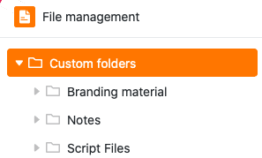
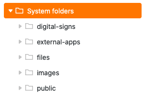
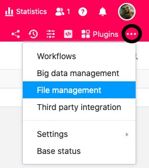
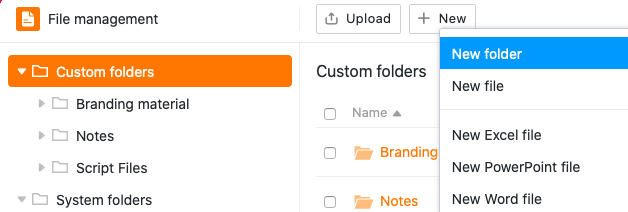
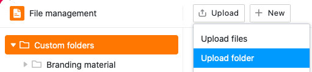
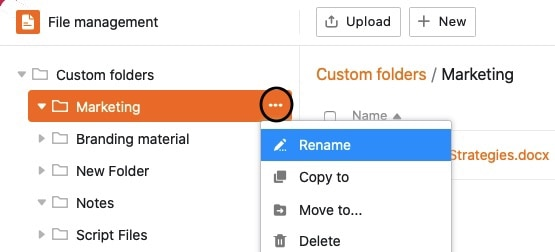
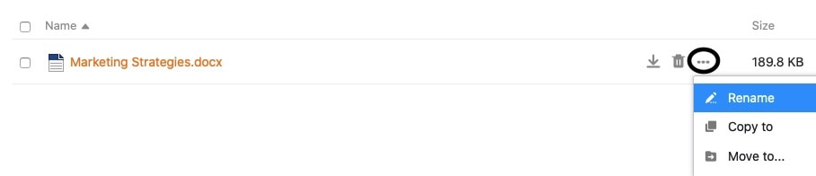
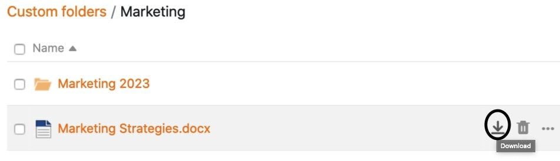
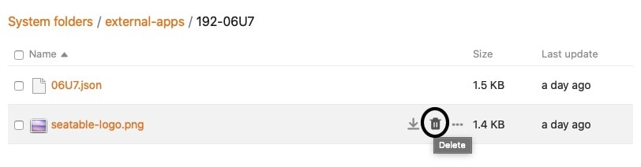

La **gestión de** archivos revoluciona la forma de manejar los archivos en tu Base. Puedes cargar, renombrar, copiar, mover, descargar y eliminar **archivos** directamente. Incluso puedes crear **nuevos documentos** (por ejemplo, archivos Excel, Word o PowerPoint) y editarlos con el editor integrado.

En este artículo general encontrarás toda la información sobre la estructura y las funciones individuales del gestor de archivos.

## Visión general de la gestión de archivos

El gestor de archivos contiene varias carpetas, que a su vez contienen varios archivos. Se puede hacer una distinción básica entre **tres tipos de** carpetas:

- Las **carpetas propias** son independientes de la estructura de una base y pueden ser creadas y organizadas libremente por el usuario.

- Las **carpetas de sistema** son creadas automáticamente por SeaTable cuando se crean determinadas columnas, apps o formularios web. Contienen [archivos]() web.

- Una carpeta **Seafile** contiene todos los archivos que has subido previamente al almacenamiento externo en la nube del mismo nombre. [Aquí]() puedes descubrir cómo funciona exactamente la integración de las bibliotecas Seafile y qué ventajas aporta.

El siguiente diagrama muestra una visión general de la **estructura** completa **de carpetas del gestor de archivos**:

## Acceder al gestor de archivos

1. Abra una **base** en la que desee gestionar ficheros.
2. Haga clic en los tres puntos de la cabecera de la base para abrir las **opciones avanzadas de la base**.
3. Vaya a **Gestión de archivos**.

5. Se abrirá automáticamente una ventana redimensionable con la **estructura de carpetas**: el gestor de archivos Base.

También puedes añadir el gestor de archivos **a la barra de herramientas** haciendo clic en el **icono central** situado en la parte superior derecha de la ventana.

Esto significa que siempre puedes acceder al **gestor de archivos** con un solo clic desde la barra de herramientas.

Si quieres volver a **quitar** el gestor de archivos de la barra de herramientas, sólo tienes que volver a hacer clic en el icono situado en el borde de la ventana.

## Ajuste el tamaño y la posición de la ventana del gestor de archivos

Tienes la opción de ajustar el tamaño de la ventana del gestor de archivos para que puedas mantener un ojo en tus tablas y datos mientras gestionas tus archivos y [arrastras archivos desde el gestor de archivos directamente a las columnas apropiadas de tus tablas](https://seatable.io/es/?post_type=docs&p=26594#8-toc-title).

Para ello, basta con abrir el gestor de archivos y mover el puntero del ratón sobre las **dos líneas de** la parte superior de la ventana hasta que aparezca una **flecha doble**. A continuación, mantenga pulsado el botón del ratón y arrastre la ventana hasta la posición deseada y suéltelo en cuanto la alcance.

Además de ajustar el tamaño de la ventana, también tienes la opción de **anclar** el gestor de archivos **a la parte derecha de la página**. Para ello, haz clic en el **primer icono desde la izquierda**, en el borde superior derecho.

El gestor de archivos aparece entonces en una ventana a la derecha de la página.

Puedes volver a anclar el gestor de archivos al borde inferior del mismo modo.

## Las distintas funciones de gestión de ficheros en detalle

Dentro de la gestión de archivos dispone de varias opciones de gestión.

### Crear un nuevo archivo en el gestor de archivos

Puedes crear y editar nuevos archivos directamente en el gestor de archivos con sólo unos clics. Para ello, primero haga clic en **Nuevo** y, a continuación, seleccione la opción **Nuevo archivo** o los distintos **tipos** de archivo disponibles para su selección.

El archivo recién creado aparecerá en su **carpeta** correspondiente. Haga clic en el nombre del archivo para abrirlo y editarlo en el editor.

### Crea tu propia carpeta en el gestor de archivos

Además de archivos, también puedes crear **tus propias carpetas** directamente en el gestor de archivos. Para ello, haga clic en **Nuevo** en el área **Mis carpetas** y, a continuación, seleccione la opción **Nueva carpeta**.

La carpeta recién creada se añade entonces a la navegación en el área **Mis carpetas**.

### Cargar archivos y carpetas en el gestor de archivos

También puedes subir archivos guardados en tu dispositivo al gestor de archivos con sólo unos clics. Para ello, primero haz clic en **Cargar** y luego selecciona la opción **Cargar archivos**.

Los archivos cargados en el gestor de archivos se guardan siempre en **Mis carpetas**. Además, se abre una ventana de subida, que muestra el progreso de grandes cantidades de datos y en la que puedes cancelar o repetir la subida si es necesario.

Además de subir archivos, también tienes la opción de subir **carpetas enteras** con archivos al gestor de archivos.

Las carpetas cargadas siempre se añaden automáticamente a **Mis carpetas**.



### Arrastre y suelte los archivos en las columnas adecuadas de la tabla

Otra función útil del gestor de archivos es el cómodo **desplazamiento** de archivos. No sólo puede **arrastrar y soltar** archivos en el gestor de archivos, sino también insertarlos desde el gestor de archivos en columnas de archivos de la tabla.



### Cambiar el nombre de un archivo o carpeta



Puedes **renombrar** tanto archivos como carpetas en el área **Mis carpetas** con sólo unos clics. Basta con pasar el ratón por encima de un archivo o carpeta, hacer clic en los **tres puntos** que aparecen y seleccionar **Cambiar nombre**.

A continuación, introduzca el nuevo **nombre** del archivo o carpeta en el **campo de texto** y confírmelo con la **tecla Intro**.

### Copiar un archivo en una carpeta



Un archivo puede copiarse a su propia carpeta con sólo unos clics. El archivo copiado estará disponible tanto en la carpeta de origen como en la de destino.

Basta con pasar el ratón por encima de un archivo, hacer clic en los **tres puntos** que aparecen y seleccionar **Copiar** a.

A continuación, seleccione la **carpeta de destino** y confirme con **Enviar**.

### Copiar su propia carpeta en otra carpeta



De forma congruente con la copia de archivos, las carpetas propias también pueden copiarse a otra carpeta con sólo unos clics. La carpeta copiada estará disponible tanto en la ubicación original como en la de destino.

Para ello, sólo tienes que pasar el ratón por encima de tu propia carpeta, hacer clic en los **tres puntos** que aparecen y seleccionar **Copiar a**.

A continuación, seleccione la **carpeta de destino** y confirme con **Enviar**.

### Mover archivos a una carpeta



Un archivo puede moverse a su propia carpeta con sólo unos clics. El archivo movido ya **no** estará disponible en la carpeta original, sino **sólo en la carpeta de destino**.

Para ello, basta con pasar el ratón por encima de un archivo, hacer clic en los **tres puntos** que aparecen y seleccionar **Mover vista**.

A continuación, seleccione la **carpeta de destino** y confirme con **Enviar**.

### Mover una carpeta propia a otra carpeta



Del mismo modo que para mover archivos, las carpetas del gestor de archivos también se pueden mover a otra carpeta con sólo unos clics. La carpeta movida ya **no** estará disponible en su ubicación original, sino **sólo en la carpeta de destino**.

Para ello, basta con pasar el ratón por encima de una carpeta, hacer clic en los **tres puntos** y seleccionar **Mover vista**.

A continuación, seleccione la **carpeta de destino** y confirme con **Enviar**.



### Descargar archivos

Puedes **descargar** todos los archivos del gestor de archivos en cualquier momento con sólo unos clics. Utiliza esta función para hacer copias de seguridad de los archivos importantes de tu dispositivo.

Sitúe el ratón sobre un archivo y haga clic en el **símbolo de descarga** . El archivo seleccionado se guardará automáticamente en tu dispositivo.

### Eliminar y restaurar archivos

Puedes **eliminar** cualquier archivo desde el gestor de archivos con sólo unos clics. Para ello, basta con pasar el ratón por encima de un archivo y hacer clic en el **icono de la papelera de reciclaje**.

A continuación, vuelva a confirmar el proceso con **Suprimir.**

Los archivos que eliminas del gestor de archivos también desaparecen de tu Base (por ejemplo, de firmas, archivos, columnas de imágenes, formularios web o apps universales) y acaban en la **papelera de reciclaje**, donde permanecen 60 días.



Si quieres restaurar un archivo de la papelera de reciclaje, por ejemplo porque se borró por error, haz clic en **Restaurar**. Entonces encontrará el archivo en la carpeta donde estaba antes de ser borrado. Cuando **vacías** la papelera de reciclaje, todos los archivos y carpetas borrados se pierden definitivamente.

### Eliminar y restaurar carpeta

Puedes eliminar **tus propias carpetas** en el gestor de archivos en cualquier momento con sólo unos clics. Para ello, pasa el ratón por encima de cualquier carpeta de la barra de **navegación**, haz clic en los **tres puntos** que aparecen y selecciona **Eliminar**.

A continuación, confirme la eliminación con **Suprimir**.



En general, también puede eliminar **subcarpetas** de otra forma. En primer lugar, haga clic en la carpeta en la que se encuentra la carpeta que desea eliminar. Ahora verá un resumen de todas las carpetas y archivos de la carpeta seleccionada. Sitúe el ratón sobre la carpeta que desea eliminar y haga clic en el **símbolo de la papelera** de reciclaje.

Confirme la operación con **Suprimir.**

Las carpetas que eliminas del gestor de archivos acaban en la **papelera de reciclaje**, donde permanecen 60 días.

{{< warning  headline="Notas importantes"  text="Tenga en cuenta que al eliminar carpetas, también se **eliminan** **todos los archivos** de las respectivas carpetas. Lo mismo ocurre con las subcarpetas de una carpeta eliminada. Por lo tanto, los archivos eliminados también desaparecerán de su base (por ejemplo, de firmas, archivos, columnas de imágenes, formularios web o aplicaciones universales). Asegúrate de que **sólo** eliminas carpetas con archivos que ya no son necesarios desde el gestor de archivos. Después de **60 días** en la papelera de reciclaje, tanto las carpetas como los archivos se eliminan definitivamente del sistema." />}}

Si desea restaurar una carpeta de la papelera de reciclaje, por ejemplo porque la ha borrado por error, haga clic en **Restaurar**. La carpeta aparecerá en el lugar donde estaba antes de ser eliminada. Cuando **vacías** la papelera de reciclaje, todos los archivos y carpetas borrados se pierden definitivamente.

