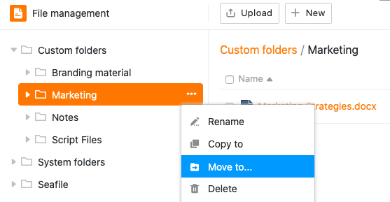

**Управление файлами** революционизирует способ работы с файлами в вашей базе. Вы можете загружать, переименовывать, копировать, перемещать, скачивать и удалять **файлы** напрямую. Вы даже можете создавать **новые документы** (например, файлы Excel, Word или PowerPoint) и редактировать их с помощью встроенного редактора.

В этой обзорной статье вы найдете всю информацию о структуре и отдельных функциях файлового менеджера.

## Обзор управления файлами

Файловый менеджер содержит различные папки, которые, в свою очередь, содержат различные файлы. В основном различают **три типа папок**:

- **Собственные папки** не зависят от структуры базы и могут свободно создаваться и организовываться пользователем.

- **Системные папки** автоматически создаются SeaTable при создании определенных колонок, приложений или веб-форм. Они содержат [файлы]().

- **Папка Seafile** содержит все файлы, которые вы ранее загрузили в одноименное внешнее облачное хранилище. [Здесь]() вы можете узнать, как именно работает интеграция библиотек Seafile и какие преимущества она дает.

На следующей схеме показана полная **структура папок файлового менеджера**:

## Доступ к файловому менеджеру

1. Откройте **базу**, в которой вы хотите управлять файлами.
2. Нажмите на три точки в заголовке базы, чтобы открыть **расширенные параметры базы**.
3. Перейдите в раздел " **Управление файлами**".

5. После этого автоматически откроется изменяемое по размеру окно со **структурой папок** - файловый менеджер Base.

Вы также можете **добавить** файловый менеджер **на панель инструментов**, нажав на **значок центра** в правом верхнем углу окна.

Это означает, что вы всегда можете получить доступ к **файловому менеджеру** одним щелчком мыши на панели инструментов.

Если вы хотите снова **убрать** файловый менеджер с панели инструментов, просто нажмите на значок в краю окна.

## Настройте размер и положение окна файлового менеджера

У вас есть возможность настроить размер окна файлового менеджера, чтобы вы могли следить за таблицами и данными, управляя файлами, и [перетаскивать файлы из файлового менеджера прямо в соответствующие колонки ваших таблиц](https://seatable.io/ru/?post_type=docs&p=26594#8-toc-title).

Для этого просто откройте файловый менеджер и наведите указатель мыши на **две линии** в верхней части окна, пока не появится **двойная стрелка**. Затем, удерживая кнопку мыши, перетащите окно в нужное место и отпустите, как только оно будет достигнуто.

Помимо регулировки размера окна, у вас есть возможность **закрепить** файловый менеджер **в правой части страницы**. Для этого нажмите на **первый значок слева** в правом верхнем углу.

После этого файловый менеджер появится в окне в правой части страницы.

Таким же образом можно снова прикрепить файловый менеджер к нижнему краю.

## Различные функции управления файлами в деталях

В рамках управления файлами вам доступны различные варианты управления.

### Создайте новый файл в файловом менеджере

Вы можете создавать и редактировать новые файлы прямо в файловом менеджере, сделав всего несколько щелчков мышью. Для этого сначала нажмите кнопку " **Создать"**, а затем выберите опцию **"Новый файл"** или различные **типы файлов**, доступные для выбора.

Вновь созданный файл появится в соответствующей **папке**. Щелкните по имени файла, чтобы открыть и отредактировать его в редакторе.

### Создайте собственную папку в файловом менеджере

Помимо файлов, вы можете создавать **собственные папки** прямо в файловом менеджере. Для этого в области " **Мои папки** " нажмите кнопку **"Создать"**, а затем выберите опцию **"Новая папка**".

После этого вновь созданная папка добавляется в навигацию в области " **Мои папки** ".

### Загрузка файлов и папок в файловый менеджер

Вы также можете загружать файлы, сохраненные на устройстве, в файловый менеджер всего несколькими щелчками мыши. Для этого сначала нажмите на кнопку **Upload**, а затем выберите опцию **Upload files**.

Файлы, загруженные в файловом менеджере, всегда сохраняются в **папках "Мои"**. Кроме того, открывается окно загрузки, в котором отображается ход загрузки больших объемов данных и в котором при необходимости можно отменить или повторить загрузку.

Помимо загрузки файлов, вы также можете загружать в файловый менеджер **целые папки** с файлами.

Загруженные папки всегда автоматически добавляются в **папку Мои папки**.



### Перетаскивайте файлы в соответствующие колонки таблицы

Еще одна полезная функция файлового менеджера - удобное **перемещение файлов**. Вы можете не только **перетаскивать** файлы в файловый менеджер, но и вставлять их из файлового менеджера в колонки файлов в таблице.



### Переименование файла или папки



Вы можете **переименовывать** как файлы, так и папки в области " **Мои папки"** всего несколькими щелчками мыши. Просто наведите курсор мыши на файл или папку, нажмите на появившиеся **три точки** и выберите **Переименовать**.

Затем введите в **текстовое поле** новое **имя** файла или папки и подтвердите его **клавишей Enter**.

### Копирование файла в папку



Файл можно скопировать в собственную папку всего несколькими щелчками мыши. Скопированный файл доступен как в исходной папке, так и в папке назначения.

Просто наведите курсор мыши на файл, нажмите на появившиеся **три точки** и выберите **Копировать** в.

Затем выберите **папку назначения** и подтвердите выбор нажатием кнопки **Отправить**.

### Копирование собственной папки в другую папку



Аналогично копированию файлов, собственные папки также могут быть скопированы в другую папку всего несколькими щелчками мыши. Скопированная папка будет доступна как в исходном месте, так и в месте назначения.

Для этого просто наведите курсор мыши на свою папку, нажмите на появившиеся **три точки** и выберите **Копировать в**.

Затем выберите **папку назначения** и подтвердите выбор нажатием кнопки **Отправить**.

### Переместить файлы в папку



Файл можно переместить в собственную папку всего несколькими щелчками мыши. Перемещенный файл больше **не** будет доступен в исходной папке, а **только в папке назначения**.

Для этого просто наведите курсор мыши на файл, нажмите на появившиеся **три точки** и выберите **Переместить просмотр**.

Затем выберите **папку назначения** и подтвердите выбор нажатием кнопки **Отправить**.

### Переместить собственную папку в другую папку



Аналогично перемещению файлов, папки в файловом менеджере можно перемещать в другую папку всего несколькими щелчками мыши. При этом перемещенная папка будет доступна **только в папке назначения**.

Для этого просто наведите курсор мыши на папку, нажмите на **три точки** и выберите **Переместить вид**.

Затем выберите **папку назначения** и подтвердите выбор нажатием кнопки **Отправить**.



### Файлы для скачивания

Вы можете в любой момент **загрузить** все файлы из файлового менеджера, сделав всего несколько щелчков мышью. Используйте эту функцию для резервного копирования важных файлов на вашем устройстве.

Наведите курсор на файл и нажмите на **символ загрузки** . Выбранный файл будет автоматически сохранен на вашем устройстве.

### Удаление и восстановление файлов

Вы можете **удалить** любой файл из файлового менеджера всего несколькими щелчками мыши. Для этого просто наведите курсор на файл и нажмите на **значок корзины**.

Затем подтвердите процесс еще раз с помощью **Delete**.

Файлы, которые вы удаляете из файлового менеджера, также исчезают из вашей базы (например, из колонок подписей, файлов, изображений, веб-форм или универсальных приложений) и попадают в **корзину**, где остаются в течение 60 дней.



Если необходимо восстановить файл из корзины, например, если он был удален по ошибке, нажмите кнопку **Восстановить**. После этого файл окажется в той папке, где он находился до удаления. При **очистке** корзины все удаленные файлы и папки теряются безвозвратно.

### Удаление и восстановление папки

Вы можете в любой момент удалить **собственные папки** в файловом менеджере всего несколькими щелчками мыши. Для этого наведите курсор на любую папку на панели **навигации**, нажмите на появившиеся **три точки** и выберите **Удалить**.

Затем подтвердите удаление с помощью **Delete**.



В общем случае удалить **вложенные папки** можно и другим способом. Сначала щелкните на папке, в которой находится удаляемая папка. Появится обзор всех папок и файлов в выбранной папке. Наведите курсор мыши на удаляемую папку и щелкните на **символе корзины**.

Подтвердите операцию кнопкой **Delete**.

Папки, которые вы удаляете из файлового менеджера, попадают в **корзину**, где остаются в течение 60 дней.

{{< warning  headline="Важные замечания"  text="Обратите внимание, что при удалении папок **удаляются** и **все файлы** в соответствующих папках. То же самое относится и к вложенным папкам в удаленной папке. Поэтому удаленные файлы также исчезнут из вашей базы (например, из колонок подписей, файлов, изображений, веб-форм или универсальных приложений). Убедитесь, что вы удаляете из файлового менеджера **только** папки с файлами, которые больше не нужны. Через **60 дней** после попадания в корзину и папки, и файлы будут удалены из системы навсегда." />}}

Если необходимо восстановить папку из корзины, например, из-за ее ошибочного удаления, нажмите кнопку **Восстановить**. После этого папка появится на том месте, где она находилась до удаления. При **очистке** корзины все удаленные файлы и папки теряются безвозвратно.

